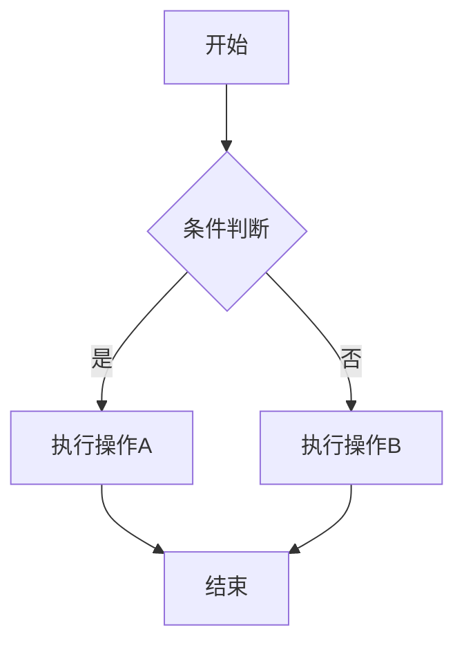

# 文章写作规范

> 本规范适用于技术笔记和博客文章的撰写，旨在保持文章风格统一、内容清晰易懂。

## 一、文档结构规范

### 1.1 文章头部（Front Matter）

```yaml
---
title: 文章标题 - 副标题（可选）
date: 2026-03-26
updated: 2026-04-01
tags: [标签1, 标签2]
category: embedded/data-structure
description: 简短描述文章内容
prerequisites:
  - /notes/c-language/pointers
  - /notes/data-structure/array
---
```

**字段说明：**

| 字段 | 必填 | 说明 |
|------|------|------|
| `title` | ✅ | 文章标题 |
| `date` | ✅ | 创建日期 |
| `updated` | ❌ | 最后更新日期 |
| `tags` | ✅ | 标签数组（不超过 5 个） |
| `category` | ❌ | 分类路径 |
| `description` | ✅ | 文章摘要 |
| `difficulty` | ❌ | 难度等级 |
| `prerequisites` | ❌ | 前置知识链接 |

### 1.2 标题层级

```markdown
# 一级标题（文章标题，全文仅一个）
## 二级标题（主要章节）
### 三级标题（子章节）
#### 四级标题（细节说明，谨慎使用）
```

**规则：** 标题层级不可跳级，如 `##` 后不能直接跟 `####`。

### 1.3 文章结构模板

**概念讲解类：**

```markdown
# 标题
## 什么是 XXX？（定义 + 类比）
## 为什么需要 XXX？（动机 + 问题场景）
## 核心概念（原理拆解）
## 代码实现（完整示例）
## 常见陷阱与最佳实践
## 总结
```

**问题解决类：**

```markdown
# 标题
## 问题描述（现象 + 复现条件）
## 原因分析（逐层排查）
## 解决方案（代码 + 解释）
## 举一反三（类似问题）
```

**对比分析类：**

```markdown
# 标题
## 背景（为什么要对比）
## 方案概述（各方案简介）
## 详细对比（表格 + 代码 + 性能数据）
## 选型建议（什么场景用什么）
## 总结
```
``

### 1.4 TL;DR 机制

对于较长的文章，在开头提供快速摘要：

```markdown
## TL;DR

> - 环形缓冲区用**取模运算**实现逻辑上的"环"
> - 容量设为 **2 的幂**可以用位运算替代取模，性能更好
> - 判满和判空的关键是区分 `head == tail` 的两种含义
>
> 如果你只是想快速使用，直接跳到[完整实现](#完整实现)。
```

***

## 二、文件与资源规范

### 2.1 文件命名规范

| 文件类型 | 命名规则 | 示例 |
|----------|----------|------|
| Markdown | 小写 + 短横线（kebab-case） | ✅ `ring-buffer.md` ❌ `RingBuffer.md` |
| 图片 | `文章主题-描述-序号.扩展名` | ✅ `ring-buffer-memory-01.png` ❌ `screenshot.png` |
| HTML 演示 | `主题-功能.html` | ✅ `ring-buffer-visualization.html` ❌ `demo1.html` |

### 2.2 图片规范

**格式要求：**

| 类型 | 推荐格式 | 大小限制 |
|------|----------|----------|
| 截图/照片 | WebP 或 PNG | ≤ 500KB |
| 矢量图/图标 | SVG | - |

**Markdown 写法：**

```markdown

```

**Alt 文本要求：**

```markdown
✅ 
❌ 、 （空 alt）
```

***

## 三、代码规范

### 3.1 代码块格式

````markdown
```语言名称
// 代码内容
```
````

### 3.2 代码块长度限制

- 单个代码块不超过 **40 行**
- 超过时拆分为多个代码块，中间穿插说明
- 展示完整代码时使用折叠组件：

```markdown
::: details 点击查看完整代码
```c
// 完整代码
```
:::
```

### 3.3 代码示例分级

| 级别 | 标记 | 含义 |
|------|------|------|
| 完整可运行 | `// 完整示例：可直接编译运行` | 包含 main 函数和头文件 |
| 代码片段 | `// 片段：需要补充上下文` | 只展示关键部分 |
| 伪代码 | `// 伪代码：展示思路` | 不保证语法正确 |

每个代码块的第一行注释应标明级别。

### 3.4 编译运行说明

对于完整可运行的代码，提供编译命令：

```markdown
**编译与运行：**
```bash
gcc -o array_list array_list.c -Wall -Wextra
./array_list
```

**预期输出：**
```
Array: [1, 2, 3, 4, 5]
Size: 5, Capacity: 8
```
```

### 3.5 代码块外部说明规范（核心要求）

**重要原则：代码块下方必须在正文部分添加详细的外部说明文字。**

#### 3.5.1 结构体说明格式

````markdown
```c
typedef struct {
    int *data;
    size_t size;
    size_t capacity;
} ArrayList;
```

上述代码定义了动态数组的结构体：

**结构体成员说明：**

| 成员 | 类型 | 说明 |
|------|------|------|
| `data` | `int *` | 指向实际存储数据的内存块的指针 |
| `size` | `size_t` | 当前数组中实际存储的元素个数 |
| `capacity` | `size_t` | 数组的总容量 |
````

#### 3.5.2 函数说明格式

````markdown
```c
ArrayList *array_list_create(size_t capacity)
{
    ArrayList *list = malloc(sizeof(ArrayList));
    if (list == NULL) return NULL;

    list->data = malloc(capacity * sizeof(int));
    if (list->data == NULL) {
        free(list);
        return NULL;
    }

    list->size = 0;
    list->capacity = capacity;
    return list;
}
```

上述代码实现了动态数组的创建函数：

**参数说明：**
- `capacity`：初始容量，指定数组最初能存储多少个元素

**返回值：**
- 成功：返回指向新创建的 `ArrayList` 结构体的指针
- 失败：返回 `NULL`（内存分配失败时）

**逐行解释：**

`malloc(sizeof(ArrayList))` - 在堆上分配结构体内存，64 位系统上通常为 24 字节。

`malloc(capacity * sizeof(int))` - 分配存储数据的内存，假设 capacity=10，则分配 40 字节。

`free(list)` - 如果数据内存分配失败，释放之前分配的结构体内存，避免内存泄漏。
````

### 3.6 代码内部注释 vs 外部说明

| 类型 | 写在代码内部 | 写在代码外部 |
|------|-------------|-------------|
| "做了什么" | ❌ | ✅ 在外部详细解释 |
| "为什么这样做" | ✅ 简短注释 | ✅ 展开解释 |
| 关键标记 | ✅ `// [1]` 标记 | ✅ 用 `[1]` 在外部对应解释 |

**示例：**

````markdown
```c
void *ptr = malloc(size);
if (!ptr) {
    errno = ENOMEM;    // [1] 设置错误码而非直接 exit
    return NULL;
}
```

[1] 这里选择设置 errno 而非调用 exit()，是因为作为库函数，不应替调用者决定错误处理策略。
````

### 3.7 渐进式代码展示策略

避免一上来就给出完整实现，采用分层展开：

````markdown
**第一步：最小可用版本**
```c
// 片段：只展示核心逻辑
void push(Stack *s, int value) {
    s->data[s->top++] = value;
}
```

**第二步：加入边界处理**
```c
// 片段：加入满栈检查
bool push(Stack *s, int value) {
    if (s->top >= s->capacity) return false;
    s->data[s->top++] = value;
    return true;
}
```

**第三步：完整的生产级代码**
```c
// 完整示例：可直接编译运行
bool push(Stack *s, int value) {
    if (s->top >= s->capacity) {
        if (!stack_resize(s, s->capacity * 2)) return false;
    }
    s->data[s->top++] = value;
    return true;
}
```
````

***

## 四、语言风格规范

### 4.1 中英文混排

- 中文为主，技术术语可使用英文
- **中英文之间需要有空格**
- **中文与数字之间需要有空格**

```markdown
✅ 状态机（State Machine）是一种行为模型。环形缓冲区的大小通常是 256 字节。
❌ 状态机(State Machine)是一种行为模型。环形缓冲区的大小通常是256字节。
```

### 4.2 标点符号

- 中文句子使用中文标点（，。！？）
- 英文句子使用英文标点（,.!?）
- 代码中的标点使用英文标点

### 4.3 写作语气

**人称选择：**

| 场景 | 人称 | 示例 |
|------|------|------|
| 解释概念 | "我们" | ✅ "我们先来看一下内存布局" |
| 指导操作 | 第二人称或无主语 | ✅ "将头文件包含到项目中" |

**语气定位：**
- 像一个耐心的同事在白板前给你讲解
- 不居高临下，不过度卖弄
- 承认复杂性，不说"显然"、"很简单"

```markdown
❌ "这个东西超级简单的啦"
❌ "显然，这里需要使用指针"
✅ "这里需要使用指针，因为我们需要直接操作内存地址"
```

### 4.4 术语一致性

在同一篇文章（甚至同一系列）中，术语应保持一致：

| 统一用词 | 避免混用 |
|---------|---------|
| 环形缓冲区 | 循环缓冲区、圆形缓冲区、Ring Buffer |
| 时间复杂度 | 时间开销、运行效率 |
| 返回值 | 返回结果、返回内容 |

首次出现时标注英文：环形缓冲区（Ring Buffer），后续直接使用中文。

***

## 五、格式元素规范

### 5.1 表格

用于对比方案、展示参数、列举规则：

```markdown
| 列1 | 列2 | 列3 |
|-----|-----|-----|
| 内容 | 内容 | 内容 |
```

### 5.2 列表

**无序列表**（无顺序关系）：

```markdown
- 状态
- 事件
- 转换
```

**有序列表**（有顺序关系）：

```markdown
1. 定义状态枚举
2. 定义事件枚举
3. 实现状态处理函数
```

### 5.3 提示框

**使用场景：**

| 类型 | 使用场景 | 示例 |
|------|---------|------|
| `tip` | 锦上添花的补充知识、便捷技巧 | "GCC 9+ 可以用 `__attribute__((cleanup))` 自动释放" |
| `warning` | 容易踩坑但不会造成严重后果 | "Windows 下路径分隔符需要转义" |
| `danger` | 可能导致数据丢失、安全漏洞、未定义行为 | "释放后的指针必须置 NULL，否则形成悬垂指针" |

```markdown
::: tip
这是一个提示信息
:::

::: warning
这是一个警告信息
:::

::: danger
这是一个危险警告
:::
```

### 5.4 数学公式

**行内公式：**

```markdown
时间复杂度为 $O(n \log n)$
```

**独立公式：**

```markdown
$$
T(n) = 2T\left(\frac{n}{2}\right) + O(n)
$$
```

### 5.5 链接

```markdown
[链接文字](/notes/embedded/ring-buffer)  // 内部链接
[链接文字](https://example.com)           // 外部链接
```

### 5.6 强调使用规范

| 格式 | 适用场景 | 示例 |
|------|---------|------|
| **加粗** | 关键概念首次出现、重要结论 | **时间复杂度为 O(1)** |
| *斜体* | 术语引入、轻微强调 | *先进先出*原则 |
| `行内代码` | 函数名、变量名、命令、文件名 | 调用 `malloc()` 函数 |
| ~~删除线~~ | 纠正常见误解 | ~~数组查找是 O(n)~~ 有序数组可以 O(log n) |

**避免过度强调：**
- 一段话中加粗不超过 **2 处**
- 不要整句加粗

```markdown
❌ **环形缓冲区是一种使用固定大小的缓冲区的数据结构**
✅ 环形缓冲区是一种使用**固定大小缓冲区**的数据结构
```

### 5.7 空行规范

- 标题前空 **1 行**，标题后空 **1 行**
- 代码块前后各空 **1 行**
- 不同话题的段落之间空 **1 行**
- 不要出现连续 **2 个以上**的空行

### 5.8 分隔线使用

- ✅ 话题发生重大转换（等同于"换一个角度"）
- ✅ 正文与附录/参考资料之间
- ❌ 每个二级标题之间（标题本身已起分隔作用）
- ❌ 在文章开头或结尾

***

## 六、HTML 演示规范

### 6.1 演示嵌入方式

```markdown
<CollapsibleIframe src="/learning-notes/demos/demo-name.html" title="演示标题" :height="500" />
```

::: warning 重要：演示路径配置
由于站点配置了 `base: '/learning-notes/'`，所有演示路径必须包含 `/learning-notes/` 前缀：

- HTML 演示文件存放在 `docs/public/demos/` 目录
- 嵌入时路径为 `/learning-notes/demos/文件名.html`
- 图片资源存放在 `docs/public/images/` 目录
- 引用图片时路径为 `/learning-notes/images/文件名.png`
:::

### 6.2 视觉风格

- 采用**黑白灰风格**，保持简洁专业
- 使用**磨砂玻璃质感**（`backdrop-filter: blur()`）
- 避免过于花哨的颜色和动画

### 6.3 功能设计

- 一个 HTML 演示**只展示一个核心概念**
- 避免在一个演示中塞入过多功能

### 6.4 响应式要求

- 最小支持宽度：320px
- 使用相对单位（rem、%、vw）而非固定 px
- 按钮和交互元素最小点击区域：44×44px

### 6.5 性能要求

- 避免引入外部 CDN 依赖（离线可用）
- 动画使用 `requestAnimationFrame`，不用 `setInterval`
- 元素数量超过 100 时考虑 Canvas 替代 DOM

### 6.6 无障碍要求

- 按钮有明确文字标签（不要只有图标）
- 颜色不作为唯一信息区分手段（配合形状/文字）

### 6.7 颜色方案

```css
/* 主色调 */
--primary: #333;           /* 主要文字和边框 */
--background: #f5f5f5;     /* 背景色 */
--card-bg: rgba(255, 255, 255, 0.8);  /* 卡片背景 */

/* 状态颜色 */
--success: #2ecc71;        /* 成功/添加 */
--danger: #e74c3c;         /* 危险/删除 */
--info: #3498db;           /* 信息/查找 */
```

***

## 七、图表规范

### 7.1 流程图

用于算法流程、状态转换、数据流向：

````markdown

````

### 7.2 数据结构图

用于展示数据在内存中的布局：

```markdown
环形缓冲区内存布局：
+---+---+---+---+---+---+---+---+
| 0 | 1 | 2 | 3 | 4 | 5 | 6 | 7 |  <- 索引
+---+---+---+---+---+---+---+---+
| A | B | C |   |   |   |   |   |  <- 数据
+---+---+---+---+---+---+---+---+
      ^       ^
    head    tail
```

***

## 八、阅读节奏与认知负荷控制

### 8.1 视觉节奏规则

长篇纯文字会让读者疲劳，建议建立交替节奏：

```
文字说明（3-5 段）
  ↓
代码块 / 图表 / 演示（视觉锚点）
  ↓
文字说明（3-5 段）
  ↓
代码块 / 图表 / 演示（视觉锚点）
```

**具体规则：**

- 连续纯文字段落不超过 **5 段**，之后必须插入代码/图表/表格
- 连续代码块不超过 **2 个**，之间必须有文字过渡
- 每个二级章节（##）至少包含一个非文字元素
- 单个段落不超过 **4 行**（过长应拆分）

### 8.2 关键要点提取

每个大章节结束时提供要点回顾：

```markdown
### 本节要点

>  **记住这三点：**
> 1. `malloc` 分配的内存必须用 `free` 释放
> 2. 释放后指针要置 `NULL`
> 3. 先检查 `malloc` 返回值再使用
```

***

## 九、系列文章与生命周期管理

### 9.1 系列文章导航

```markdown
::: tip  本文是「数据结构」系列的第 3 篇
1. [数组与动态数组](/notes/ds/array) ✅
2. [链表](/notes/ds/linked-list) ✅
3. **栈与队列**（当前）
4. [哈希表](/notes/ds/hash-table)
5. [二叉树](/notes/ds/binary-tree)
:::
```

### 9.2 跨文章引用规范

**前向引用（引用后续文章）：**

```markdown
> 关于红黑树的自平衡机制，我们将在 [红黑树详解](/notes/ds/rbtree) 中深入讨论。
```

**后向引用（引用前置文章）：**

```markdown
> 如果你对指针还不熟悉，建议先阅读 [指针基础](/notes/c/pointers)。
```

**规则：**
- 前向引用使用"将在...中讨论"
- 后向引用使用"如果不熟悉，建议先阅读..."
- 避免循环引用（A 依赖 B，B 又依赖 A）

### 9.3 时效性声明

对于依赖特定版本的内容，在文章头部标注：

```markdown
::: warning 版本说明
本文基于 FreeRTOS v10.5.1 和 STM32 HAL 库 v1.8.0 编写。
最后验证日期：2026-03-26。
:::
```

### 9.4 更新日志

文章底部更新记录：

```markdown
## 更新日志

| 日期 | 内容 |
|------|------|
| 2026-03-26 | 初稿发布 |
```

### 9.5 废弃文章处理

```markdown
::: danger ⚠️ 本文已过时
本文介绍的 API 已在 v3.0 中废弃。
请阅读新版文章：[新版链接](/notes/new-article)
:::
```

**规则：**
- 过时文章不删除（避免外部链接失效）
- 在头部添加废弃标记和新文章链接
- 从导航栏/侧边栏中移除

***

## 十、读者导向设计

### 10.1 前置知识声明

在文章开头明确告知读者需要什么基础：

```markdown
## 前置知识

阅读本文前，你需要了解：

- C 语言指针和动态内存分配（[复习链接](/notes/c/pointers)）
- 基本的时间复杂度概念

本文不假设你了解：
- 任何高级数据结构
- 操作系统原理
```

***

## 十一、特殊内容处理

### 11.1 错误信息展示

**展示错误和解决方案的标准格式：**

```markdown
**错误现象：**
```
Segmentation fault (core dumped)
```

**错误代码：**
```c
int *ptr = NULL;
*ptr = 42;  // ← 错误在这里
```

**原因分析：**
对 NULL 指针解引用触发段错误。

**修复方案：**
```c
int *ptr = malloc(sizeof(int));
if (ptr != NULL) {
    *ptr = 42;
}
```
```

***

## 十二、文章质量检查清单

### 12.1 写作完成自查

- [ ] 把文章从头读一遍，作为读者能否看懂
- [ ] 所有代码块能独立编译/运行
- [ ] 没有遗留 TODO 或占位符

### 12.2 发布前检查

**结构检查：**
- [ ] Front Matter 字段完整
- [ ] 标题层级正确，无跳级
- [ ] 文章结构完整（引言、正文、总结）

**内容检查：**
- [ ] 概念解释清晰，读者能理解
- [ ] 代码示例完整，可运行
- [ ] **代码块后有详细的外部说明**
- [ ] 参数、函数有明确解释
- [ ] 关键逻辑有分步骤说明

**格式检查：**
- [ ] 中英文之间有空格
- [ ] 中文与数字之间有空格
- [ ] 标点符号使用正确
- [ ] 术语使用一致

**链接与资源检查：**
- [ ] 所有链接可访问（内部 + 外部）
- [ ] 图片加载正常，alt 文本有意义
- [ ] HTML 演示在移动端可正常交互
- [ ] 浏览器控制台无报错

***

## 十三、示例文章模板

```markdown
---
title: 文章标题 - 副标题
date: 2026-03-26
updated: 2026-04-01
tags: [标签1, 标签2]
category: embedded/data-structure
description: 文章摘要
difficulty: intermediate
prerequisites:
  - /notes/c-language/pointers
---

# 文章标题

>  阅读时长：约 15 分钟
>  难度等级：中级
>  读完你将学会：创建、插入、删除、扩容动态数组

## TL;DR

> - 要点一
> - 要点二
> - 要点三

## 前置知识

阅读本文前，你需要了解：

- C 语言指针和动态内存分配（[复习链接](/notes/c/pointers)）
- 基本的时间复杂度概念

## 什么是 XXX？

简要介绍概念，让读者建立基本认知。

<CollapsibleIframe src="/learning-notes/demos/demo.html" title="演示标题" :height="400" />

## 为什么需要 XXX？

解释为什么需要学习这个知识点。

## 如何实现 XXX？

### 基本实现

```c
// 片段：需要补充上下文
typedef struct {
    int value;
    char name[32];
} Example;
```

上述代码定义了示例结构体：

**结构体成员说明：**

| 成员 | 类型 | 说明 |
|------|------|------|
| `value` | `int` | 存储整数值 |
| `name` | `char[32]` | 存储名称字符串 |

### 本节要点

>  **记住这三点：**
> 1. 要点一
> 2. 要点二
> 3. 要点三

## 常见陷阱

::: warning
这里容易出错，需要注意...
:::

## 总结

1. 要点一
2. 要点二

## 更新日志

| 日期 | 内容 |
|------|------|
| 2026-03-26 | 初稿发布 |

## 参考资料

[1] 参考资料名称. https://example.com

## 相关主题

- [相关文章1](/path/to/article1)
- [相关文章2](/path/to/article2)
```
