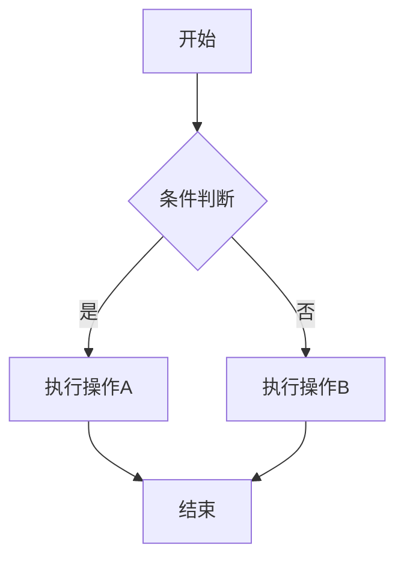
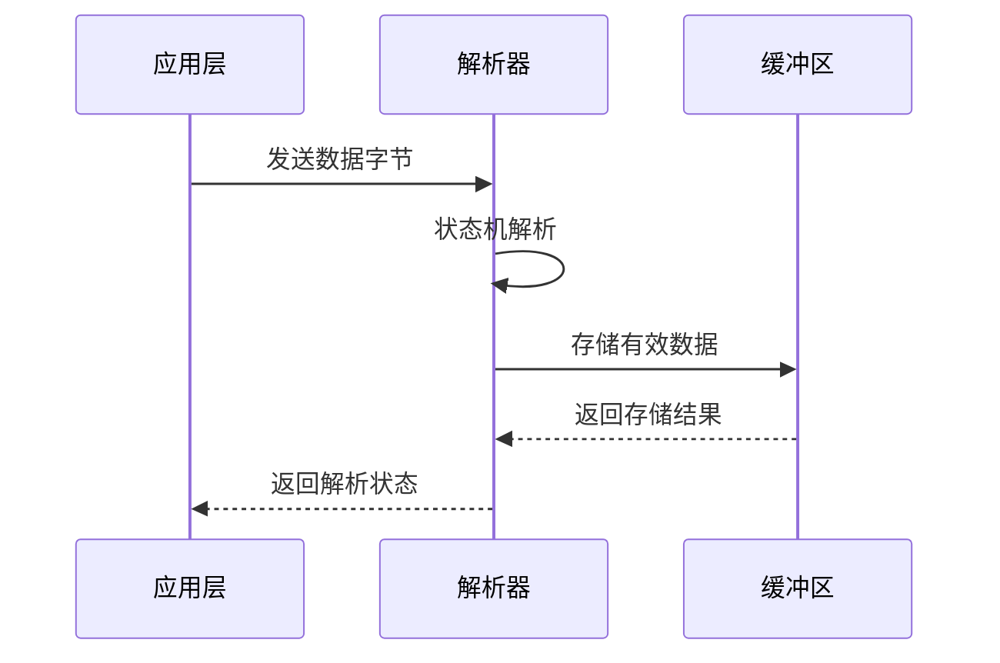

# 文章写作规范

> 本规范适用于技术笔记和博客文章的撰写，旨在保持文章风格统一、内容清晰易懂。

## 一、文档结构规范

### 1.1 文章头部（Front Matter）

每篇文章必须在开头包含以下元数据：

```yaml
---
title: 文章标题 - 副标题（可选）
date: 2026-03-26
tags: [标签1, 标签2, 标签3]
description: 简短描述文章内容，用于SEO和文章预览
---
```

**字段说明：**

| 字段            | 必填 | 说明                    |
| ------------- | -- | --------------------- |
| `title`       | 是  | 文章标题，简洁明了，可包含副标题      |
| `date`        | 是  | 发布日期，格式为 `YYYY-MM-DD` |
| `tags`        | 是  | 文章标签，使用数组格式，便于分类检索    |
| `description` | 是  | 文章摘要，控制在100字以内        |

### 1.2 标题层级

文章标题层级应遵循以下规则：

```markdown
# 一级标题（文章标题，全文仅一个）
## 二级标题（主要章节）
### 三级标题（子章节）
#### 四级标题（细节说明，谨慎使用）
```

**层级要求：**

- 一级标题（`#`）仅用于文章标题，全文唯一
- 二级标题（`##`）用于划分主要章节，是文章的骨架
- 三级标题（`###`）用于章节内的子主题
- 四级标题（`####`）尽量少用，避免层级过深
- 标题层级**不可跳级**，如 `##` 后直接跟 `####`

### 1.3 标准文章结构

一篇完整的技术文章应包含以下部分：

```markdown
# 文章标题

## 引言/背景

简要介绍文章主题，说明为什么需要学习这个知识点。

## 核心概念

解释核心概念，让读者建立基本认知。

## 详细内容

### 子主题1
### 子主题2

## 实际应用

结合实际场景，展示如何应用所学知识。

## 总结

总结文章要点，帮助读者回顾。

## 相关主题

提供相关文章链接，方便读者延伸阅读。
```

### 1.4 段落规范

**段落长度：**

- 每段控制在 4-7 句话，避免大段文字
- 技术解释要详细，确保读者能理解
- 适当使用空行分隔，提高可读性

**段落结构：**

```markdown
好的段落结构示例：

状态机是一种行为模型，它用有限个状态来描述系统在不同条件下的行为。
系统在某一时刻只能处于一个状态，当特定事件发生时，会从一个状态转换到另一个状态。

听起来抽象？其实生活中到处都是状态机：

- 红绿灯：红灯 → 绿灯 → 黄灯 → 红灯
- 电梯：停止 → 上行 → 停止 → 开门 → 关门
```

***

## 二、代码规范

### 2.1 代码块格式

**基本格式：**

````markdown
```语言名称
// 代码内容
```
````

**支持的语言标识：**

| 语言     | 标识符              | 语言         | 标识符                 |
| ------ | ---------------- | ---------- | ------------------- |
| C语言    | `c`              | JavaScript | `javascript` 或 `js` |
| C++    | `cpp`            | TypeScript | `typescript` 或 `ts` |
| Python | `python` 或 `py`  | HTML       | `html`              |
| Java   | `java`           | CSS        | `css`               |
| Shell  | `shell` 或 `bash` | JSON       | `json`              |

### 2.2 代码块外部说明规范

**重要原则：代码块下方必须在正文部分添加详细的外部说明文字**，这是技术文章的核心要求。

外部说明应该出现在代码块外的正文区域，包含以下内容：

1. **代码功能概述**：这段代码实现了什么功能
2. **参数说明**：每个参数的含义和作用
3. **函数说明**：函数的功能、返回值、副作用
4. **关键逻辑解释**：核心算法或逻辑的说明
5. **注意事项**：使用时需要注意的问题

**标准格式示例：**

````markdown
```c
typedef struct {
    SystemState current;    // 当前状态
    SystemEvent event;      // 触发事件
    SystemState next;       // 下一状态
    void (*action)(void);   // 执行动作
} StateTransition;
```

上述代码定义了状态转换规则结构体，用于描述状态机的转换逻辑：

**结构体成员说明：**

| 成员 | 类型 | 说明 |
|------|------|------|
| `current` | `SystemState` | 当前状态，表示系统所处的状态，取值为状态枚举之一 |
| `event` | `SystemEvent` | 触发事件，导致状态改变的条件，如 `EVENT_START`、`EVENT_STOP` |
| `next` | `SystemState` | 下一状态，转换后的目标状态 |
| `action` | `void (*)(void)` | 执行动作，状态转换时要执行的函数指针，可为 `NULL` |

**使用场景：**

该结构体通常用于状态转换表中，配合查表法实现状态机。当系统收到事件时，遍历转换表，找到匹配的 `current` 和 `event`，执行 `action` 后切换到 `next` 状态。
````

**简单代码的说明格式：**

````markdown
```c
bool ring_buffer_is_empty(RingBuffer *rb) {
    return rb->head == rb->tail;
}
```

该函数用于判断环形缓冲区是否为空。

**参数说明：**
- `rb`：环形缓冲区结构体指针，不能为 `NULL`

**返回值：**
- `true`：缓冲区为空
- `false`：缓冲区不为空

**实现原理：** 当头指针等于尾指针时，说明缓冲区中没有数据。
````

**复杂代码的说明格式：**

对于较复杂的代码，应该分步骤解释：

````markdown
```c
void parse_byte(ProtocolParser *parser, uint8_t byte) {
    switch (parser->state) {
        case PARSE_IDLE:
            if (byte == 0xAA) {
                parser->state = PARSE_HEADER;
            }
            break;
        case PARSE_HEADER:
            parser->length = byte;
            parser->index = 0;
            parser->checksum = 0;
            parser->state = PARSE_DATA;
            break;
        // ... 其他状态
    }
}
```

该函数实现协议解析状态机，逐字节解析数据帧。

**参数说明：**
- `parser`：解析器结构体指针，保存解析状态和中间数据
- `byte`：当前接收到的字节

**状态转换流程：**

1. **PARSE_IDLE 状态**：等待帧头 `0xAA`
   - 收到 `0xAA`：进入 `PARSE_HEADER` 状态
   - 收到其他字节：保持当前状态

2. **PARSE_HEADER 状态**：解析长度字段
   - 保存长度到 `parser->length`
   - 初始化索引和校验和
   - 进入 `PARSE_DATA` 状态

**注意事项：**
- 该函数应该在每个字节到达时调用
- 解析成功后 `parser->frame_ready` 会被置位
````

### 2.3 代码注释规范

**行内注释：**

```c
int buffer[256];     // 数据缓冲区
int head = 0;        // 头指针，指向读取位置
int tail = 0;        // 尾指针，指向写入位置
```

**块注释：**

```c
/**
 * @brief 初始化环形缓冲区
 * @param rb 环形缓冲区结构体指针
 * @param buffer 数据存储区
 * @param size 缓冲区大小
 * @return 成功返回0，失败返回-1
 */
int ring_buffer_init(RingBuffer *rb, uint8_t *buffer, size_t size);
```

### 2.4 代码示例要求

**完整性：**

代码示例应尽量完整，包含必要的头文件和上下文：

```c
#include <stdint.h>
#include <stdbool.h>

typedef struct {
    uint8_t *buffer;
    size_t size;
    size_t head;
    size_t tail;
} RingBuffer;

bool ring_buffer_is_empty(RingBuffer *rb) {
    return rb->head == rb->tail;
}
```

**可运行性：**

- 提供的代码应能编译运行
- 避免使用未定义的变量或函数
- 必要时提供完整的示例代码

### 2.5 代码与演示配合

对于复杂的概念，建议同时提供代码和 HTML 演示：

````markdown
## 状态机实现

下面是一个简单的状态机实现：

```c
void state_machine(int event) {
    switch (current_state) {
        case STATE_IDLE:
            handle_idle(event);
            break;
        case STATE_RUNNING:
            handle_running(event);
            break;
    }
}
````

上述代码通过 `switch-case` 结构实现状态机，根据当前状态调用对应的处理函数。

<CollapsibleIframe src="/demos/state-machine.html" title="状态机演示" :height="500" />
```

***

## 三、语言风格规范

### 3.1 中英文混排

**基本原则：**

- 中文为主，技术术语可使用英文
- 中英文之间需要有空格
- 中文与数字之间需要有空格

**正确示例：**

```markdown
状态机（State Machine）是一种行为模型，它用有限个状态来描述系统行为。
在 C 语言中，我们可以使用 switch-case 语句实现状态机。
环形缓冲区的大小通常是 256 字节或 512 字节。
```

**错误示例：**

```markdown
状态机(State Machine)是一种行为模型。    // 错误：括号内无空格
在C语言中，我们可以使用switch-case语句。 // 错误：中英文无空格
环形缓冲区的大小通常是256字节。           // 错误：中文与数字无空格
```

### 3.2 标点符号

**使用中文标点：**

- 中文句子使用中文标点（，。！？）
- 英文句子使用英文标点（,.!?）
- 代码中的标点使用英文标点

**正确示例：**

```markdown
状态机有四个要素：状态、事件、转换和动作。
When the event occurs, the state changes.
```

### 3.3 术语统一

**首次出现时解释：**

```markdown
状态机（State Machine，FSM）是一种行为模型...
```

**常用术语对照表：**

| 英文            | 中文    | 备注      |
| ------------- | ----- | ------- |
| State Machine | 状态机   | <br />  |
| Ring Buffer   | 环形缓冲区 | 也称循环缓冲区 |
| Callback      | 回调函数  | <br />  |
| Interrupt     | 中断    | <br />  |
| Pointer       | 指针    | <br />  |

### 3.4 叙述风格

**详细解释原则：**

技术文章应详细解释概念，确保读者能理解：

```markdown
好的示例：

状态机的核心思想是把复杂的逻辑拆分成多个独立的状态，每个状态只关心自己的行为。
这样做的好处是：当系统处于某个状态时，我们只需要处理该状态下可能发生的事件，
而不需要考虑其他状态的情况。这大大简化了代码的复杂度。

不好的示例：

状态机就是把逻辑分成多个状态。
```

**循序渐进原则：**

```markdown
1. 先解释"是什么"
2. 再解释"为什么需要"
3. 最后解释"怎么做"

示例：

## 什么是状态机？

状态机是一种行为模型...

## 为什么需要状态机？

传统的 if-else 嵌套存在以下问题...

## 如何实现状态机？

常见的实现方式有三种...
```

***

## 四、格式元素规范

### 4.1 表格

**表格用途：**

- 对比不同方案的优缺点
- 展示参数说明
- 列举状态转换规则

**表格格式：**

```markdown
| 列1 | 列2 | 列3 |
|-----|-----|-----|
| 内容 | 内容 | 内容 |
```

**表格示例：**

```markdown
| 实现方式 | 优点 | 缺点 | 适用场景 |
|----------|------|------|----------|
| Switch-Case | 简单直接 | 状态多时冗长 | 状态较少 |
| 状态表 | 易于扩展 | 需要遍历查找 | 状态较多 |
| 函数指针 | 最灵活 | 实现复杂 | 高级应用 |
```

### 4.2 列表

**无序列表：**

用于列举没有顺序关系的内容：

```markdown
状态机的四个要素：
- 状态（State）
- 事件（Event）
- 转换（Transition）
- 动作（Action）
```

**有序列表：**

用于有顺序关系的内容：

```markdown
实现步骤：
1. 定义状态枚举
2. 定义事件枚举
3. 实现状态处理函数
4. 实现状态机主循环
```

### 4.3 引用

**引用用途：**

- 引用外部资料
- 展示重要提示
- 标注参考来源

**引用格式：**

```markdown
> 这是一段引用文字
```

### 4.4 提示框

VitePress 支持三种提示框：

**提示（Tip）：**

```markdown
::: tip
这是一个提示信息
:::
```

**警告（Warning）：**

```markdown
::: warning
这是一个警告信息
:::
```

**危险（Danger）：**

```markdown
::: danger
这是一个危险警告
:::
```

**使用场景：**

- `tip`：补充说明、最佳实践
- `warning`：注意事项、潜在问题
- `danger`：严重警告、可能导致错误

### 4.5 链接

**内部链接：**

```markdown
[链接文字](/notes/embedded/ring-buffer)
```

**外部链接：**

```markdown
[链接文字](https://example.com)
```

**相关主题链接：**

文章末尾应提供相关文章链接：

```markdown
## 相关主题

- [环形缓冲区](/notes/embedded/ring-buffer) - 数据存储基础
- [回调函数](/notes/embedded/callback) - 事件处理机制
```

### 4.6 图片

**图片格式：**

```markdown

```

**图片要求：**

- 图片存放在 `docs/public/images/` 目录
- 使用有意义的文件名
- 提供清晰的图片描述

***

## 五、HTML 演示规范

### 5.1 演示嵌入方式

使用 `CollapsibleIframe` 组件嵌入 HTML 演示：

```markdown
<CollapsibleIframe src="/demos/demo-name.html" title="演示标题" :height="500" />
```

**参数说明：**

| 参数        | 说明                              |
| --------- | ------------------------------- |
| `src`     | HTML 文件路径，相对于 `docs/public/` 目录 |
| `title`   | 演示标题，显示在折叠栏上                    |
| `:height` | 演示区域高度，单位为像素                    |

### 5.2 HTML 演示设计原则

**视觉风格：**

- 采用**黑白灰风格**，保持简洁专业
- 使用**磨砂玻璃质感**（`backdrop-filter: blur()`）
- 避免过于花哨的颜色和动画

**功能拆分：**

- 一个 HTML 演示**只展示一个核心概念**
- 避免在一个演示中塞入过多功能
- 复杂概念可拆分为多个独立演示

**示例：**

```markdown
不好的做法：一个 HTML 展示状态机、环形缓冲区、回调函数

好的做法：
- state-machine.html - 专门演示状态机
- ring-buffer.html - 专门演示环形缓冲区
- callback.html - 专门演示回调函数
```

### 5.3 HTML 演示代码规范

**基本结构：**

```html
<!DOCTYPE html>
<html lang="zh-CN">
<head>
    <meta charset="UTF-8">
    <meta name="viewport" content="width=device-width, initial-scale=1.0">
    <title>演示标题</title>
    <style>
        /* 黑白灰风格 + 磨砂玻璃质感 */
        * {
            margin: 0;
            padding: 0;
            box-sizing: border-box;
        }

        body {
            font-family: -apple-system, BlinkMacSystemFont, 'Segoe UI', sans-serif;
            background: #f5f5f5;
            min-height: 100vh;
            padding: 20px;
            color: #333;
        }

        .card {
            background: rgba(255, 255, 255, 0.8);
            backdrop-filter: blur(10px);
            border-radius: 12px;
            padding: 24px;
            box-shadow: 0 4px 20px rgba(0, 0, 0, 0.1);
        }
    </style>
</head>
<body>
    <!-- 演示内容 -->
</body>
</html>
```

**设计要点：**

1. **背景色**：使用浅灰色（`#f5f5f5` 或 `#f0f0f0`）
2. **卡片背景**：半透明白色 + 磨砂玻璃效果
3. **阴影**：柔和的灰色阴影
4. **圆角**：统一使用 `8px` 或 `12px`
5. **字体**：系统默认字体栈

### 5.4 演示与文章配合

**演示位置：**

- 在概念解释后、代码示例前
- 或在代码示例后，用于直观展示效果

**配合示例：**

````markdown
## 状态机演示

下面是一个状态机的交互式演示，你可以点击按钮触发事件，观察状态变化：

<CollapsibleIframe src="/demos/state-machine.html" title="状态机演示" :height="500" />

## 代码实现

演示中的状态机可以用以下代码实现：

```c
// 代码示例
````

````

---

## 六、图表规范

### 6.1 流程图

对于复杂的流程，应使用流程图进行可视化说明。

**使用场景：**
- 算法流程
- 状态转换
- 数据流向
- 决策逻辑

**Mermaid 流程图示例：**

````markdown

````

**流程图说明：**

流程图下方应添加文字说明，解释关键节点：

```markdown
上图展示了状态机的处理流程：

1. **开始**：系统初始化，进入空闲状态
2. **条件判断**：根据当前状态和事件决定执行路径
3. **执行操作**：调用对应的状态处理函数
4. **结束**：更新状态，等待下一个事件
```

### 6.2 时序图

用于展示模块间的交互顺序。

**使用场景：**
- 函数调用关系
- 模块通信过程
- 协议交互流程

**Mermaid 时序图示例：**

````markdown

````

### 6.3 架构图

用于展示系统整体结构。

**使用场景：**
- 系统架构
- 模块关系
- 层次结构

**架构图说明格式：**

```markdown
系统架构分为三层：

| 层级 | 模块 | 职责 |
|------|------|------|
| 应用层 | 业务逻辑 | 处理用户请求，协调各模块 |
| 中间层 | 协议解析 | 数据帧的组包和解包 |
| 底层 | 硬件驱动 | 串口、网络等硬件操作 |
```

### 6.4 数据结构图

用于展示数据在内存中的布局。

**使用场景：**
- 结构体内存布局
- 缓冲区组织方式
- 数据包格式

**示例：**

```markdown
环形缓冲区内存布局：

```
+---+---+---+---+---+---+---+---+
| 0 | 1 | 2 | 3 | 4 | 5 | 6 | 7 |  <- 索引
+---+---+---+---+---+---+---+---+
| A | B | C |   |   |   |   |   |  <- 数据
+---+---+---+---+---+---+---+---+
      ^       ^
      |       |
    head    tail
  (读取)   (写入)
```

- `head` 指向下一个要读取的位置
- `tail` 指向下一个要写入的位置
- 当 `head == tail` 时，缓冲区为空
```

---

## 七、数学公式规范

### 7.1 公式格式

VitePress 支持 LaTeX 数学公式。

**行内公式：**

```markdown
环形缓冲区的有效数据长度为 $L = (tail - head + N) \mod N$
```

**块级公式：**

```markdown
$$
P(A|B) = \frac{P(B|A) \cdot P(A)}{P(B)}
$$
```

### 7.2 公式说明规范

公式后必须添加说明，解释变量含义：

```markdown
环形缓冲区的有效数据长度计算公式：

$$
L = (tail - head + N) \mod N
$$

其中：
- $L$：有效数据长度，单位为字节
- $tail$：尾指针，指向下一个写入位置
- $head$：头指针，指向下一个读取位置
- $N$：缓冲区总大小，单位为字节
- $\mod$：取模运算，处理指针回绕
```

### 7.3 公式使用原则

**何时使用公式：**

- 需要精确表达数学关系
- 涉及复杂计算或推导
- 需要展示算法复杂度

**何时避免使用公式：**

- 简单的加减乘除可以用文字描述
- 读者可能不熟悉的数学符号
- 可以用代码更直观表达的情况

---

## 八、版本与兼容性规范

### 8.1 版本说明

涉及特定版本的功能时，应注明版本要求：

```markdown
该功能需要 GCC 5.0 以上版本支持。

| 编译器 | 最低版本 | 说明 |
|--------|----------|------|
| GCC | 5.0 | 支持 C11 标准 |
| Clang | 3.4 | 支持 C11 标准 |
| MSVC | 2015 | 支持 C11 部分特性 |
```

### 8.2 平台兼容性

涉及平台相关的代码，应注明支持的平台：

```markdown
该代码在以下平台测试通过：

| 平台 | 架构 | 编译器 | 测试结果 |
|------|------|--------|----------|
| Linux | x86_64 | GCC 9.3 | 通过 |
| Linux | ARM | GCC 8.2 | 通过 |
| Windows | x86_64 | MSVC 2019 | 通过 |
| macOS | x86_64 | Clang 11 | 通过 |
```

### 8.3 代码变更说明

如果文章中的代码有更新，应添加变更说明：

```markdown
::: warning 代码更新
2026-03-26 更新：修复了缓冲区溢出的潜在问题，增加了边界检查。
:::
```

---

## 九、性能与安全规范

### 9.1 性能分析

对于性能敏感的代码，应提供性能分析：

```markdown
**时间复杂度分析：**

| 操作 | 时间复杂度 | 说明 |
|------|------------|------|
| 写入 | O(1) | 直接写入 tail 位置 |
| 读取 | O(1) | 直接读取 head 位置 |
| 查询长度 | O(1) | 指针相减计算 |

**空间复杂度：** O(N)，其中 N 为缓冲区大小

**性能测试结果：**

在 STM32F103 (72MHz) 平台上的测试结果：

| 操作 | 耗时 | 说明 |
|------|------|------|
| 单次写入 | 0.5μs | 1 字节数据 |
| 单次读取 | 0.4μs | 1 字节数据 |
| 批量写入 256 字节 | 128μs | DMA 模式 |
```

### 9.2 安全性说明

对于安全相关的代码，应添加安全性说明：

```markdown
**安全性注意事项：**

1. **缓冲区溢出防护**
   - 所有写入操作前检查剩余空间
   - 使用 `size_t` 类型避免整数溢出

2. **线程安全**
   - 该实现非线程安全
   - 多线程环境下需要加锁保护
   - 建议使用互斥锁或关中断保护

3. **资源管理**
   - 确保缓冲区在使用期间有效
   - 避免悬空指针访问
```

### 9.3 错误处理

代码示例应包含错误处理：

```markdown
**错误处理示例：**

```c
int ring_buffer_write(RingBuffer *rb, const uint8_t *data, size_t len) {
    // 参数检查
    if (rb == NULL || data == NULL) {
        return -1;  // 无效参数
    }

    // 空间检查
    if (ring_buffer_available(rb) < len) {
        return -2;  // 空间不足
    }

    // 写入数据
    // ...

    return 0;  // 成功
}
```

**错误码定义：**

| 返回值 | 含义 | 处理建议 |
|--------|------|----------|
| 0 | 成功 | 继续执行 |
| -1 | 无效参数 | 检查传入参数 |
| -2 | 空间不足 | 等待或扩大缓冲区 |
```

---

## 十、文章质量检查清单

### 10.1 结构检查

- [ ] 文章头部包含完整的 Front Matter
- [ ] 标题层级正确，无跳级
- [ ] 文章结构完整（引言、正文、总结）
- [ ] 段落长度适中，无大段文字

### 10.2 内容检查

- [ ] 概念解释清晰，读者能理解
- [ ] 代码示例完整，可运行
- [ ] **代码块后有详细的外部说明**
- [ ] 参数、函数有明确解释
- [ ] 关键逻辑有分步骤说明

### 10.3 格式检查

- [ ] 中英文之间有空格
- [ ] 中文与数字之间有空格
- [ ] 标点符号使用正确
- [ ] 表格、列表格式正确

### 10.4 图表检查

- [ ] 流程图/时序图清晰易懂
- [ ] 图表下方有文字说明
- [ ] 数据结构图标注完整

### 10.5 公式检查

- [ ] 公式格式正确
- [ ] 变量含义有说明
- [ ] 公式使用场景恰当

### 10.6 演示检查

- [ ] HTML 演示采用黑白灰风格
- [ ] 演示功能单一，不过于复杂
- [ ] 演示与文章内容配合紧密

### 10.7 兼容性检查

- [ ] 版本要求有说明
- [ ] 平台兼容性有标注
- [ ] 代码变更有记录

### 10.8 安全性检查

- [ ] 性能分析完整
- [ ] 安全注意事项有说明
- [ ] 错误处理代码完整

### 10.9 链接检查

- [ ] 内部链接路径正确
- [ ] 外部链接可访问
- [ ] 相关主题链接完整

---

## 十一、示例文章模板

```markdown
---
title: 文章标题 - 副标题
date: 2026-03-26
tags: [标签1, 标签2]
description: 文章摘要
---

# 文章标题

## 什么是 XXX？

简要介绍概念，让读者建立基本认知。

<CollapsibleIframe src="/demos/demo.html" title="演示标题" :height="400" />

## 为什么需要 XXX？

解释为什么需要学习这个知识点，解决什么问题。

## 如何实现 XXX？

### 方式一：基本实现

```c
typedef struct {
    int value;
    char name[32];
} Example;
```

上述代码定义了示例结构体：

**结构体成员说明：**

| 成员 | 类型 | 说明 |
|------|------|------|
| `value` | `int` | 存储整数值 |
| `name` | `char[32]` | 存储名称字符串 |

### 方式二：进阶实现

```c
int example_process(Example *obj, int mode) {
    if (obj == NULL) return -1;
    return obj->value * mode;
}
```

该函数处理示例对象。

**参数说明：**
- `obj`：示例对象指针，不能为 `NULL`
- `mode`：处理模式，1 表示乘法，2 表示除法

**返回值：**
- 成功：返回处理结果
- 失败：返回 -1

## 实际应用

结合实际场景，展示如何应用。

## 性能分析

| 操作 | 时间复杂度 | 空间复杂度 |
|------|------------|------------|
| 查询 | O(1) | O(1) |
| 插入 | O(n) | O(1) |

## 总结

1. 要点一
2. 要点二
3. 要点三

## 参考资料

[1] 参考资料名称. https://example.com

## 相关主题

- [相关文章1](/path/to/article1)
- [相关文章2](/path/to/article2)
```

---

## 十二、常见问题

### Q1：代码块应该多长？

代码块不宜过长，建议控制在 30 行以内。如果代码较长，可以：
- 拆分为多个代码块，逐步讲解
- 只展示关键部分，省略样板代码
- 提供完整代码链接

### Q2：如何处理复杂概念？

对于复杂概念，建议：
1. 用生活中的例子类比
2. 提供可视化演示
3. 分步骤详细解释
4. 提供多个代码示例

### Q3：HTML 演示应该多复杂？

遵循"单一职责"原则：
- 一个演示只展示一个概念
- 避免功能堆砌
- 保持界面简洁

### Q4：如何保持文章风格统一？

- 参考现有文章的写作风格
- 使用本文档提供的模板
- 定期回顾和修订文章

### Q5：代码块外部说明必须包含哪些内容？

根据代码复杂度，外部说明应包含：

**简单代码（1-5行）：**
- 功能概述
- 参数说明（如有）

**中等代码（6-15行）：**
- 功能概述
- 参数说明
- 返回值说明
- 关键逻辑解释

**复杂代码（16行以上）：**
- 功能概述
- 参数说明
- 返回值说明
- 分步骤逻辑解释
- 注意事项
- 性能分析（如适用）

### Q6：何时需要添加流程图？

以下情况建议添加流程图：

1. **多分支逻辑**：超过 3 个分支的判断逻辑
2. **状态转换**：状态机、协议解析等
3. **复杂流程**：涉及多个模块交互
4. **算法说明**：需要展示算法执行过程

### Q7：如何处理平台相关的代码？

对于平台相关代码，应：

1. 在代码前说明适用平台
2. 提供平台差异的说明表格
3. 如可能，提供跨平台的替代方案
4. 标注已知的不兼容问题

### Q8：文章中是否需要包含测试代码？

建议包含以下测试相关内容：

1. **单元测试示例**：关键函数的测试用例
2. **使用示例**：完整的使用代码
3. **边界条件**：特殊情况的测试说明
4. **测试结果**：实际测试的数据或截图

