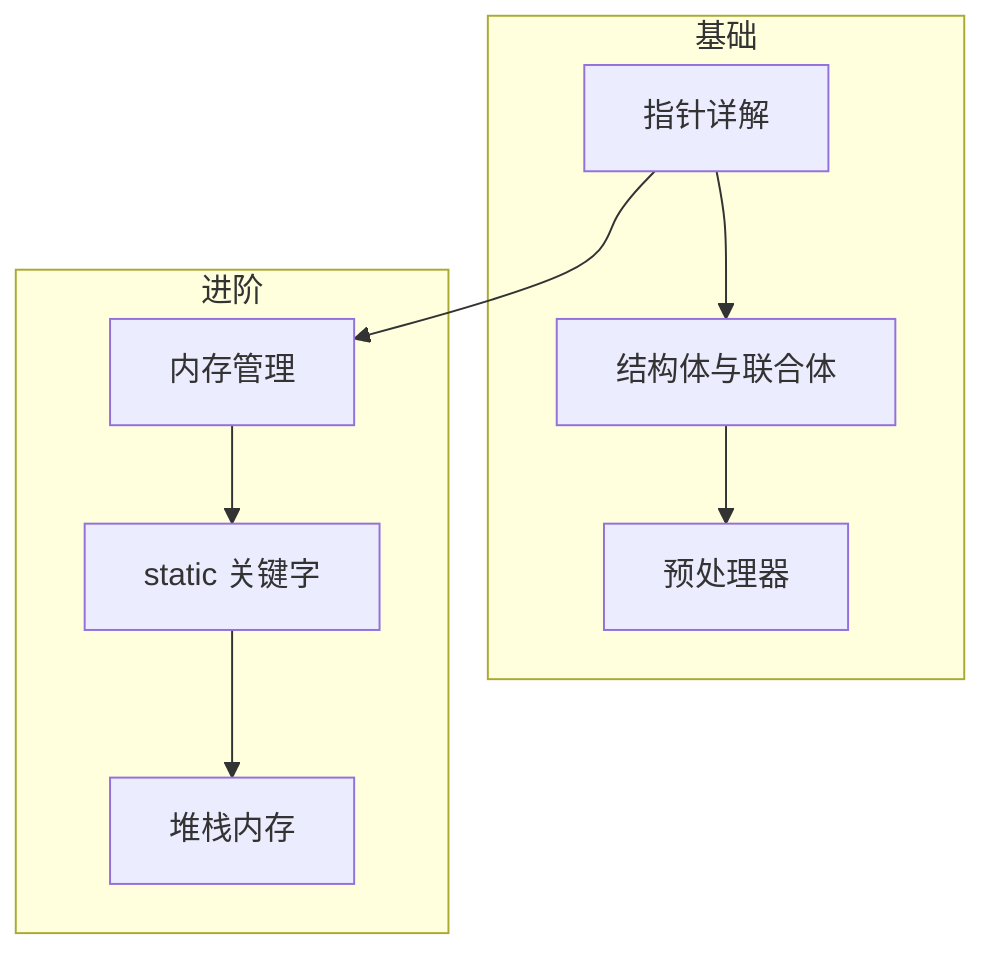

# C 语言核心概念

本系列文章深入讲解 C 语言的核心概念，帮助读者建立扎实的编程基础。

## 系列文章

### 语言基础

- [指针详解](/notes/c/pointer) - 指针的本质、运算、函数指针、多级指针
- [结构体与联合体](/notes/c/struct-union) - 复合数据类型、内存对齐、位域
- [预处理器](/notes/c/preprocessor) - 宏定义、条件编译、文件包含

### 内存管理

- [堆栈内存](/notes/c/stack) - 从用户态到内核态的深度解析
- [内存管理](/notes/c/memory-management) - malloc/free 与内核内存分配

### 存储类

- [static 关键字](/notes/c/static) - 从存储类到内核模块设计

## 学习路径

建议按以下顺序学习：

1. **指针详解**：理解指针是掌握 C 语言的关键
2. **结构体与联合体**：掌握复合数据类型和内存布局
3. **预处理器**：理解编译前处理机制
4. **堆栈内存**：深入理解程序的内存布局
5. **static 关键字**：掌握变量的生命周期和作用域控制
6. **内存管理**：学习动态内存分配的原理和最佳实践

## 前置知识

学习本系列文章前，你需要：

- 了解 C 语言基本语法
- 熟悉函数的定义和调用
- 了解基本的编程概念

## 相关主题

- [回调函数](/notes/embedded/callback) - 函数指针的应用
- [环形缓冲区](/notes/embedded/ring-buffer) - 内存管理实践
- [内核模块开发](/notes/linux/kernel-module) - Linux 内核编程
