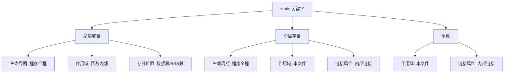

# static 关键字

## 什么是 static？

`static` 是 C 语言中一个重要但容易混淆的关键字。它有两个核心作用：

1. **控制生命周期**：让变量在程序整个运行期间都存在
2. **控制作用域**：限制变量或函数的可见范围

根据使用位置不同，`static` 有三种不同的含义。理解这三种用法，是掌握 C 语言内存管理和模块设计的关键。

## static 的三种用法



| 使用位置 | 生命周期 | 作用域 | 链接属性 | 存储位置 |
|----------|----------|--------|----------|----------|
| 局部变量 | 程序全程 | 函数内部 | 无链接 | 数据段/BSS 段 |
| 全局变量 | 程序全程 | 本文件 | 内部链接 | 数据段/BSS 段 |
| 函数 | - | 本文件 | 内部链接 | 代码段 |

## 用法一：静态局部变量

### 基本概念

当 `static` 修饰**函数内部的局部变量**时，该变量：

- **生命周期**：从程序启动到程序结束（存储在数据段或 BSS 段）
- **作用域**：仅限函数内部可见
- **初始化**：只在第一次调用时初始化一次
- **存储位置**：不在栈上，而在数据段或 BSS 段

### 对比：普通局部变量 vs 静态局部变量

```c
#include <stdio.h>

void normal_counter(void) {
    int count = 0;      // 普通局部变量，存储在栈上
    count++;
    printf("normal: %d\n", count);
}

void static_counter(void) {
    static int count = 0;  // 静态局部变量，存储在 BSS 段
    count++;
    printf("static: %d\n", count);
}

int main(void) {
    for (int i = 0; i < 3; i++) {
        normal_counter();
        static_counter();
    }
    return 0;
}
```

上述代码对比了普通局部变量和静态局部变量的行为。

**输出结果：**

```
normal: 1
static: 1
normal: 1
static: 2
normal: 1
static: 3
```

**行为分析：**

| 调用次数 | normal_counter | static_counter |
|----------|----------------|----------------|
| 第 1 次 | count=0, 输出 1 | count=0→1, 输出 1 |
| 第 2 次 | count=0, 输出 1 | count=1→2, 输出 2 |
| 第 3 次 | count=0, 输出 1 | count=2→3, 输出 3 |

### 内存布局分析

```c
void example(void) {
    int a = 10;           // 栈上
    static int b = 20;    // 数据段（已初始化）
    static int c;         // BSS 段（未初始化，自动为 0）
}
```

上述代码展示了不同变量的存储位置。

**内存布局：**

```
┌─────────────────────────────────────────────────────────────┐
│                      进程内存空间                            │
│  ┌─────────────────────────────────────────────────────────┐│
│  │  数据段 (.data)                                         ││
│  │  ┌─────────────────────────────────────────────────────┐││
│  │  │ static int b = 20;  (example 函数内)                 │││
│  │  │ static 全局变量 (已初始化)                           │││
│  │  └─────────────────────────────────────────────────────┘││
│  ├─────────────────────────────────────────────────────────┤│
│  │  BSS 段                                                 ││
│  │  ┌─────────────────────────────────────────────────────┐││
│  │  │ static int c;  (example 函数内，初始化为 0)          │││
│  │  │ static 全局变量 (未初始化)                           │││
│  │  └─────────────────────────────────────────────────────┘││
│  ├─────────────────────────────────────────────────────────┤│
│  │  栈区                                                   ││
│  │  ┌─────────────────────────────────────────────────────┐││
│  │  │ int a = 10;  (example 函数内)                        │││
│  │  │ 返回地址、保存的寄存器等                              │││
│  │  └─────────────────────────────────────────────────────┘││
│  └─────────────────────────────────────────────────────────┘│
└─────────────────────────────────────────────────────────────┘
```

上述图示展示了静态局部变量在内存中的位置。

**存储位置说明：**

| 变量 | 存储位置 | 原因 | 初始化时机 |
|------|----------|------|------------|
| `a` | 栈 | 普通局部变量 | 每次函数调用 |
| `b` | 数据段 | 静态变量，已初始化 | 程序启动时 |
| `c` | BSS 段 | 静态变量，未初始化 | 程序启动时（清零） |

### 典型应用场景

#### 场景一：设备 ID 生成器

```c
int device_create_id(void) {
    static int next_id = 1;
    return next_id++;
}

int main(void) {
    int id1 = device_create_id();  // 1
    int id2 = device_create_id();  // 2
    int id3 = device_create_id();  // 3
    return 0;
}
```

上述代码使用静态变量实现 ID 生成器。

**应用说明：**

- 无需全局变量即可实现计数
- 函数封装性好，外部无法直接修改
- **注意：线程不安全，多线程环境需加锁**

#### 场景二：单例模式（嵌入式常用）

```c
typedef struct {
    int initialized;
    void *driver_handle;
    uint8_t buffer[256];
} DeviceContext;

DeviceContext* get_device_instance(void) {
    static DeviceContext instance = {0};
    
    if (!instance.initialized) {
        instance.driver_handle = driver_init();
        instance.initialized = 1;
    }
    
    return &instance;
}

void device_write(const uint8_t *data, size_t len) {
    DeviceContext *ctx = get_device_instance();
    if (ctx && ctx->driver_handle) {
        driver_write(ctx->driver_handle, data, len);
    }
}
```

上述代码展示了嵌入式设备驱动的单例模式实现。

**设计要点：**

| 要点 | 说明 |
|------|------|
| 延迟初始化 | 第一次使用时才初始化 |
| 状态保持 | 实例数据在函数调用间保持 |
| 封装性 | 外部只能通过接口访问 |

#### 场景三：函数返回值缓存

```c
int expensive_calculation(int input) {
    static int cached_input = -1;
    static int cached_result = 0;
    
    if (input == cached_input) {
        return cached_result;  // 返回缓存结果
    }
    
    // 执行复杂计算
    int result = complex_algorithm(input);
    
    cached_input = input;
    cached_result = result;
    return result;
}
```

上述代码使用静态变量缓存计算结果。

**缓存策略：**

- 保存上次输入和结果
- 相同输入直接返回缓存
- 适用于计算代价高的函数

#### 场景四：中断处理中的状态机

```c
typedef enum {
    STATE_IDLE,
    STATE_RECEIVING,
    STATE_COMPLETE
} ParserState;

void uart_rx_handler(uint8_t byte) {
    static ParserState state = STATE_IDLE;
    static uint8_t buffer[256];
    static uint8_t index = 0;
    
    switch (state) {
        case STATE_IDLE:
            if (byte == 0xAA) {  // 帧头
                index = 0;
                buffer[index++] = byte;
                state = STATE_RECEIVING;
            }
            break;
            
        case STATE_RECEIVING:
            buffer[index++] = byte;
            if (index >= 10) {  // 假设帧长 10 字节
                process_frame(buffer, index);
                state = STATE_COMPLETE;
            }
            break;
            
        case STATE_COMPLETE:
            state = STATE_IDLE;
            break;
    }
}
```

上述代码展示了中断处理中使用静态变量实现状态机。

**中断上下文注意事项：**

| 注意点 | 说明 |
|--------|------|
| 线程安全 | 中断可能嵌套，需要保护 |
| 原子操作 | 状态转换应该是原子的 |
| 简短原则 | 中断处理要尽可能短 |

## 用法二：静态全局变量

### 基本概念

当 `static` 修饰**全局变量**时，该变量：

- **生命周期**：程序全程
- **作用域**：仅限当前文件（内部链接）
- **可见性**：其他文件无法通过 `extern` 访问
- **链接属性**：从外部链接变为内部链接

### 链接属性详解

C 语言中，标识符有三种链接属性：

| 链接属性 | 说明 | 示例 |
|----------|------|------|
| 外部链接 | 整个程序可见 | 普通全局变量、函数 |
| 内部链接 | 当前文件可见 | static 全局变量、static 函数 |
| 无链接 | 当前块可见 | 局部变量 |

```c
// file1.c
int global_var = 100;        // 外部链接
static int static_var = 200; // 内部链接

// file2.c
extern int global_var;       // 正确：可以访问
// extern int static_var;    // 错误：链接错误，找不到定义

void func(void) {
    global_var = 300;        // 正确
    // static_var = 400;     // 错误
}
```

上述代码对比了外部链接和内部链接的区别。

### 为什么需要静态全局变量？

#### 问题：命名冲突

```c
// file1.c
int counter = 0;  // 全局计数器

// file2.c
int counter = 0;  // 另一个计数器
// 链接错误：multiple definition of 'counter'
```

上述代码演示了全局变量命名冲突问题。

**问题分析：**

- 两个文件定义了同名全局变量
- 链接时产生"重复定义"错误
- 大型项目中难以避免

#### 解决：使用 static

```c
// file1.c
static int counter = 0;  // 仅 file1 可见

// file2.c
static int counter = 0;  // 仅 file2 可见，不冲突
```

上述代码使用 static 解决命名冲突。

**解决方案说明：**

- 每个文件的 counter 独立
- 互不干扰，各自管理
- 提高模块封装性

### 模块封装设计

```c
// driver.c
#include "driver.h"

static int driver_fd = -1;           // 模块内部状态
static uint8_t tx_buffer[256];       // 发送缓冲区
static uint8_t rx_buffer[256];       // 接收缓冲区

static int driver_configure(int baudrate) {
    // 内部配置函数
    return 0;
}

int driver_init(void) {
    if (driver_fd >= 0) {
        return -1;  // 已初始化
    }
    
    driver_fd = open_device("/dev/ttyS0");
    if (driver_fd < 0) {
        return -1;
    }
    
    driver_configure(115200);
    return 0;
}

int driver_write(const uint8_t *data, size_t len) {
    if (driver_fd < 0) {
        return -1;
    }
    return write(driver_fd, data, len);
}

int driver_read(uint8_t *data, size_t len) {
    if (driver_fd < 0) {
        return -1;
    }
    return read(driver_fd, data, len);
}

void driver_close(void) {
    if (driver_fd >= 0) {
        close(driver_fd);
        driver_fd = -1;
    }
}
```

上述代码展示了使用静态全局变量实现模块封装。

**封装设计原则：**

| 原则 | 说明 |
|------|------|
| 信息隐藏 | 内部状态不暴露给外部 |
| 接口清晰 | 只通过公开函数访问 |
| 单一职责 | 模块只负责一个功能 |
| 易于维护 | 修改内部实现不影响外部 |

## 用法三：静态函数

### 基本概念

当 `static` 修饰**函数**时，该函数：

- **作用域**：仅限当前文件可见
- **链接属性**：内部链接
- **用途**：实现模块内部的辅助函数

### 对比：普通函数 vs 静态函数

```c
// utils.c

// 普通函数：外部可见
int public_function(int x) {
    return x * 2;
}

// 静态函数：仅本文件可见
static int helper_function(int x) {
    return x + 1;
}

int process(int x) {
    return public_function(helper_function(x));
}
```

上述代码对比了普通函数和静态函数的可见性。

**可见性说明：**

| 函数 | 可见性 | 其他文件可调用 | 头文件声明 |
|------|--------|----------------|------------|
| `public_function` | 外部 | 是 | 需要 |
| `helper_function` | 本文件 | 否 | 不需要 |
| `process` | 外部 | 是 | 需要 |

### 典型应用场景

#### 场景一：驱动内部辅助函数

```c
// spi_driver.c
#include "spi_driver.h"

static void spi_set_clock(uint32_t freq) {
    // 设置 SPI 时钟
    SPI->CR1 = (SPI->CR1 & ~SPI_CR1_BR) | freq;
}

static void spi_set_mode(uint8_t mode) {
    // 设置 SPI 模式
    SPI->CR1 = (SPI->CR1 & ~SPI_CR1_CPHA) | mode;
}

static uint8_t spi_transfer_byte(uint8_t data) {
    SPI->DR = data;
    while (!(SPI->SR & SPI_SR_RXNE));
    return SPI->DR;
}

// 公开接口
int spi_init(const SpiConfig *config) {
    spi_set_clock(config->clock);
    spi_set_mode(config->mode);
    return 0;
}

int spi_write(const uint8_t *data, size_t len) {
    for (size_t i = 0; i < len; i++) {
        spi_transfer_byte(data[i]);
    }
    return len;
}
```

上述代码展示了驱动模块中静态函数的使用。

**设计优势：**

- 辅助函数不暴露给外部
- 减少头文件中的函数声明
- 防止外部误用内部函数
- 编译器可以更好地优化

#### 场景二：协议解析内部函数

```c
// protocol.c
#include "protocol.h"

typedef enum {
    FIELD_HEADER,
    FIELD_LENGTH,
    FIELD_DATA,
    FIELD_CHECKSUM
} ParseField;

static uint8_t calculate_checksum(const uint8_t *data, size_t len) {
    uint8_t sum = 0;
    for (size_t i = 0; i < len; i++) {
        sum += data[i];
    }
    return ~sum;
}

static bool validate_header(uint8_t header) {
    return header == 0xAA;
}

static int parse_field(ParseField field, const uint8_t *data) {
    // 内部解析逻辑
    return 0;
}

// 公开接口
int protocol_parse(const uint8_t *data, size_t len, ProtocolFrame *frame) {
    if (!validate_header(data[0])) {
        return -1;
    }
    
    if (calculate_checksum(data, len - 1) != data[len - 1]) {
        return -2;
    }
    
    // 解析帧内容
    return 0;
}
```

上述代码展示了协议解析模块中静态函数的使用。

## Linux 内核中的应用

### 内核模块中的 static

在 Linux 内核驱动开发中，static 的使用非常普遍：

```c
// my_driver.c
#include <linux/module.h>
#include <linux/platform_device.h>

static struct platform_device *my_device;

static int my_probe(struct platform_device *pdev) {
    dev_info(&pdev->dev, "Device probed\n");
    return 0;
}

static int my_remove(struct platform_device *pdev) {
    dev_info(&pdev->dev, "Device removed\n");
    return 0;
}

static const struct of_device_id my_of_match[] = {
    { .compatible = "my-vendor,my-device", },
    { },
};
MODULE_DEVICE_TABLE(of, my_of_match);

static struct platform_driver my_driver = {
    .probe = my_probe,
    .remove = my_remove,
    .driver = {
        .name = "my-driver",
        .of_match_table = my_of_match,
    },
};

module_platform_driver(my_driver);

MODULE_LICENSE("GPL");
MODULE_AUTHOR("Author");
MODULE_DESCRIPTION("My Platform Driver");
```

上述代码展示了 Linux 内核驱动中 static 的典型用法。

**内核中使用 static 的原因：**

| 原因 | 说明 |
|------|------|
| 避免符号冲突 | 内核符号表是全局的，static 避免冲突 |
| 优化提示 | 编译器可以更好地优化 static 函数 |
| 封装性 | 隐藏内部实现细节 |
| 符号导出控制 | 只有显式导出的符号才能被其他模块使用 |

### 文件操作结构体

```c
static int my_open(struct inode *inode, struct file *file) {
    return 0;
}

static int my_release(struct inode *inode, struct file *file) {
    return 0;
}

static ssize_t my_read(struct file *file, char __user *buf,
                       size_t count, loff_t *ppos) {
    return 0;
}

static ssize_t my_write(struct file *file, const char __user *buf,
                        size_t count, loff_t *ppos) {
    return 0;
}

static const struct file_operations my_fops = {
    .owner = THIS_MODULE,
    .open = my_open,
    .release = my_release,
    .read = my_read,
    .write = my_write,
};
```

上述代码展示了字符设备驱动中 static 函数的使用。

## RTOS 中的应用

### FreeRTOS 任务模块

```c
// task_manager.c
#include "task_manager.h"
#include "FreeRTOS.h"
#include "task.h"

static TaskHandle_t task_handles[TASK_MAX];
static uint8_t task_count = 0;

static void task_wrapper(void *pvParameters) {
    TaskInfo *info = (TaskInfo *)pvParameters;
    if (info && info->entry) {
        info->entry(info->arg);
    }
    vTaskDelete(NULL);
}

int task_create(const char *name, TaskEntry entry, void *arg, 
                uint16_t stack_size, uint8_t priority) {
    if (task_count >= TASK_MAX) {
        return -1;
    }
    
    TaskInfo *info = pvPortMalloc(sizeof(TaskInfo));
    if (!info) {
        return -2;
    }
    
    info->entry = entry;
    info->arg = arg;
    
    BaseType_t ret = xTaskCreate(
        task_wrapper,
        name,
        stack_size / sizeof(StackType_t),
        info,
        priority,
        &task_handles[task_count]
    );
    
    if (ret != pdPASS) {
        vPortFree(info);
        return -3;
    }
    
    task_count++;
    return 0;
}
```

上述代码展示了 FreeRTOS 任务管理模块中 static 的使用。

### 驱动抽象层

```c
// hal_gpio.c
#include "hal_gpio.h"

static GPIO_TypeDef *gpio_ports[] = {
    GPIOA, GPIOB, GPIOC, GPIOD
};

static const uint8_t gpio_port_count = sizeof(gpio_ports) / sizeof(gpio_ports[0]);

static inline GPIO_TypeDef* get_gpio_port(uint8_t port) {
    if (port >= gpio_port_count) {
        return NULL;
    }
    return gpio_ports[port];
}

int hal_gpio_init(uint8_t port, uint8_t pin, GpioMode mode) {
    GPIO_TypeDef *gpio = get_gpio_port(port);
    if (!gpio) {
        return -1;
    }
    
    // 配置 GPIO
    gpio->MODER &= ~(3 << (pin * 2));
    gpio->MODER |= (mode << (pin * 2));
    
    return 0;
}

int hal_gpio_write(uint8_t port, uint8_t pin, uint8_t value) {
    GPIO_TypeDef *gpio = get_gpio_port(port);
    if (!gpio) {
        return -1;
    }
    
    if (value) {
        gpio->BSRR = (1 << pin);
    } else {
        gpio->BSRR = (1 << (pin + 16));
    }
    
    return 0;
}
```

上述代码展示了 HAL 层中 static 的使用。

## 线程安全问题

### 问题：多线程环境

```c
int get_next_id(void) {
    static int id = 0;
    return ++id;  // 非原子操作，线程不安全！
}
```

上述代码在多线程环境下存在竞态条件。

**竞态条件分析：**

```
线程 A                    线程 B
读取 id = 0
                          读取 id = 0
写入 id = 1
返回 1                    写入 id = 1
                          返回 1 (应该是 2!)
```

### 解决方案

#### 方案一：互斥锁

```c
#include <pthread.h>

static int id = 0;
static pthread_mutex_t mutex = PTHREAD_MUTEX_INITIALIZER;

int get_next_id(void) {
    int result;
    
    pthread_mutex_lock(&mutex);
    result = ++id;
    pthread_mutex_unlock(&mutex);
    
    return result;
}
```

上述代码使用互斥锁保护静态变量。

#### 方案二：原子操作

```c
#include <stdatomic.h>

static atomic_int id = 0;

int get_next_id(void) {
    return atomic_fetch_add(&id, 1) + 1;
}
```

上述代码使用 C11 原子操作实现线程安全。

#### 方案三：RTOS 中的临界区

```c
#include "FreeRTOS.h"
#include "task.h"

static int id = 0;

int get_next_id(void) {
    int result;
    
    taskENTER_CRITICAL();
    result = ++id;
    taskEXIT_CRITICAL();
    
    return result;
}
```

上述代码在 FreeRTOS 中使用临界区保护。

**三种方案对比：**

| 方案 | 优点 | 缺点 | 适用场景 |
|------|------|------|----------|
| 互斥锁 | 通用、可睡眠 | 开销较大 | Linux 应用 |
| 原子操作 | 无锁、高效 | 功能有限 | 简单计数 |
| 临界区 | 简单、高效 | 不能睡眠 | RTOS |

## 常见误区

### 误区一：static 变量存储在栈上

```c
void func(void) {
    static int x = 0;  // 存储在 BSS 段，不是栈！
}
```

**正确理解：**

- 静态局部变量存储在数据段或 BSS 段
- 只有普通局部变量才存储在栈上
- 静态变量在程序启动时就分配好内存

### 误区二：static 变量每次调用都初始化

```c
void func(void) {
    static int x = some_function();  // 只在第一次调用时执行
}
```

**正确理解：**

- 初始化只在第一次调用时执行
- 后续调用跳过初始化
- 如果初始化依赖运行时值，需要额外处理

### 误区三：static 函数不能被间接调用

```c
// file1.c
static void internal_func(void) { }

void public_func(void) {
    internal_func();  // 内部调用，正确
}

// file2.c
void some_func(void) {
    // internal_func();  // 外部调用，错误
    public_func();       // 通过公开函数间接调用，正确
}
```

**正确理解：**

- 静态函数不能被外部直接调用
- 但可以通过公开函数间接调用
- 这是模块封装的常见模式

## 总结

| 用法 | 位置 | 生命周期 | 作用域 | 链接属性 | 典型应用 |
|------|------|----------|--------|----------|----------|
| 静态局部变量 | 函数内 | 程序全程 | 函数内 | 无链接 | 计数器、缓存、单例、状态机 |
| 静态全局变量 | 函数外 | 程序全程 | 文件内 | 内部链接 | 模块状态、信息隐藏 |
| 静态函数 | 函数定义 | - | 文件内 | 内部链接 | 辅助函数、避免冲突 |

**核心要点：**

1. **static 改变存储位置**：从栈移到数据段/BSS 段
2. **static 限制作用域**：全局变文件级，文件级变函数级
3. **static 改变链接属性**：外部链接变内部链接
4. **static 保证初始化**：只初始化一次
5. **注意线程安全**：静态变量在多线程环境需要保护
6. **内核开发必备**：避免符号冲突、实现模块封装

## 参考资料

[1] C99 Standard. ISO/IEC 9899:1999

[2] Expert C Programming. Peter van der Linden

[3] Linux Kernel Documentation. https://www.kernel.org/doc/

[4] FreeRTOS Documentation. https://www.freertos.org/

## 相关主题

- [堆栈内存](/notes/c/stack) - 理解程序的内存布局
- [内存管理](/notes/c/memory-management) - 动态内存分配
- [回调函数](/notes/embedded/callback) - 函数指针与模块解耦
