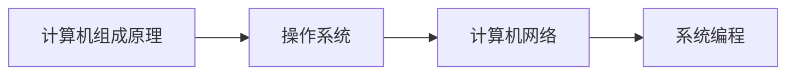

# 计算机基础

本系列文章深入讲解计算机基础知识，帮助读者建立扎实的底层认知。

## 系列文章

### 计算机组成

- [计算机组成原理](/notes/cs/computer-organization) - CPU、内存、总线、I/O 等核心概念

### 操作系统

- [进程与线程](/notes/cs/process-thread) - 进程线程模型、通信方式、调度算法

### 计算机网络

- [TCP/IP 协议](/notes/cs/tcp-ip) - TCP/UDP 协议原理、三次握手四次挥手

### 数据组织

- [数据结构基础](/notes/cs/data-structure) - 线性表、树、图、哈希表等核心数据结构
- [数据库基础](/notes/cs/database) - SQL 语言、关系模型、数据库设计

## 学习路径

## 前置知识

学习本系列文章前，你需要：

- 了解 C 语言基本语法
- 理解指针的概念
- 熟悉 Linux 基本命令

## 相关主题

- [C 语言核心概念](/notes/c/) - C 语言内存管理、存储类
- [嵌入式开发](/notes/embedded/) - 嵌入式系统开发
