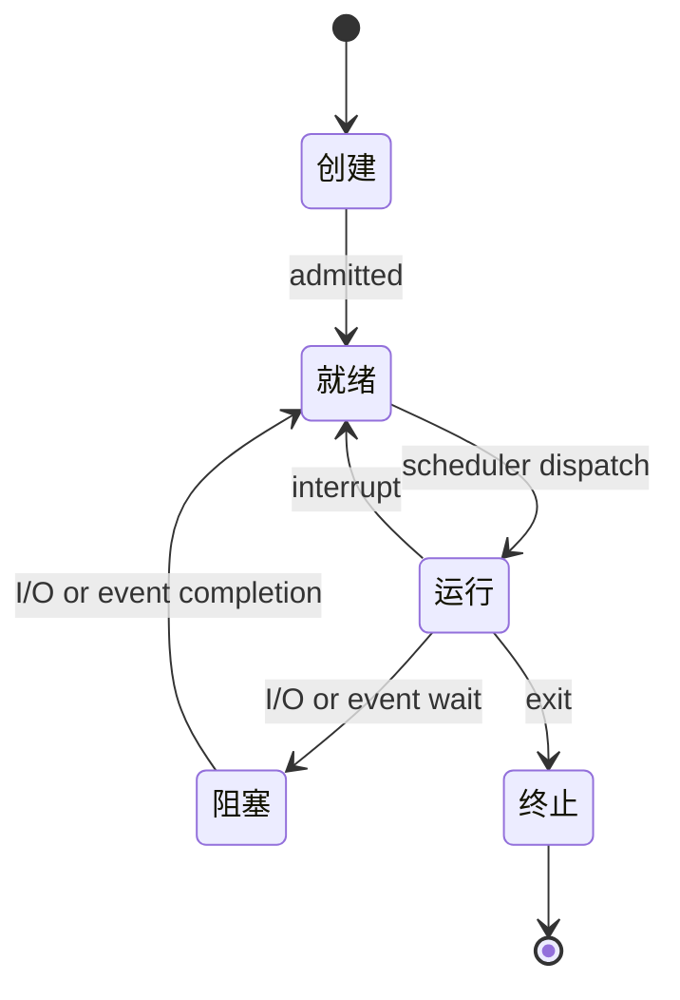

# 进程与线程

## 什么是进程？

进程是**程序的一次执行过程**，是系统进行资源分配和调度的基本单位。每个进程都有独立的内存空间、文件描述符、环境变量等资源。

### 进程的组成

```
┌─────────────────────────────────────────────────────────────┐
│                        进程控制块 (PCB)                      │
│  ┌─────────────────────────────────────────────────────────┐│
│  │ 进程标识符 (PID)                                         ││
│  │ 进程状态（就绪/运行/阻塞）                                ││
│  │ 程序计数器 (PC)                                          ││
│  │ CPU 寄存器                                               ││
│  │ CPU 调度信息（优先级、调度队列指针）                      ││
│  │ 内存管理信息（页表、基地址）                              ││
│  │ I/O 状态信息                                             ││
│  └─────────────────────────────────────────────────────────┘│
├─────────────────────────────────────────────────────────────┤
│                        进程地址空间                          │
│  ┌─────────────────────────────────────────────────────────┐│
│  │ 代码段 (.text)                                          ││
│  ├─────────────────────────────────────────────────────────┤│
│  │ 数据段 (.data/.bss)                                     ││
│  ├─────────────────────────────────────────────────────────┤│
│  │ 堆区 (Heap)                                             ││
│  ├─────────────────────────────────────────────────────────┤│
│  │ 栈区 (Stack)                                            ││
│  └─────────────────────────────────────────────────────────┘│
└─────────────────────────────────────────────────────────────┘
```

上述图示展示了进程的组成结构。

**PCB 关键信息：**

| 字段 | 说明 |
|------|------|
| PID | 进程唯一标识符 |
| 状态 | 就绪、运行、阻塞 |
| PC | 下一条指令地址 |
| 优先级 | 调度优先级 |
| 内存指针 | 页表、代码/数据指针 |
| I/O 状态 | 打开的文件、I/O 设备 |

### 进程状态转换



上述状态图展示了进程的生命周期。

<CollapsibleIframe src="/learning-notes/demos/process/process-state.html" title="进程状态转换可视化" :height="450" />

**状态说明：**

| 状态 | 说明 |
|------|------|
| 创建 | 进程正在创建，分配 PCB |
| 就绪 | 进程已准备好，等待 CPU |
| 运行 | 进程正在执行 |
| 阻塞 | 进程等待 I/O 或事件 |
| 终止 | 进程执行完毕 |

## 什么是线程？

线程是**CPU 调度的基本单位**，是进程中的一个执行流。同一进程的多个线程共享进程的资源。

### 线程与进程的区别

```
进程 A                              进程 B
┌─────────────────────┐            ┌─────────────────────┐
│ 代码段              │            │ 代码段              │
│ 数据段              │            │ 数据段              │
│ 打开的文件          │            │ 打开的文件          │
│ ┌─────┬─────┬─────┐│            │ ┌─────┐            │
│ │线程1│线程2│线程3││            │ │线程1│            │
│ │栈   │栈   │栈   ││            │ │栈   │            │
│ │寄存器│寄存器│寄存器││            │ │寄存器│            │
│ └─────┴─────┴─────┘│            │ └─────┘            │
└─────────────────────┘            └─────────────────────┘
    共享进程资源                        独立进程资源
```

上述图示展示了多线程进程的结构。

**详细对比：**

| 特性 | 进程 | 线程 |
|------|------|------|
| 资源 | 独立地址空间 | 共享进程资源 |
| 通信 | 需要 IPC | 直接读写共享变量 |
| 开销 | 创建/切换开销大 | 创建/切换开销小 |
| 安全性 | 进程隔离，更安全 | 一个线程崩溃可能影响整个进程 |
| 适用场景 | 需要隔离的任务 | 需要频繁通信的任务 |

## 进程通信（IPC）

### 管道

```c
#include <unistd.h>

int pipe(int pipefd[2]);
// pipefd[0]: 读端
// pipefd[1]: 写端

int main(void) {
    int pipefd[2];
    pid_t pid;
    char buf[100];
    
    pipe(pipefd);
    pid = fork();
    
    if (pid == 0) {
        // 子进程：写入数据
        close(pipefd[0]);  // 关闭读端
        write(pipefd[1], "Hello from child", 17);
        close(pipefd[1]);
    } else {
        // 父进程：读取数据
        close(pipefd[1]);  // 关闭写端
        read(pipefd[0], buf, sizeof(buf));
        printf("Parent received: %s\n", buf);
        close(pipefd[0]);
    }
    return 0;
}
```

上述代码展示了管道通信的基本用法。

**管道特点：**

| 特点 | 说明 |
|------|------|
| 单向 | 数据只能单向流动 |
| 亲缘关系 | 只能用于父子进程或兄弟进程 |
| 缓冲区 | 内核缓冲区，大小有限 |
| 阻塞 | 读空管道或写满管道会阻塞 |

### 共享内存

```c
#include <sys/shm.h>

int main(void) {
    key_t key = ftok("/tmp", 'A');
    int shmid = shmget(key, 1024, IPC_CREAT | 0666);
    
    // 附加共享内存
    char *shm = shmat(shmid, NULL, 0);
    
    // 写入数据
    strcpy(shm, "Hello shared memory");
    
    // 分离共享内存
    shmdt(shm);
    
    // 删除共享内存
    shmctl(shmid, IPC_RMID, NULL);
    return 0;
}
```

上述代码展示了共享内存的使用方式。

**IPC 方式对比：**

| 方式 | 速度 | 数据量 | 复杂度 | 适用场景 |
|------|------|--------|--------|----------|
| 管道 | 中 | 小 | 低 | 简单数据流 |
| FIFO | 中 | 小 | 低 | 无亲缘关系进程 |
| 共享内存 | 快 | 大 | 高 | 大量数据交换 |
| 消息队列 | 中 | 中 | 中 | 异步通信 |
| 信号量 | 快 | 无 | 中 | 同步控制 |
| Socket | 慢 | 大 | 高 | 网络通信 |

## 线程同步

### 互斥锁

```c
#include <pthread.h>

pthread_mutex_t mutex = PTHREAD_MUTEX_INITIALIZER;
int counter = 0;

void* thread_func(void *arg) {
    for (int i = 0; i < 10000; i++) {
        pthread_mutex_lock(&mutex);
        counter++;
        pthread_mutex_unlock(&mutex);
    }
    return NULL;
}

int main(void) {
    pthread_t t1, t2;
    
    pthread_create(&t1, NULL, thread_func, NULL);
    pthread_create(&t2, NULL, thread_func, NULL);
    
    pthread_join(t1, NULL);
    pthread_join(t2, NULL);
    
    printf("counter = %d\n", counter);  // 20000
    return 0;
}
```

上述代码展示了互斥锁保护共享变量的用法。

### 条件变量

```c
#include <pthread.h>

pthread_mutex_t mutex = PTHREAD_MUTEX_INITIALIZER;
pthread_cond_t cond = PTHREAD_COND_INITIALIZER;
int ready = 0;

void* producer(void *arg) {
    pthread_mutex_lock(&mutex);
    ready = 1;
    pthread_cond_signal(&cond);
    pthread_mutex_unlock(&mutex);
    return NULL;
}

void* consumer(void *arg) {
    pthread_mutex_lock(&mutex);
    while (!ready) {
        pthread_cond_wait(&cond, &mutex);
    }
    printf("Consumer: ready = %d\n", ready);
    pthread_mutex_unlock(&mutex);
    return NULL;
}
```

上述代码展示了条件变量的使用方式。

**同步机制对比：**

| 机制 | 用途 | 特点 |
|------|------|------|
| 互斥锁 | 保护临界区 | 只有一个线程可以持有 |
| 读写锁 | 读多写少 | 读读并行，写独占 |
| 条件变量 | 等待条件成立 | 需要配合互斥锁使用 |
| 信号量 | 资源计数 | 可以允许多个线程访问 |
| 自旋锁 | 短时间等待 | 忙等待，不释放 CPU |

## 进程调度算法

### 常见调度算法

| 算法 | 说明 | 优点 | 缺点 |
|------|------|------|------|
| FCFS | 先来先服务 | 简单公平 | 护航效应 |
| SJF | 短作业优先 | 平均等待时间最短 | 需要预知执行时间 |
| SRTF | 最短剩余时间优先 | SJF 的抢占版本 | 开销大 |
| 优先级 | 按优先级调度 | 灵活 | 可能饥饿 |
| RR | 时间片轮转 | 公平响应快 | 时间片选择困难 |
| 多级反馈队列 | 多队列 + 动态优先级 | 综合各种优点 | 实现复杂 |

### Linux 进程调度

Linux 使用 **CFS（Completely Fair Scheduler）** 调度器：

```c
// Linux 进程调度策略
#define SCHED_NORMAL    0   // 普通进程，CFS 调度
#define SCHED_FIFO      1   // 实时进程，先进先出
#define SCHED_RR        2   // 实时进程，时间片轮转
#define SCHED_BATCH     3   // 批处理进程
#define SCHED_IDLE      5   // 空闲进程
#define SCHED_DEADLINE  6   // 截止时间调度
```

上述代码展示了 Linux 的调度策略。

**CFS 核心思想：**

- 使用红黑树维护可运行进程
- 按虚拟运行时间（vruntime）排序
- 总是选择 vruntime 最小的进程运行
- 保证每个进程获得公平的 CPU 时间

## 进程创建与终止

### fork 系统调用

```c
#include <unistd.h>
#include <sys/wait.h>

int main(void) {
    pid_t pid = fork();
    
    if (pid < 0) {
        perror("fork failed");
        return 1;
    } else if (pid == 0) {
        // 子进程
        printf("Child process: PID = %d\n", getpid());
        execlp("/bin/ls", "ls", "-l", NULL);
        exit(0);
    } else {
        // 父进程
        printf("Parent process: PID = %d, child PID = %d\n", 
               getpid(), pid);
        wait(NULL);  // 等待子进程结束
        printf("Child process terminated\n");
    }
    return 0;
}
```

上述代码展示了 fork 和 exec 的使用方式。

**fork 特点：**

| 特点 | 说明 |
|------|------|
| 返回值 | 父进程返回子进程 PID，子进程返回 0 |
| 复制 | 复制父进程的地址空间（写时复制） |
| 资源 | 子进程继承父进程的资源 |
| 执行顺序 | 父子进程执行顺序不确定 |

### 写时复制（Copy-on-Write）

```
fork() 之前：
┌─────────────────────────────────────────────────────────────┐
│ 父进程                                                      │
│ 代码段 │ 数据段 │ 堆 │ 栈                                   │
└─────────────────────────────────────────────────────────────┘

fork() 之后（写时复制）：
┌─────────────────────────────────────────────────────────────┐
│ 共享页面（只读）                                             │
│ 代码段 │ 数据段 │ 堆 │ 栈                                   │
└─────────────────────────────────────────────────────────────┘
     ↑                    ↑
     │                    │
┌────┴────┐          ┌────┴────┐
│父进程   │          │子进程   │
│页表     │          │页表     │
└─────────┘          └─────────┘

写入时：
┌─────────────────────────────────────────────────────────────┐
│ 父进程页面                    子进程页面（复制）              │
│ 数据段 │ 堆 │ 栈              数据段 │ 堆 │ 栈               │
└─────────────────────────────────────────────────────────────┘
```

上述图示展示了写时复制的工作原理。

## 总结

| 概念 | 说明 |
|------|------|
| 进程 | 资源分配的基本单位，有独立地址空间 |
| 线程 | CPU 调度的基本单位，共享进程资源 |
| IPC | 进程间通信，包括管道、共享内存、消息队列等 |
| 同步 | 线程同步机制，包括互斥锁、条件变量、信号量等 |
| 调度 | 进程调度算法，Linux 使用 CFS |

## 参考资料

[1] Operating System Concepts. Abraham Silberschatz

[2] Linux Kernel Development. Robert Love

[3] 深入理解 Linux 内核. Daniel P. Bovet

## 相关主题

- [TCP/IP 协议](/notes/cs/tcp-ip) - 网络通信基础
- [RTOS 核心概念](/notes/hardware/rtos) - 实时操作系统
- [内核模块开发](/notes/linux/kernel-module) - Linux 内核编程
