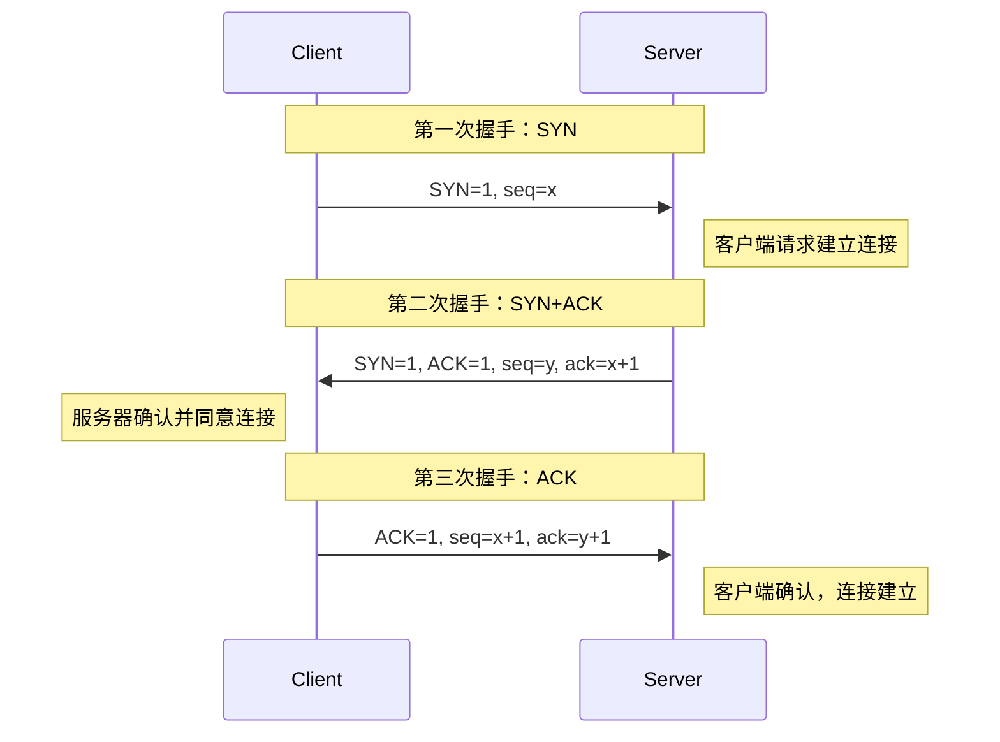
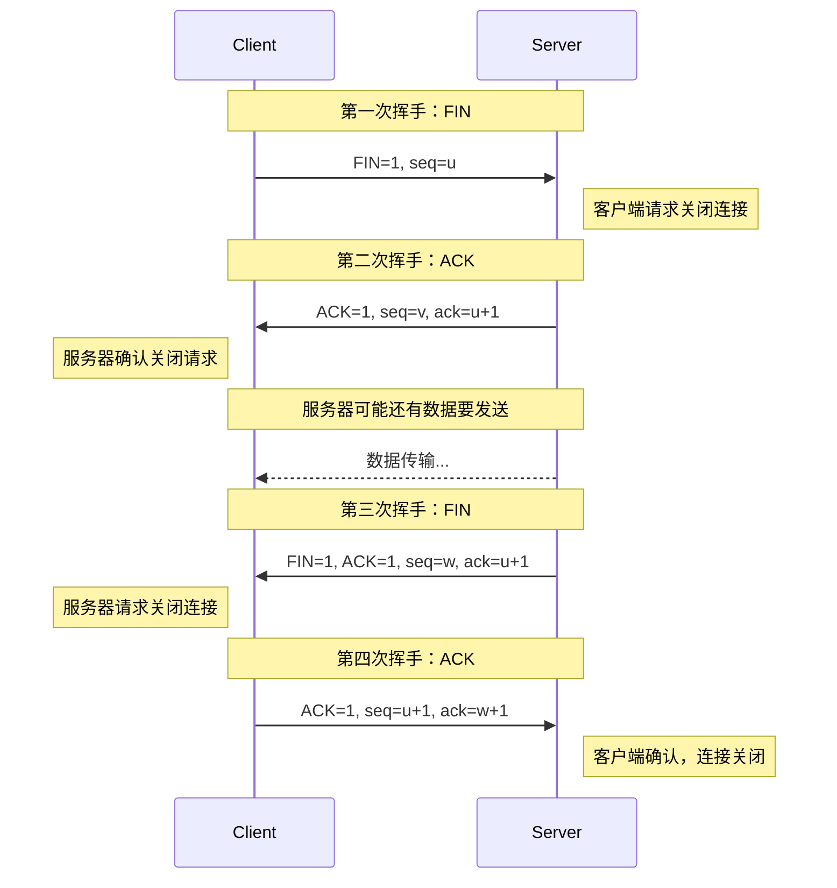
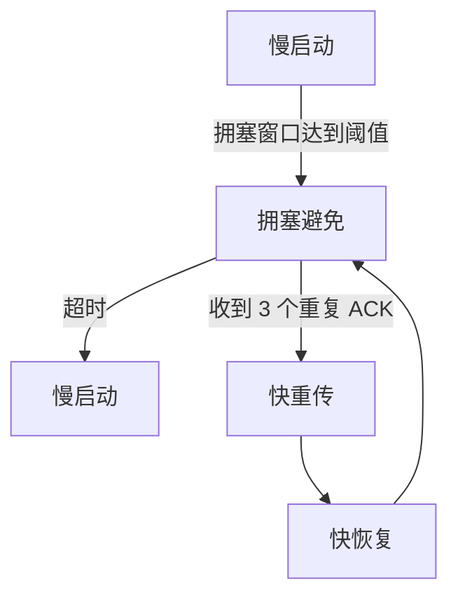

# TCP/IP 协议

## TCP/IP 协议栈

TCP/IP 是互联网的基础协议，采用分层架构：

```
┌─────────────────────────────────────────────────────────────┐
│                    应用层 (Application)                      │
│  HTTP / FTP / SMTP / DNS / SSH                              │
├─────────────────────────────────────────────────────────────┤
│                    传输层 (Transport)                        │
│  TCP / UDP                                                  │
├─────────────────────────────────────────────────────────────┤
│                    网络层 (Network)                          │
│  IP / ICMP / ARP / RARP                                     │
├─────────────────────────────────────────────────────────────┤
│                    数据链路层 (Data Link)                    │
│  Ethernet / WiFi / PPP                                      │
├─────────────────────────────────────────────────────────────┤
│                    物理层 (Physical)                         │
│  双绞线 / 光纤 / 无线电波                                    │
└─────────────────────────────────────────────────────────────┘
```

上述图示展示了 TCP/IP 四层模型。

**各层功能：**

| 层次 | 功能 | 典型协议 |
|------|------|----------|
| 应用层 | 提供网络服务接口 | HTTP、FTP、DNS |
| 传输层 | 端到端通信 | TCP、UDP |
| 网络层 | 路由选择、分组转发 | IP、ICMP、ARP |
| 数据链路层 | 帧传输、MAC 寻址 | Ethernet、WiFi |

## TCP 协议

### TCP 报文格式

```
 0                   1                   2                   3
 0 1 2 3 4 5 6 7 8 9 0 1 2 3 4 5 6 7 8 9 0 1 2 3 4 5 6 7 8 9 0 1
├───────────────────────────────────────────────────────────────┤
│          Source Port          │       Destination Port        │
├───────────────────────────────────────────────────────────────┤
│                        Sequence Number                        │
├───────────────────────────────────────────────────────────────┤
│                    Acknowledgment Number                      │
├───────┬───────┬───────────────┬───────────────────────────────┤
│ Data  │ Reserved│     U     A   P   R   S   F   │          Window            │
│ Offset│      │     R     C   S   S   Y   I   │                            │
│       │      │     G     K   H   T   N   N   │                            │
├───────────────────────────────────────────────────────────────┤
│           Checksum            │         Urgent Pointer        │
├───────────────────────────────────────────────────────────────┤
│                    Options (if present)                       │
├───────────────────────────────────────────────────────────────┤
│                           Data                                │
└───────────────────────────────────────────────────────────────┘
```

上述图示展示了 TCP 报文格式。

**关键字段说明：**

| 字段 | 大小 | 说明 |
|------|------|------|
| Source/Dest Port | 各 16 位 | 源/目的端口 |
| Sequence Number | 32 位 | 序列号，数据字节流编号 |
| Ack Number | 32 位 | 确认号，期望收到的下一个序列号 |
| Data Offset | 4 位 | TCP 头部长度 |
| Flags | 6 位 | 控制标志（SYN/ACK/FIN/RST 等） |
| Window | 16 位 | 接收窗口大小 |
| Checksum | 16 位 | 校验和 |

### TCP 三次握手



上述时序图展示了 TCP 三次握手过程。

**为什么需要三次握手？**

| 原因 | 说明 |
|------|------|
| 防止历史连接 | 避免延迟的 SYN 报文导致错误连接 |
| 同步序列号 | 双方都需要确认对方的初始序列号 |
| 防止重复连接 | 确保双方都准备好建立连接 |

**三次握手状态变化：**

```
客户端状态变化：
CLOSED → SYN_SENT → ESTABLISHED

服务器状态变化：
CLOSED → LISTEN → SYN_RCVD → ESTABLISHED
```

### TCP 四次挥手



上述时序图展示了 TCP 四次挥手过程。

**为什么需要四次挥手？**

| 原因 | 说明 |
|------|------|
| 半关闭状态 | TCP 是全双工，每个方向需要单独关闭 |
| 服务器可能还有数据 | 服务器收到 FIN 后可能还有数据要发送 |
| 确保数据完整 | 确保双方都完成数据发送 |

**四次挥手状态变化：**

```
客户端状态变化：
ESTABLISHED → FIN_WAIT_1 → FIN_WAIT_2 → TIME_WAIT → CLOSED

服务器状态变化：
ESTABLISHED → CLOSE_WAIT → LAST_ACK → CLOSED
```

**TIME_WAIT 状态：**

| 问题 | 说明 |
|------|------|
| 为什么需要 | 确保最后的 ACK 到达服务器 |
| 持续时间 | 2MSL（Maximum Segment Lifetime） |
| 过多影响 | 占用端口资源，可能导致端口耗尽 |

### TCP 滑动窗口

滑动窗口实现流量控制，防止发送方发送过快导致接收方缓冲区溢出：

```
发送方窗口：
┌─────────────────────────────────────────────────────────────┐
│                    发送窗口                                  │
│  ┌─────────────────────────────────────────────────────────┐│
│  │  已发送未确认  │  可发送未发送  │  不可发送              ││
│  │  ┌───┬───┬───┐│  ┌───┬───┬───┐│                        ││
│  │  │ 1 │ 2 │ 3 ││  │ 4 │ 5 │ 6 ││                        ││
│  │  └───┴───┴───┘│  └───┴───┴───┘│                        ││
│  └─────────────────────────────────────────────────────────┘│
│        ↑                    ↑                               │
│     窗口左边界           窗口右边界                          │
└─────────────────────────────────────────────────────────────┘

接收方窗口：
┌─────────────────────────────────────────────────────────────┐
│  ┌─────────────────────────────────────────────────────────┐│
│  │  已接收确认  │  接收窗口  │  缓冲区                      ││
│  │  ┌───┬───┬───┐│           │                              ││
│  │  │ 1 │ 2 │ 3 ││           │                              ││
│  │  └───┴───┴───┘│           │                              ││
│  └─────────────────────────────────────────────────────────┘│
└─────────────────────────────────────────────────────────────┘
```

上述图示展示了滑动窗口的工作原理。

**窗口控制机制：**

| 机制 | 说明 |
|------|------|
| 窗口通告 | 接收方通过 Window 字段告知发送方可用缓冲区 |
| 零窗口 | 接收方缓冲区满时，Window=0，发送方停止发送 |
| 窗口探测 | 发送方定期发送探测报文，检测窗口是否恢复 |

### TCP 拥塞控制

拥塞控制防止过多的数据注入网络，避免网络拥塞：



上述流程图展示了 TCP 拥塞控制的状态转换。

**四种算法：**

| 算法 | 说明 |
|------|------|
| 慢启动 | cwnd 从 1 开始指数增长，直到达到 ssthresh |
| 拥塞避免 | cwnd 线性增长，每个 RTT 加 1 |
| 快重传 | 收到 3 个重复 ACK 立即重传，不等超时 |
| 快恢复 | 快重传后，cwnd 减半，进入拥塞避免 |

**拥塞窗口变化示例：**

```
轮次:   1   2   3   4   5   6   7   8   9   10  11  12  ...
cwnd:   1   2   4   8   16  17  18  19  10  11  12  13  ...
        ↑               ↑   ↑           ↑
      慢启动          拥塞避免       快恢复
                    (ssthresh=16)  (超时，ssthresh=10)
```

上述示例展示了拥塞窗口的变化过程。

## UDP 协议

### UDP 报文格式

```
 0                   1                   2                   3
 0 1 2 3 4 5 6 7 8 9 0 1 2 3 4 5 6 7 8 9 0 1 2 3 4 5 6 7 8 9 0 1
├───────────────────────────────────────────────────────────────┤
│          Source Port          │       Destination Port        │
├───────────────────────────────────────────────────────────────┤
│            Length             │           Checksum            │
├───────────────────────────────────────────────────────────────┤
│                           Data                                │
└───────────────────────────────────────────────────────────────┘
```

上述图示展示了 UDP 报文格式。

**UDP 特点：**

| 特点 | 说明 |
|------|------|
| 无连接 | 不需要建立连接，直接发送 |
| 不可靠 | 不保证交付，不保证顺序 |
| 无拥塞控制 | 网络拥塞时不会降低发送速率 |
| 开销小 | 头部只有 8 字节 |
| 支持广播 | 可以发送广播和组播 |

### TCP vs UDP

| 特性 | TCP | UDP |
|------|-----|-----|
| 连接 | 面向连接 | 无连接 |
| 可靠性 | 可靠传输 | 不可靠 |
| 顺序 | 有序 | 无序 |
| 流量控制 | 有 | 无 |
| 拥塞控制 | 有 | 无 |
| 头部开销 | 20 字节 | 8 字节 |
| 适用场景 | 文件传输、邮件 | 视频流、DNS、游戏 |

## Socket 编程

### TCP Socket 编程

```c
#include <sys/socket.h>
#include <netinet/in.h>
#include <unistd.h>

// 服务器端
int server_fd = socket(AF_INET, SOCK_STREAM, 0);

struct sockaddr_in addr = {
    .sin_family = AF_INET,
    .sin_port = htons(8080),
    .sin_addr.s_addr = INADDR_ANY
};

bind(server_fd, (struct sockaddr*)&addr, sizeof(addr));
listen(server_fd, 5);

struct sockaddr_in client_addr;
socklen_t client_len = sizeof(client_addr);
int client_fd = accept(server_fd, (struct sockaddr*)&client_addr, &client_len);

char buffer[1024];
int n = read(client_fd, buffer, sizeof(buffer));
write(client_fd, buffer, n);

close(client_fd);
close(server_fd);

// 客户端
int sock = socket(AF_INET, SOCK_STREAM, 0);

struct sockaddr_in server_addr = {
    .sin_family = AF_INET,
    .sin_port = htons(8080),
    .sin_addr.s_addr = inet_addr("127.0.0.1")
};

connect(sock, (struct sockaddr*)&server_addr, sizeof(server_addr));

write(sock, "Hello", 5);
char buffer[1024];
int n = read(sock, buffer, sizeof(buffer));

close(sock);
```

上述代码展示了 TCP Socket 编程的基本流程。

**Socket API 说明：**

| 函数 | 说明 |
|------|------|
| `socket()` | 创建 Socket |
| `bind()` | 绑定地址和端口 |
| `listen()` | 监听连接 |
| `accept()` | 接受连接 |
| `connect()` | 发起连接 |
| `read()/write()` | 读写数据 |
| `close()` | 关闭 Socket |

### UDP Socket 编程

```c
// 服务器端
int sock = socket(AF_INET, SOCK_DGRAM, 0);

struct sockaddr_in addr = {
    .sin_family = AF_INET,
    .sin_port = htons(8080),
    .sin_addr.s_addr = INADDR_ANY
};

bind(sock, (struct sockaddr*)&addr, sizeof(addr));

char buffer[1024];
struct sockaddr_in client_addr;
socklen_t client_len = sizeof(client_addr);

int n = recvfrom(sock, buffer, sizeof(buffer), 0,
                 (struct sockaddr*)&client_addr, &client_len);
sendto(sock, buffer, n, 0,
       (struct sockaddr*)&client_addr, client_len);

close(sock);

// 客户端
int sock = socket(AF_INET, SOCK_DGRAM, 0);

struct sockaddr_in server_addr = {
    .sin_family = AF_INET,
    .sin_port = htons(8080),
    .sin_addr.s_addr = inet_addr("127.0.0.1")
};

sendto(sock, "Hello", 5, 0,
       (struct sockaddr*)&server_addr, sizeof(server_addr));

char buffer[1024];
int n = recvfrom(sock, buffer, sizeof(buffer), 0, NULL, NULL);

close(sock);
```

上述代码展示了 UDP Socket 编程的基本流程。

## 网络编程模型

### I/O 多路复用

```c
#include <sys/select.h>

fd_set readfds;
struct timeval timeout;

while (1) {
    FD_ZERO(&readfds);
    FD_SET(sock1, &readfds);
    FD_SET(sock2, &readfds);
    
    timeout.tv_sec = 5;
    timeout.tv_usec = 0;
    
    int ret = select(max(sock1, sock2) + 1, &readfds, NULL, NULL, &timeout);
    
    if (ret > 0) {
        if (FD_ISSET(sock1, &readfds)) {
            // sock1 可读
        }
        if (FD_ISSET(sock2, &readfds)) {
            // sock2 可读
        }
    }
}
```

上述代码展示了 select 多路复用的使用方式。

**I/O 多路复用对比：**

| 方式 | 最大连接数 | 效率 | 特点 |
|------|------------|------|------|
| select | 1024 | O(n) | 跨平台，效率低 |
| poll | 无限制 | O(n) | 无最大连接数限制 |
| epoll | 无限制 | O(1) | Linux 特有，高效 |

### epoll 编程

```c
#include <sys/epoll.h>

int epfd = epoll_create1(0);

struct epoll_event ev;
ev.events = EPOLLIN;
ev.data.fd = listen_sock;
epoll_ctl(epfd, EPOLL_CTL_ADD, listen_sock, &ev);

struct epoll_event events[100];
while (1) {
    int nfds = epoll_wait(epfd, events, 100, -1);
    
    for (int i = 0; i < nfds; i++) {
        if (events[i].data.fd == listen_sock) {
            // 新连接
            int client_sock = accept(listen_sock, NULL, NULL);
            ev.events = EPOLLIN | EPOLLET;  // 边缘触发
            ev.data.fd = client_sock;
            epoll_ctl(epfd, EPOLL_CTL_ADD, client_sock, &ev);
        } else {
            // 读取数据
            read(events[i].data.fd, buffer, sizeof(buffer));
        }
    }
}
```

上述代码展示了 epoll 的使用方式。

**epoll 工作模式：**

| 模式 | 说明 | 特点 |
|------|------|------|
| LT (Level Triggered) | 水平触发 | 默认模式，只要可读就一直触发 |
| ET (Edge Triggered) | 边缘触发 | 状态变化时触发，需一次性读完 |

## 总结

| 概念 | 说明 |
|------|------|
| TCP | 面向连接、可靠传输、流量控制、拥塞控制 |
| UDP | 无连接、不可靠、开销小、支持广播 |
| 三次握手 | SYN → SYN+ACK → ACK |
| 四次挥手 | FIN → ACK → FIN → ACK |
| 滑动窗口 | 流量控制，防止接收方缓冲区溢出 |
| 拥塞控制 | 慢启动、拥塞避免、快重传、快恢复 |

## 参考资料

[1] Computer Networking: A Top-Down Approach. James F. Kurose

[2] TCP/IP Illustrated. W. Richard Stevens

[3] UNIX Network Programming. W. Richard Stevens

## 相关主题

- [进程与线程](/notes/cs/process-thread) - 操作系统核心概念
- [RTOS 核心概念](/notes/hardware/rtos) - 实时操作系统
- [网络编程](/notes/embedded/network) - 嵌入式网络通信
