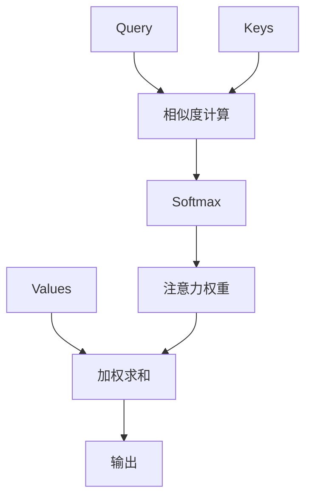

# 注意力机制详解

> 阅读时长：约 15 分钟
> 难度等级：中级
> 读完你将学会：理解注意力机制原理、手动实现注意力计算、掌握 Self-Attention

## 要点速览

> - 注意力机制让模型**关注重要信息**，忽略无关信息
> - 核心公式：$\text{Attention}(Q, K, V) = \text{softmax}(\frac{QK^T}{\sqrt{d_k}})V$
> - Self-Attention 让序列中的每个位置**关注其他所有位置**
> - 注意力权重可视化可以解释模型决策

## 前置知识

阅读本文前，你需要了解：

- [LSTM 与 GRU](/notes/deep-learning/lstm) - 序列建模基础
- 基本的矩阵运算

本文不假设你了解：

- Transformer 架构
- 任何深度学习框架

***

<CollapsibleIframe src="/learning-notes/demos/attention/attention.html" title="注意力机制可视化" :height="400" />

## 一、为什么需要注意力机制？

### Seq2Seq 的问题

传统的 Seq2Seq 模型将整个输入序列压缩成一个固定长度的向量：

```
输入: "我 喜欢 学习 深度 学习"
        ↓
编码器 LSTM
        ↓
固定向量 (如 256 维)
        ↓
解码器 LSTM
        ↓
输出: "I like learning deep learning"
```

**问题：信息瓶颈**

```python
# 传统 Seq2Seq
encoder_hidden = encoder(input_sequence)  # 所有信息压缩到一个向量
decoder_output = decoder(encoder_hidden)  # 解码器只能看到这个向量
```

**解释：**
- 长序列的信息无法完全压缩到固定向量
- 解码器无法"回头看"输入序列
- 长距离依赖难以建模

### 注意力的直觉

类比：阅读理解时，你会反复"回头看"文章的关键部分。

```
翻译任务:
输入: "我 喜欢 学习 深度 学习"
输出: "I like learning deep learning"

当翻译 "deep" 时，应该重点关注 "深度"
当翻译 "learning" 时，应该重点关注 "学习"
```

**核心思想：解码时动态关注输入序列的不同部分。**

***

## 二、注意力机制原理

### 2.1 基本概念

注意力机制涉及三个核心概念：

| 概念 | 符号 | 含义 |
|------|------|------|
| 查询 | Q (Query) | 当前需要什么信息 |
| 键 | K (Key) | 每个位置的特征标签 |
| 值 | V (Value) | 每个位置的实际内容 |

**类比理解：**

```
图书馆检索系统:
- Query: 你想找什么书（如"深度学习"）
- Key: 书的标签/分类（如"计算机科学"、"机器学习"）
- Value: 书的实际内容

注意力 = Query 与 Key 的匹配程度 × Value
```

### 2.2 注意力计算步骤



**第一步：计算相似度**

```python
scores = Q @ K.T
```

**解释：**
- `Q` 形状 `(1, d)` 或 `(seq_len_q, d)`
- `K.T` 形状 `(d, seq_len_k)`
- `scores` 形状 `(seq_len_q, seq_len_k)`
- 点积衡量 Query 和每个 Key 的相似度

**第二步：缩放**

```python
scores = scores / np.sqrt(d_k)
```

**解释：**
- `d_k` 是 Key 的维度
- 缩放防止点积值过大
- 使 softmax 梯度更稳定

**第三步：Softmax 归一化**

```python
attention_weights = softmax(scores, axis=-1)
```

**解释：**
- Softmax 将分数转换为概率分布
- 所有权重和为 1
- 高相似度 → 高权重

**第四步：加权求和**

```python
output = attention_weights @ V
```

**解释：**
- `V` 形状 `(seq_len_k, d_v)`
- 输出是 Value 的加权平均
- 高权重的 Value 贡献更大

### 2.3 完整实现

```python
import numpy as np

def softmax(x, axis=-1):
    """Softmax 函数"""
    exp_x = np.exp(x - np.max(x, axis=axis, keepdims=True))
    return exp_x / np.sum(exp_x, axis=axis, keepdims=True)

def attention(Q, K, V):
    """
    缩放点积注意力
    
    参数:
        Q: Query (seq_len_q, d_k)
        K: Key (seq_len_k, d_k)
        V: Value (seq_len_k, d_v)
    
    返回:
        output: 注意力输出 (seq_len_q, d_v)
        weights: 注意力权重 (seq_len_q, seq_len_k)
    """
    d_k = Q.shape[-1]
    
    # 计算相似度分数
    scores = Q @ K.T / np.sqrt(d_k)
    
    # Softmax 得到权重
    weights = softmax(scores, axis=-1)
    
    # 加权求和
    output = weights @ V
    
    return output, weights
```

**参数说明：**

| 参数 | 形状 | 说明 |
|------|------|------|
| `Q` | (seq_len_q, d_k) | 查询序列 |
| `K` | (seq_len_k, d_k) | 键序列 |
| `V` | (seq_len_k, d_v) | 值序列 |
| `output` | (seq_len_q, d_v) | 注意力输出 |
| `weights` | (seq_len_q, seq_len_k) | 注意力权重矩阵 |

### 2.4 数值示例

```python
# 示例：简单注意力计算
Q = np.array([[1, 0, 0]])      # Query: 关注第一个维度
K = np.array([[1, 0, 0],       # Key 1: 与 Query 相似
              [0, 1, 0],       # Key 2: 与 Query 不相似
              [0.5, 0, 0]])    # Key 3: 与 Query 部分相似
V = np.array([[10, 20],        # Value 1
              [30, 40],        # Value 2
              [50, 60]])       # Value 3

output, weights = attention(Q, K, V)
```

**解释：**
- Query 与 Key 1 最相似（点积=1）
- Query 与 Key 2 不相似（点积=0）
- Query 与 Key 3 部分相似（点积=0.5）

---

```python
print(f"注意力权重: {weights}")
```

**解释：**
- 输出类似 `[0.50, 0.12, 0.38]`
- Key 1 权重最高，Key 2 权重最低

---

```python
print(f"输出: {output}")
```

**解释：**
- 输出是 Value 的加权平均
- 主要来自 Value 1 和 Value 3

**注意力权重可视化：**

```
Query: [1, 0, 0]

Keys:          相似度    Softmax权重
[1, 0, 0]   →   1.0   →   0.50  ████████████████
[0, 1, 0]   →   0.0   →   0.12  ████
[0.5, 0, 0] →   0.5   →   0.38  ███████████

输出 = 0.50×[10,20] + 0.12×[30,40] + 0.38×[50,60]
     = [5,10] + [3.6,4.8] + [19,22.8]
     = [27.6, 37.6]
```

### 本节要点

> **记住这三点：**
> 1. 注意力 = Query 与 Key 的相似度 × Value
> 2. Softmax 确保权重和为 1
> 3. 缩放因子 `1/√d_k` 防止梯度消失

***

## 三、Self-Attention（自注意力）

### 3.1 核心思想

Self-Attention 让序列中的每个位置关注其他所有位置：

```
输入序列: [我, 喜欢, 学习]

"我" 关注: 自己(高) + "喜欢"(中) + "学习"(低)
"喜欢" 关注: "我"(中) + 自己(高) + "学习"(中)
"学习" 关注: "我"(低) + "喜欢"(中) + 自己(高)
```

**关键：Q、K、V 都来自同一个输入序列。**

### 3.2 计算过程

```python
# 输入序列
X = np.array([
    [1, 0, 0, 0],  # "我"
    [0, 1, 0, 0],  # "喜欢"
    [0, 0, 1, 0]   # "学习"
])  # shape: (3, 4)
```

**解释：**
- 输入是 3 个词，每个词 4 维向量
- 这里用 one-hot 表示，实际中用词嵌入

---

```python
# 定义投影矩阵
W_Q = np.random.randn(4, 3)  # 输入维度 → Query 维度
W_K = np.random.randn(4, 3)  # 输入维度 → Key 维度
W_V = np.random.randn(4, 3)  # 输入维度 → Value 维度
```

**解释：**
- 三个投影矩阵是可学习的参数
- 将输入投影到不同的表示空间

---

```python
# 计算 Q, K, V
Q = X @ W_Q  # shape: (3, 3)
K = X @ W_K  # shape: (3, 3)
V = X @ W_V  # shape: (3, 3)
```

**解释：**
- 每个输入位置都生成自己的 Q、K、V
- Q 用于查询其他位置
- K 用于被其他位置查询
- V 是要传递的信息

---

```python
# Self-Attention
output, weights = attention(Q, K, V)
```

**解释：**
- 使用之前定义的 `attention` 函数
- 输出形状 `(3, 3)`，每个位置一个输出向量

**Self-Attention 数据流：**

```
输入 X (3, 4)
    │
    ├── W_Q → Q (3, 3)
    │         │
    ├── W_K → K (3, 3) ──→ QK^T/√d ──→ Softmax ──→ 权重 (3, 3)
    │         │                                              │
    └── W_V → V (3, 3) ──────────────────────────────────────→ 加权求和
                                                               │
                                                               ▼
                                                         输出 (3, 3)
```

### 3.3 完整 Self-Attention 实现

```python
class SelfAttention:
    """
    Self-Attention 实现
    """
    
    def __init__(self, input_size, hidden_size):
        self.input_size = input_size
        self.hidden_size = hidden_size
        
        # 投影矩阵
        self.W_Q = np.random.randn(input_size, hidden_size) * 0.1
        self.W_K = np.random.randn(input_size, hidden_size) * 0.1
        self.W_V = np.random.randn(input_size, hidden_size) * 0.1
        
        # 输出投影
        self.W_O = np.random.randn(hidden_size, hidden_size) * 0.1
    
    def forward(self, X):
        """
        前向传播
        
        参数:
            X: 输入序列 (seq_len, input_size)
        
        返回:
            output: 注意力输出 (seq_len, hidden_size)
            weights: 注意力权重 (seq_len, seq_len)
        """
        # 计算 Q, K, V
        Q = X @ self.W_Q
        K = X @ self.W_K
        V = X @ self.W_V
        
        # 注意力计算
        output, weights = attention(Q, K, V)
        
        # 输出投影
        output = output @ self.W_O
        
        return output, weights
```

**参数说明：**

| 参数 | 形状 | 说明 |
|------|------|------|
| `W_Q` | (input_size, hidden_size) | Query 投影 |
| `W_K` | (input_size, hidden_size) | Key 投影 |
| `W_V` | (input_size, hidden_size) | Value 投影 |
| `W_O` | (hidden_size, hidden_size) | 输出投影 |

### 本节要点

> **记住这三点：**
> 1. Self-Attention 的 Q、K、V 都来自同一输入
> 2. 每个位置可以关注所有其他位置
> 3. 时间复杂度 O(n²)，n 是序列长度

***

## 四、多头注意力

### 4.1 核心思想

多头注意力让模型同时关注不同的子空间：

```
单头: 只能学习一种"关注模式"
多头: 可以学习多种"关注模式"

例如:
- 头1: 关注语法关系
- 头2: 关注语义关系
- 头3: 关注位置关系
```

### 4.2 计算过程

```python
def multi_head_attention(X, n_heads, W_Q_list, W_K_list, W_V_list, W_O):
    """
    多头注意力
    
    参数:
        X: 输入 (seq_len, input_size)
        n_heads: 头数量
        W_Q_list: 每个头的 Query 投影矩阵列表
        W_K_list: 每个头的 Key 投影矩阵列表
        W_V_list: 每个头的 Value 投影矩阵列表
        W_O: 输出投影矩阵
    """
    head_outputs = []
    head_weights = []
    
    for i in range(n_heads):
        # 每个头独立计算注意力
        Q = X @ W_Q_list[i]
        K = X @ W_K_list[i]
        V = X @ W_V_list[i]
        
        output, weights = attention(Q, K, V)
        head_outputs.append(output)
        head_weights.append(weights)
    
    # 拼接所有头的输出
    concat = np.concatenate(head_outputs, axis=-1)
    
    # 输出投影
    final_output = concat @ W_O
    
    return final_output, head_weights
```

**解释：**
- 每个头有独立的投影矩阵
- 各头并行计算注意力
- 最后拼接并通过线性层

**多头注意力图示：**

```
输入 X
    │
    ├─────┬─────┬─────┐
    ▼     ▼     ▼     ▼
  头1   头2   头3   头4
    │     │     │     │
    ▼     ▼     ▼     ▼
  注意  注意  注意  注意
    │     │     │     │
    └─────┴─────┴─────┘
          │
          ▼
       拼接 (Concat)
          │
          ▼
       线性投影 (W_O)
          │
          ▼
        输出
```

### 本节要点

> **记住这三点：**
> 1. 多头注意力 = 多个独立的注意力头
> 2. 每个头学习不同的关注模式
> 3. 头的数量通常是 8 或 16

***

## 五、注意力机制的应用

### 5.1 机器翻译

```python
# Seq2Seq with Attention
class Seq2SeqAttention:
    """
    带注意力的序列到序列模型
    """
    
    def __init__(self, src_vocab_size, tgt_vocab_size, hidden_size):
        self.hidden_size = hidden_size
        
        # 编码器
        self.encoder_embedding = np.random.randn(src_vocab_size, hidden_size) * 0.1
        self.encoder_lstm = LSTMCell(hidden_size, hidden_size)
        
        # 解码器
        self.decoder_embedding = np.random.randn(tgt_vocab_size, hidden_size) * 0.1
        self.decoder_lstm = LSTMCell(hidden_size, hidden_size)
        
        # 注意力
        self.W_Q = np.random.randn(hidden_size, hidden_size) * 0.1
        self.W_K = np.random.randn(hidden_size, hidden_size) * 0.1
        self.W_V = np.random.randn(hidden_size, hidden_size) * 0.1
        
        # 输出层
        self.W_out = np.random.randn(hidden_size, tgt_vocab_size) * 0.1
    
    def encode(self, src_sequence):
        """编码源序列"""
        encoder_outputs = []
        h, c = np.zeros(self.hidden_size), np.zeros(self.hidden_size)
        
        for token in src_sequence:
            x = self.encoder_embedding[token]
            h, c = self.encoder_lstm.forward(x, h, c)
            encoder_outputs.append(h)
        
        return np.array(encoder_outputs), (h, c)
    
    def decode_step(self, tgt_token, h, c, encoder_outputs):
        """解码一步"""
        x = self.decoder_embedding[tgt_token]
        h, c = self.decoder_lstm.forward(x, h, c)
        
        # 注意力
        Q = h @ self.W_Q
        K = encoder_outputs @ self.W_K
        V = encoder_outputs @ self.W_V
        
        context, _ = attention(Q.reshape(1, -1), K, V)
        context = context.reshape(-1)
        
        # 结合上下文
        output = np.tanh(h + context)
        output = output @ self.W_out
        
        return output, h, c
```

**解释：**
- 编码器处理源序列，保存所有隐藏状态
- 解码时，用注意力从编码器输出中提取信息
- 上下文向量与解码器状态结合生成输出

### 5.2 文本分类

```python
# 注意力池化用于文本分类
class AttentionPooling:
    """
    注意力池化：对序列进行加权求和
    """
    
    def __init__(self, hidden_size):
        self.W = np.random.randn(hidden_size, 1) * 0.1
    
    def forward(self, H):
        """
        参数:
            H: 序列表示 (seq_len, hidden_size)
        
        返回:
            output: 池化后的表示 (hidden_size,)
            weights: 注意力权重 (seq_len,)
        """
        # 计算每个位置的重要性分数
        scores = H @ self.W  # (seq_len, 1)
        
        # Softmax
        weights = softmax(scores, axis=0).flatten()
        
        # 加权求和
        output = np.sum(H * weights.reshape(-1, 1), axis=0)
        
        return output, weights
```

**解释：**
- 学习每个位置的重要性
- 重要词获得更高权重
- 加权求和得到句子表示

### 本节要点

> **记住这三点：**
> 1. 注意力可以替代固定向量编码
> 2. 注意力权重可以解释模型决策
> 3. 注意力池化优于简单平均池化

***

## 六、总结

### 核心公式

$$
\text{Attention}(Q, K, V) = \text{softmax}\left(\frac{QK^T}{\sqrt{d_k}}\right)V
$$

### 注意力类型对比

| 类型 | Q 来源 | K 来源 | V 来源 | 应用场景 |
|------|--------|--------|--------|---------|
| 编码器-解码器注意力 | 解码器 | 编码器 | 编码器 | 机器翻译 |
| Self-Attention | 输入本身 | 输入本身 | 输入本身 | Transformer |
| 掩码注意力 | 输入本身 | 输入本身 | 输入本身 | GPT 生成 |

## 更新日志

| 日期 | 内容 |
|------|------|
| 2026-03-28 | 初稿发布 |

## 相关主题

- [LSTM 与 GRU](/notes/deep-learning/lstm) - 序列建模基础
- [Transformer 架构](/notes/deep-learning/transformer) - 注意力的完整应用
