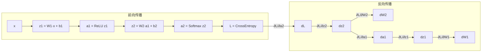

# 前向传播与反向传播

> 阅读时长：约 15 分钟
> 难度等级：中级
> 读完你将学会：理解前向/反向传播的完整流程、掌握链式法则、理解梯度的传递机制

## 要点速览

> - **前向传播**：数据从输入层流向输出层，每层执行线性变换 + 激活
> - **反向传播**：梯度从输出层流向输入层，利用链式法则逐层计算
> - 核心公式：$\frac{\partial L}{\partial W^{[l]}} = \delta^{[l]} (a^{[l-1]})^T$

## 前置知识

阅读本文前，你需要了解：

- [线性层](/notes/deep-learning/linear-layer) - 线性变换
- [激活函数](/notes/deep-learning/activation-functions) - 非线性变换

本文不假设你了解：

- 复杂的微积分推导
- 任何深度学习框架

***

## 前向传播

### 什么是前向传播？

前向传播（Forward Propagation）是指数据从输入层经过各隐藏层，最终到达输出层的过程。

### 单层前向传播

对于第 $l$ 层：

$$
\begin{aligned}
z^{[l]} &= W^{[l]} a^{[l-1]} + b^{[l]} & \text{(线性变换)} \\
a^{[l]} &= \sigma^{[l]}(z^{[l]}) & \text{(激活函数)}
\end{aligned}
$$

**维度分析：**

| 符号 | 维度 | 说明 |
|------|------|------|
| $a^{[l-1]}$ | $(n^{[l-1]}, 1)$ | 上一层的激活输出 |
| $W^{[l]}$ | $(n^{[l]}, n^{[l-1]})$ | 当前层权重 |
| $b^{[l]}$ | $(n^{[l]}, 1)$ | 当前层偏置 |
| $z^{[l]}$ | $(n^{[l]}, 1)$ | 线性变换结果 |
| $a^{[l]}$ | $(n^{[l]}, 1)$ | 当前层激活输出 |

### 批量前向传播

对于批量数据，使用矩阵运算：

$$
Z^{[l]} = W^{[l]} A^{[l-1]} + b^{[l]}
$$

其中 $A^{[l-1]} \in \mathbb{R}^{n^{[l-1]} \times m}$，$m$ 是批量大小。

```python
# 片段：前向传播核心代码
z = W @ a_prev + b    # 线性变换
a = activation(z)     # 激活函数
```

### 前向传播可视化

<CollapsibleIframe src="/learning-notes/demos/forward-backward/forward-propagation.html" title="前向传播可视化" :height="500" />

***

## 反向传播

### 什么是反向传播？

反向传播（Backpropagation）利用**链式法则**，从输出层向输入层逐层计算梯度。

### 链式法则

链式法则是反向传播的核心：

$$
\frac{\partial L}{\partial w} = \frac{\partial L}{\partial y} \cdot \frac{\partial y}{\partial z} \cdot \frac{\partial z}{\partial w}
$$

### 完整推导

考虑一个简单的两层网络：

$$
\begin{aligned}
z^{[1]} &= W^{[1]} x + b^{[1]} \\
a^{[1]} &= \text{ReLU}(z^{[1]}) \\
z^{[2]} &= W^{[2]} a^{[1]} + b^{[2]} \\
a^{[2]} &= \text{Softmax}(z^{[2]}) \\
L &= -\sum y \log(a^{[2]})
\end{aligned}
$$

**输出层梯度：**

$$
\begin{aligned}
\frac{\partial L}{\partial z^{[2]}} &= a^{[2]} - y \quad \text{(Softmax + Cross-Entropy 简化)} \\
\frac{\partial L}{\partial W^{[2]}} &= \frac{\partial L}{\partial z^{[2]}} \cdot (a^{[1]})^T \\
\frac{\partial L}{\partial b^{[2]}} &= \frac{\partial L}{\partial z^{[2]}}
\end{aligned}
$$

**隐藏层梯度：**

$$
\begin{aligned}
\frac{\partial L}{\partial a^{[1]}} &= (W^{[2]})^T \frac{\partial L}{\partial z^{[2]}} \\
\frac{\partial L}{\partial z^{[1]}} &= \frac{\partial L}{\partial a^{[1]}} \odot \text{ReLU}'(z^{[1]}) \\
\frac{\partial L}{\partial W^{[1]}} &= \frac{\partial L}{\partial z^{[1]}} \cdot x^T \\
\frac{\partial L}{\partial b^{[1]}} &= \frac{\partial L}{\partial z^{[1]}}
\end{aligned}
$$

其中 $\odot$ 表示逐元素乘法（Hadamard 积）。

```python
# 片段：反向传播核心代码
# 输出层梯度
delta = y_pred - y_true

# 权重梯度
dW = delta @ a_prev.T / m

# 偏置梯度
db = np.mean(delta, axis=1, keepdims=True)

# 传递梯度到前一层
delta_prev = (W.T @ delta) * activation_derivative(z)
```

### 反向传播可视化

<CollapsibleIframe src="/learning-notes/demos/forward-backward/backpropagation.html" title="反向传播可视化" :height="500" />

***

## 计算图视角

从计算图的角度理解前向和反向传播：



***

## 本节要点

> **记住这三点：**
> 1. 前向传播：数据从输入流向输出，每层执行线性变换 + 激活
> 2. 反向传播：梯度从输出流向输入，利用链式法则逐层计算
> 3. 每层需要保存中间结果（z 值、激活值）用于反向传播

## 更新日志

| 日期 | 内容 |
|------|------|
| 2026-03-28 | 初稿发布 |

## 相关主题

- [线性层](/notes/deep-learning/linear-layer) - 线性变换
- [激活函数](/notes/deep-learning/activation-functions) - 非线性变换
- [损失函数与优化器](/notes/deep-learning/loss-optimizer) - 损失计算与参数更新
