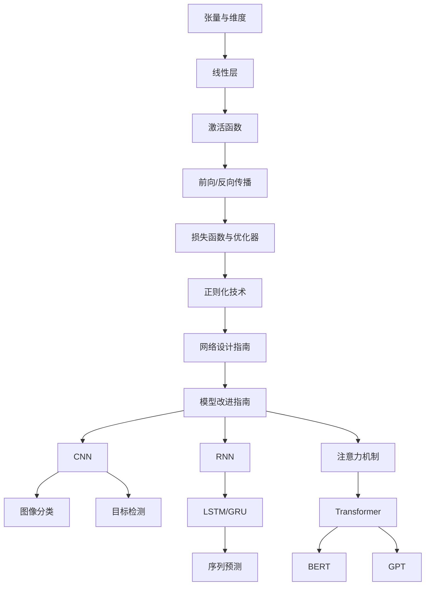

# 深度学习

本系列文章深入讲解深度学习核心技术，从基础神经网络到前沿模型架构，帮助你系统掌握深度学习理论与实践。

## 系列文章

### 基础概念

- [张量与维度](/notes/deep-learning/tensor-dimension) - 张量的定义、维度概念、矩阵乘法规则
- [线性层](/notes/deep-learning/linear-layer) - 仿射变换、参数量计算、权重与偏置
- [激活函数](/notes/deep-learning/activation-functions) - Sigmoid、ReLU、Softmax 详解
- [前向传播与反向传播](/notes/deep-learning/forward-backward) - 链式法则、梯度传递
- [损失函数与优化器](/notes/deep-learning/loss-optimizer) - MSE、Cross-Entropy、SGD、Adam

### 训练技巧

- [正则化技术](/notes/deep-learning/regularization) - Dropout、BatchNorm、L2 正则化
- [网络设计指南](/notes/deep-learning/network-design) - 隐藏层设计、超参数选择、网络模板
- [模型改进指南](/notes/deep-learning/model-improvement) - 复现基线、结构改进、消融实验、调优策略

### 卷积神经网络（CNN）

- [CNN 基础](/notes/deep-learning/cnn) - 卷积、池化、特征提取、经典网络架构

### 循环神经网络（RNN）

- [RNN 基础](/notes/deep-learning/rnn) - 序列建模、时间依赖、梯度问题
- [LSTM 与 GRU](/notes/deep-learning/lstm) - 门控机制、长距离依赖、实现细节

### 注意力机制与 Transformer

- [注意力机制](/notes/deep-learning/attention) - Self-Attention、Multi-Head Attention、注意力应用
- [Transformer 架构](/notes/deep-learning/transformer) - 编码器、解码器、位置编码、BERT/GPT

## 学习路径

## 前置知识

学习本系列文章前，你需要：

- 熟练掌握 Python 编程
- 了解机器学习基础概念
- 熟悉线性代数和微积分
- 了解 NumPy、Pandas 等数据处理库

## 相关主题

- [计算机基础](/notes/cs/) - 数据结构、算法基础
- [数据结构基础](/notes/cs/data-structure) - 算法与数据结构
