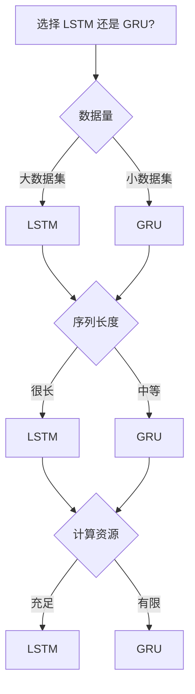

# LSTM 与 GRU 详解

> 阅读时长：约 15 分钟
> 难度等级：中级
> 读完你将学会：理解门控机制原理、手动实现 LSTM 单元、选择 LSTM 或 GRU

## 要点速览

> - LSTM 通过**三个门**（遗忘门、输入门、输出门）控制信息流
> - **细胞状态**是 LSTM 的"长期记忆"，可以长时间保留信息
> - GRU 是 LSTM 的简化版，**两个门**，参数更少
> - 两者都能解决 RNN 的梯度消失问题，适合长序列任务

## 前置知识

阅读本文前，你需要了解：

- [RNN 基础](/notes/deep-learning/rnn) - 隐藏状态、时间步
- 基本的矩阵运算

本文不假设你了解：

- 任何深度学习框架
- 复杂的门控机制

***

## 一、为什么需要 LSTM？

### RNN 的问题

RNN 在处理长序列时存在**梯度消失**问题：

```
句子: "我 出生 在 北京 ... (100个词后) ... 我 说 中文"

RNN 难以将"北京"的信息传递到"中文"位置
```

**问题本质：**

```python
# RNN 的隐藏状态更新
h_t = tanh(W @ h_prev + U @ x_t)
```

**解释：**
- `tanh` 的导数最大为 1
- 经过多个时间步连乘，梯度趋近于 0
- 无法学习长距离依赖

### LSTM 的解决思路

LSTM 引入**细胞状态**和**门控机制**：

```
RNN:  h_t = tanh(变换)         # 只有短期记忆
LSTM: C_t = f_t * C_{t-1} + i_t * 候选值  # 长期记忆 + 门控
```

**核心思想：**

| 组件 | 作用 |
|------|------|
| 细胞状态 C | 长期记忆，信息可以无损传递 |
| 遗忘门 f | 决定丢弃哪些旧信息 |
| 输入门 i | 决定接收哪些新信息 |
| 输出门 o | 决定输出哪些信息 |

***

## 二、LSTM 详解

### 2.1 LSTM 结构概览

```mermaid
flowchart TD
    subgraph LSTM单元
        X[x_t 输入] --> F[遗忘门]
        X --> I[输入门]
        X --> O[输出门]
        X --> G[候选细胞]
        
        C_prev[C_{t-1}] --> F
        F --> C_mul[×]
        C_prev --> C_mul
        
        G --> I_mul[×]
        I --> I_mul
        
        C_mul --> C_add[+]
        I_mul --> C_add
        C_add --> C_t[C_t 细胞状态]
        
        C_t --> O_tanh[tanh]
        O_tanh --> O_mul[×]
        O --> O_mul
        O_mul --> H_t[h_t 隐藏状态]
    end
```

### 2.2 遗忘门

遗忘门决定从细胞状态中丢弃哪些信息。

```python
f_t = sigmoid(W_f @ h_prev + U_f @ x_t + b_f)
```

**解释：**
- `sigmoid` 输出 0~1 之间的值
- 0 表示完全丢弃，1 表示完全保留
- `W_f @ h_prev` - 基于上一时刻隐藏状态
- `U_f @ x_t` - 基于当前输入

**数据流图示：**

```
h_prev (128维)     x_t (64维)
      │                │
      ▼                ▼
  W_f (128,128)    U_f (128,64)
      │                │
      └───────┬────────┘
              ▼
            相加
              │
              ▼
          sigmoid
              │
              ▼
        f_t (128维)
      值范围: 0~1
```

---

```python
# 遗忘门实现
import numpy as np

def forget_gate(h_prev, x_t, W_f, U_f, b_f):
    """
    遗忘门
    
    参数:
        h_prev: 上一时刻隐藏状态 (hidden_size,)
        x_t: 当前输入 (input_size,)
        W_f: 隐藏状态权重 (hidden_size, hidden_size)
        U_f: 输入权重 (hidden_size, input_size)
        b_f: 偏置 (hidden_size,)
    """
    return sigmoid(W_f @ h_prev + U_f @ x_t + b_f)

def sigmoid(x):
    return 1 / (1 + np.exp(-x))
```

**解释：**
- `W_f @ h_prev` - 隐藏状态变换，形状 `(hidden_size,)`
- `U_f @ x_t` - 输入变换，形状 `(hidden_size,)`
- `sigmoid` - 压缩到 0~1 范围

### 2.3 输入门

输入门决定哪些新信息将被存储到细胞状态。

```python
i_t = sigmoid(W_i @ h_prev + U_i @ x_t + b_i)
```

**解释：**
- 输入门决定"更新多少"
- 值为 0 表示不更新，1 表示完全更新

---

```python
# 候选细胞状态
C_tilde = tanh(W_c @ h_prev + U_c @ x_t + b_c)
```

**解释：**
- `C_tilde` 是候选细胞状态
- `tanh` 输出 -1~1 之间的值
- 表示"可能添加的新信息"

**输入门数据流：**

```
输入门 i_t: 控制更新强度
候选值 C_tilde: 新信息内容

最终更新量 = i_t * C_tilde

示例:
i_t = [0.9, 0.1, 0.5, ...]    # 第0维强更新，第1维弱更新
C_tilde = [0.8, -0.3, 0.2, ...]

更新量 = [0.72, -0.03, 0.1, ...]
```

### 2.4 细胞状态更新

细胞状态是 LSTM 的核心，实现长期记忆。

```python
C_t = f_t * C_prev + i_t * C_tilde
```

**解释：**
- `f_t * C_prev` - 保留部分旧信息
- `i_t * C_tilde` - 添加部分新信息
- 乘法是逐元素相乘（Hadamard 积）

**细胞状态更新图示：**

```
C_prev (旧细胞状态)
    │
    ▼
  × f_t (遗忘门) ────→ 保留部分
    │
    ▼
    + ←── i_t × C_tilde ←── 新信息
    │
    ▼
  C_t (新细胞状态)
```

---

```python
def update_cell_state(C_prev, f_t, i_t, C_tilde):
    """
    更新细胞状态
    
    参数:
        C_prev: 旧细胞状态 (hidden_size,)
        f_t: 遗忘门输出 (hidden_size,)
        i_t: 输入门输出 (hidden_size,)
        C_tilde: 候选细胞状态 (hidden_size,)
    """
    C_t = f_t * C_prev + i_t * C_tilde
    return C_t
```

**解释：**
- `*` 是逐元素乘法
- 这是 LSTM 的关键：信息可以无损传递
- 当 `f_t ≈ 1` 时，`C_t ≈ C_prev`，梯度可以回传

### 2.5 输出门

输出门决定隐藏状态输出什么。

```python
o_t = sigmoid(W_o @ h_prev + U_o @ x_t + b_o)
h_t = o_t * tanh(C_t)
```

**解释：**
- `o_t` 决定输出哪些信息
- `tanh(C_t)` 将细胞状态压缩到 -1~1
- 最终隐藏状态是两者的乘积

**输出门图示：**

```
C_t (细胞状态)
    │
    ▼
  tanh ────→ 压缩到 -1~1
    │
    ▼
  × o_t (输出门) ────→ 选择输出
    │
    ▼
  h_t (隐藏状态)
```

### 2.6 完整 LSTM 单元实现

```python
import numpy as np

class LSTMCell:
    """
    LSTM 单元实现
    """
    
    def __init__(self, input_size, hidden_size):
        self.input_size = input_size
        self.hidden_size = hidden_size
        
        # 遗忘门参数
        self.W_f = np.random.randn(hidden_size, hidden_size) * 0.01
        self.U_f = np.random.randn(hidden_size, input_size) * 0.01
        self.b_f = np.zeros(hidden_size)
        
        # 输入门参数
        self.W_i = np.random.randn(hidden_size, hidden_size) * 0.01
        self.U_i = np.random.randn(hidden_size, input_size) * 0.01
        self.b_i = np.zeros(hidden_size)
        
        # 候选细胞状态参数
        self.W_c = np.random.randn(hidden_size, hidden_size) * 0.01
        self.U_c = np.random.randn(hidden_size, input_size) * 0.01
        self.b_c = np.zeros(hidden_size)
        
        # 输出门参数
        self.W_o = np.random.randn(hidden_size, hidden_size) * 0.01
        self.U_o = np.random.randn(hidden_size, input_size) * 0.01
        self.b_o = np.zeros(hidden_size)
    
    def sigmoid(self, x):
        return 1 / (1 + np.exp(-np.clip(x, -500, 500)))
    
    def forward(self, x_t, h_prev, C_prev):
        """
        单步前向传播
        """
        # 遗忘门
        f_t = self.sigmoid(self.W_f @ h_prev + self.U_f @ x_t + self.b_f)
        
        # 输入门
        i_t = self.sigmoid(self.W_i @ h_prev + self.U_i @ x_t + self.b_i)
        
        # 候选细胞状态
        C_tilde = np.tanh(self.W_c @ h_prev + self.U_c @ x_t + self.b_c)
        
        # 更新细胞状态
        C_t = f_t * C_prev + i_t * C_tilde
        
        # 输出门
        o_t = self.sigmoid(self.W_o @ h_prev + self.U_o @ x_t + self.b_o)
        
        # 隐藏状态
        h_t = o_t * np.tanh(C_t)
        
        return h_t, C_t, (f_t, i_t, C_tilde, o_t)
```

**参数说明：**

| 参数 | 形状 | 说明 |
|------|------|------|
| `W_*` | (hidden, hidden) | 隐藏状态权重 |
| `U_*` | (hidden, input) | 输入权重 |
| `b_*` | (hidden,) | 偏置 |
| 总参数量 | 4 × (hidden² + hidden×input + hidden) | 四组门参数 |

### 本节要点

> **记住这三点：**
> 1. 细胞状态 C 是"长期记忆"，可以无损传递
> 2. 三个门分别控制：遗忘、输入、输出
> 3. 门控值接近 1 时，梯度可以无损回传

***

## 三、GRU 详解

### 3.1 GRU 结构

GRU 是 LSTM 的简化版，只有两个门：

```mermaid
flowchart TD
    subgraph GRU单元
        X[x_t 输入] --> R[重置门]
        X --> Z[更新门]
        
        H_prev[h_{t-1}] --> R
        R --> H_tilde[候选隐藏状态]
        X --> H_tilde
        
        H_prev --> Z_mul[×]
        Z --> Z_mul
        
        H_tilde --> Z_mul2[×]
        Z --> Z_inv[1-z]
        Z_inv --> Z_mul2
        
        Z_mul --> H_add[+]
        Z_mul2 --> H_add
        H_add --> H_t[h_t 隐藏状态]
    end
```

### 3.2 重置门

重置门决定多少过去信息用于计算候选隐藏状态。

```python
r_t = sigmoid(W_r @ h_prev + U_r @ x_t + b_r)
```

**解释：**
- 重置门控制"忽略多少过去信息"
- 当 `r_t ≈ 0` 时，相当于重置记忆

---

```python
# 候选隐藏状态
h_tilde = tanh(W_h @ (r_t * h_prev) + U_h @ x_t + b_h)
```

**解释：**
- `r_t * h_prev` - 重置后的过去信息
- 如果 `r_t ≈ 0`，只使用当前输入

### 3.3 更新门

更新门同时控制遗忘和输入。

```python
z_t = sigmoid(W_z @ h_prev + U_z @ x_t + b_z)
```

**解释：**
- 更新门决定"保留多少旧状态"
- `z_t ≈ 1` 时，`h_t ≈ h_prev`（保留旧状态）
- `z_t ≈ 0` 时，`h_t ≈ h_tilde`（使用新状态）

### 3.4 隐藏状态更新

```python
h_t = (1 - z_t) * h_tilde + z_t * h_prev
```

**解释：**
- 这是 LSTM 中遗忘门和输入门的合并
- 一个门同时控制"保留多少"和"更新多少"

**GRU vs LSTM 对比：**

```
LSTM:
  C_t = f_t * C_prev + i_t * C_tilde  # 两个门
  h_t = o_t * tanh(C_t)               # 输出门

GRU:
  h_t = (1 - z_t) * h_tilde + z_t * h_prev  # 一个门
```

### 3.5 完整 GRU 单元实现

```python
class GRUCell:
    """
    GRU 单元实现
    """
    
    def __init__(self, input_size, hidden_size):
        self.input_size = input_size
        self.hidden_size = hidden_size
        
        # 重置门参数
        self.W_r = np.random.randn(hidden_size, hidden_size) * 0.01
        self.U_r = np.random.randn(hidden_size, input_size) * 0.01
        self.b_r = np.zeros(hidden_size)
        
        # 更新门参数
        self.W_z = np.random.randn(hidden_size, hidden_size) * 0.01
        self.U_z = np.random.randn(hidden_size, input_size) * 0.01
        self.b_z = np.zeros(hidden_size)
        
        # 候选隐藏状态参数
        self.W_h = np.random.randn(hidden_size, hidden_size) * 0.01
        self.U_h = np.random.randn(hidden_size, input_size) * 0.01
        self.b_h = np.zeros(hidden_size)
    
    def sigmoid(self, x):
        return 1 / (1 + np.exp(-np.clip(x, -500, 500)))
    
    def forward(self, x_t, h_prev):
        """
        单步前向传播
        """
        # 重置门
        r_t = self.sigmoid(self.W_r @ h_prev + self.U_r @ x_t + self.b_r)
        
        # 更新门
        z_t = self.sigmoid(self.W_z @ h_prev + self.U_z @ x_t + self.b_z)
        
        # 候选隐藏状态
        h_tilde = np.tanh(self.W_h @ (r_t * h_prev) + self.U_h @ x_t + self.b_h)
        
        # 最终隐藏状态
        h_t = (1 - z_t) * h_tilde + z_t * h_prev
        
        return h_t, (r_t, z_t, h_tilde)
```

**参数对比：**

| 模型 | 参数量 | 门数量 |
|------|--------|--------|
| LSTM | 4 × (h² + h×i + h) | 3 个门 |
| GRU | 3 × (h² + h×i + h) | 2 个门 |

### 本节要点

> **记住这三点：**
> 1. GRU 是 LSTM 的简化版，参数更少
> 2. 更新门同时控制遗忘和输入
> 3. GRU 训练更快，LSTM 表达能力更强

***

## 四、LSTM vs GRU 对比

### 4.1 结构对比

| 特性 | LSTM | GRU |
|------|------|-----|
| 门数量 | 3 个 | 2 个 |
| 状态数量 | 2 个 (C, h) | 1 个 (h) |
| 参数量 | 多 | 少 25% |
| 计算速度 | 较慢 | 较快 |
| 表达能力 | 更强 | 略弱 |

### 4.2 选择建议



**实践经验：**

| 场景 | 推荐 | 原因 |
|------|------|------|
| 机器翻译 | LSTM | 需要强表达能力 |
| 语音识别 | LSTM | 序列很长 |
| 文本分类 | GRU | 计算效率重要 |
| 时间序列预测 | GRU | 数据量通常不大 |

***

## 五、实战技巧

### 5.1 初始化技巧

```python
# 遗忘门偏置初始化为 1
# 这样初始时遗忘门接近 1，信息可以传递
lstm.bias_f.data.fill_(1.0)
```

**解释：**
- 遗忘门偏置初始化为正数
- 初始时 `f_t ≈ 1`，细胞状态可以传递
- 避免训练初期梯度消失

### 5.2 梯度裁剪

```python
def clip_gradient(grads, max_norm=5.0):
    """
    梯度裁剪
    """
    total_norm = np.sqrt(sum(np.sum(g**2) for g in grads))
    
    if total_norm > max_norm:
        scale = max_norm / total_norm
        grads = [g * scale for g in grads]
    
    return grads
```

**解释：**
- LSTM/GRU 虽然缓解了梯度消失
- 但仍可能出现梯度爆炸
- 梯度裁剪是标准做法

### 5.3 双向 LSTM

```python
class BiLSTM:
    """
    双向 LSTM：同时考虑过去和未来
    """
    
    def forward(self, x_sequence):
        seq_len = len(x_sequence)
        
        # 前向 LSTM
        h_forward = []
        h, c = self.init_hidden()
        for t in range(seq_len):
            h, c = self.lstm_forward(x_sequence[t], h, c)
            h_forward.append(h)
        
        # 后向 LSTM
        h_backward = []
        h, c = self.init_hidden()
        for t in range(seq_len - 1, -1, -1):
            h, c = self.lstm_backward(x_sequence[t], h, c)
            h_backward.insert(0, h)
        
        # 拼接
        outputs = [np.concatenate([f, b]) for f, b in zip(h_forward, h_backward)]
        
        return outputs
```

**解释：**
- 前向 LSTM：从左到右处理
- 后向 LSTM：从右到左处理
- 拼接两个方向的隐藏状态

***

## 六、总结

### LSTM 核心公式

$$
\begin{aligned}
f_t &= \sigma(W_f h_{t-1} + U_f x_t + b_f) & \text{(遗忘门)} \\
i_t &= \sigma(W_i h_{t-1} + U_i x_t + b_i) & \text{(输入门)} \\
\tilde{C}_t &= \tanh(W_c h_{t-1} + U_c x_t + b_c) & \text{(候选细胞)} \\
C_t &= f_t \odot C_{t-1} + i_t \odot \tilde{C}_t & \text{(细胞状态)} \\
o_t &= \sigma(W_o h_{t-1} + U_o x_t + b_o) & \text{(输出门)} \\
h_t &= o_t \odot \tanh(C_t) & \text{(隐藏状态)}
\end{aligned}
$$

### GRU 核心公式

$$
\begin{aligned}
r_t &= \sigma(W_r h_{t-1} + U_r x_t + b_r) & \text{(重置门)} \\
z_t &= \sigma(W_z h_{t-1} + U_z x_t + b_z) & \text{(更新门)} \\
\tilde{h}_t &= \tanh(W_h (r_t \odot h_{t-1}) + U_h x_t + b_h) & \text{(候选隐藏)} \\
h_t &= (1 - z_t) \odot \tilde{h}_t + z_t \odot h_{t-1} & \text{(隐藏状态)}
\end{aligned}
$$

## 更新日志

| 日期 | 内容 |
|------|------|
| 2026-03-28 | 初稿发布 |

## 相关主题

- [RNN 基础](/notes/deep-learning/rnn) - 序列建模基础
- [注意力机制](/notes/deep-learning/attention) - 解决长距离依赖的新方法
