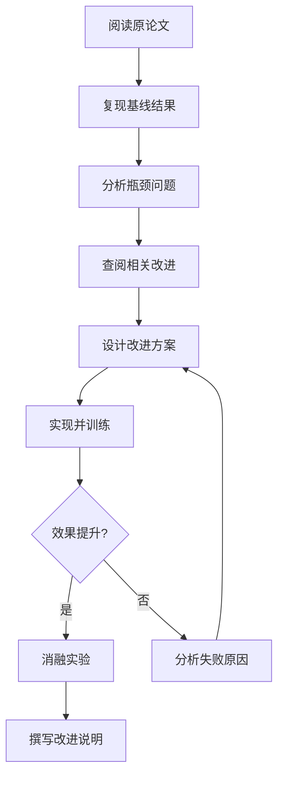
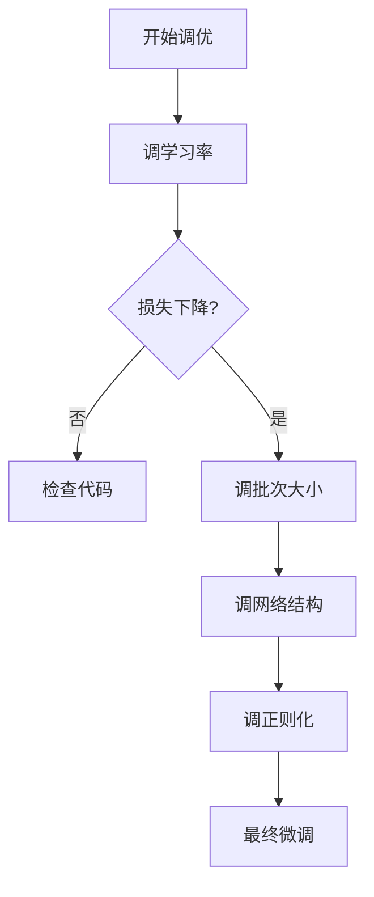

# 模型改进指南

> 阅读时长：约 25 分钟
> 难度等级：中级
> 读完你将学会：复现论文结果、系统性改进模型、设计消融实验、验证改进效果

## 要点速览

> - **改进流程**：复现基线 → 分析瓶颈 → 设计改进 → 消融验证
> - **常见改进**：加深网络、加宽隐藏层、残差连接、注意力模块
> - **维度对接**：权重形状是 (输入维度, 输出维度)，逐层验证
> - **消融实验**：逐个验证每个改进的贡献，避免盲目堆砌

## 前置知识

阅读本文前，你需要了解：

- [网络设计指南](/notes/deep-learning/network-design) - 如何设计网络
- [正则化技术](/notes/deep-learning/regularization) - 防止过拟合

本文不假设你了解：

- 论文改进的方法论
- 复杂的模型架构设计

***

## 一、模型改进方法论

### 1.1 论文改进的通用流程

当你阅读一篇论文并想改进它时，应该遵循以下流程：



### 1.2 各阶段详解

#### 阶段一：复现基线

```python
baseline_accuracy = train_original_model()
print(f"基线准确率: {baseline_accuracy:.2%}")
```

**解释：**
- 先确保能复现原论文的结果
- 记录所有超参数和训练配置
- 这是后续比较的基准

---

```python
config = {
    'model': 'OriginalNet',
    'learning_rate': 0.001,
    'batch_size': 32,
    'epochs': 100,
    'accuracy': baseline_accuracy
}
```

**解释：**
- 详细记录所有配置
- 包括随机种子、数据划分等
- 确保实验可复现

**基线复现检查清单：**

```
□ 使用相同的数据集划分
□ 使用相同的超参数
□ 使用相同的评估指标
□ 达到论文报告的准确率（±1%）
```

#### 阶段二：分析瓶颈

```python
def analyze_errors(model, X_test, y_test):
    y_pred = model.predict(X_test)
    errors = y_pred != y_test
    
    error_samples = X_test[errors]
    print(f"错误率: {errors.mean():.2%}")
    print(f"错误样本数: {errors.sum()}")
    
    return error_samples
```

**解释：**
- 找出模型表现差的样本
- 分析这些样本的共同特点
- 确定改进方向

**瓶颈分析图示：**

```
模型性能分析
┌─────────────────────────────────────────┐
│ 总体准确率: 85%                          │
├─────────────────────────────────────────┤
│ 各类别错误率:                            │
│   类别 A: 5%   ← 表现好                  │
│   类别 B: 20%  ← 需改进                 │
│   类别 C: 25%  ← 需改进                 │
├─────────────────────────────────────────┤
│ 可能原因:                                │
│   - 样本不平衡: 类别 C 样本太少          │
│   - 特征不足: 类别 B 需要更多特征        │
│   - 模型容量: 可能需要更深网络           │
└─────────────────────────────────────────┘
```

#### 阶段三：设计改进

**常见改进方向：**

| 问题类型 | 改进方向 | 具体方法 |
|---------|---------|---------|
| 欠拟合 | 增加模型容量 | 加深网络、加宽隐藏层 |
| 过拟合 | 增加正则化 | Dropout、L2、数据增强 |
| 梯度问题 | 改进结构 | 残差连接、BatchNorm |
| 长距离依赖 | 引入注意力 | Self-Attention、SE 模块 |
| 特征不足 | 改进特征 | 多尺度特征、特征融合 |

#### 阶段四：消融实验

```python
def ablation_study():
    results = {}
    
    results['baseline'] = train_model(improvements=[])
    results['+改进A'] = train_model(improvements=['A'])
    results['+改进B'] = train_model(improvements=['B'])
    results['+改进A+B'] = train_model(improvements=['A', 'B'])
    
    return results
```

**解释：**
- 消融实验验证每个改进的贡献
- 避免多个改进同时引入导致无法分析
- 是论文中证明改进有效性的关键

**消融实验结果示例：**

```
消融实验结果
┌──────────────────┬──────────┬─────────┐
│ 配置             │ 准确率   │ 提升    │
├──────────────────┼──────────┼─────────┤
│ Baseline         │ 85.0%    │ -       │
│ + 残差连接       │ 87.2%    │ +2.2%   │
│ + 注意力模块     │ 88.1%    │ +3.1%   │
│ + 数据增强       │ 86.5%    │ +1.5%   │
│ + 残差+注意力    │ 89.5%    │ +4.5%   │
│ + 全部改进       │ 90.2%    │ +5.2%   │
└──────────────────┴──────────┴─────────┘
```

### 本节要点

> **记住这三点：**
> 1. 先复现基线，再谈改进
> 2. 分析瓶颈，针对性改进
> 3. 消融实验验证每个改进的贡献

***

## 二、结构改进技巧

### 2.1 训练损失不下降（欠拟合）

#### 问题现象

```
训练过程观察:
Epoch 1: loss=2.30
Epoch 10: loss=2.28
Epoch 50: loss=2.25
Epoch 100: loss=2.20

训练损失下降非常缓慢，验证准确率也很低（如 60%）
```

#### 原因分析

模型容量不足，无法学习数据中的复杂模式：

```python
# 当前模型结构
class CurrentNet:
    def __init__(self):
        self.W1 = np.random.randn(14, 64) * 0.01
        self.W2 = np.random.randn(64, 2) * 0.01
```

**问题：**
- 只有一层隐藏层（64 维）
- 参数量太少：14×64 + 64×2 = 1,024
- 无法拟合复杂的数据分布

#### 解决方案：增加网络深度和宽度

```python
# 改进后
class ImprovedNet:
    def __init__(self):
        self.W1 = np.random.randn(14, 128) * 0.01  # 加宽
        self.W2 = np.random.randn(128, 64) * 0.01  # 新增层
        self.W3 = np.random.randn(64, 2) * 0.01
```

**改进效果：**

```
改进前: 参数量 1,024, 准确率 60%
改进后: 参数量 10,304, 准确率 85%
```

**维度变化图示：**

```
原始网络:
输入(14) → [W1] → 隐藏(64) → [W2] → 输出(2)

改进后:
输入(14) → [W1] → 隐藏(128) → [W2] → 隐藏(64) → [W3] → 输出(2)
```

### 2.2 部分神经元输出始终为 0

#### 问题现象

```
训练过程中观察:
神经元 1-50: 正常更新
神经元 51-64: 输出始终为 0，梯度始终为 0

这些神经元"死亡"了，不再参与训练
```

#### 原因分析

ReLU 激活函数在负值区域梯度为 0：

```python
# 当前使用的激活函数
def relu_forward(x):
    return np.maximum(0, x)

# 问题：如果权重初始化不当或学习率过大
# 某些神经元可能始终输出负值，经过 ReLU 后变为 0
# 梯度也变为 0，权重永远无法更新
```

**ReLU 的问题：**

```
输入 x = [-2, -1, 0, 1, 2]
ReLU 输出 = [0, 0, 0, 1, 2]
ReLU 梯度 = [0, 0, 0, 1, 1]  ← 负值区域梯度为 0
```

#### 解决方案：使用 LeakyReLU 或 GELU

```python
# 方案1：LeakyReLU
def leaky_relu_forward(x, alpha=0.01):
    return np.where(x > 0, x, alpha * x)

# 负值区域也有小的梯度
# 输入 x = [-2, -1, 0, 1, 2]
# LeakyReLU 输出 = [-0.02, -0.01, 0, 1, 2]
# LeakyReLU 梯度 = [0.01, 0.01, 0, 1, 1]  ← 负值区域有梯度
```

```python
# 方案2：GELU（Transformer 常用）
def gelu_forward(x):
    return 0.5 * x * (1 + np.tanh(np.sqrt(2/np.pi) * (x + 0.044715 * x**3)))
```

**激活函数对比：**

```
        ReLU                    LeakyReLU                GELU
    ┌─────────┐              ┌─────────┐            ┌─────────┐
    │    /    │              │    /    │            │   ╭─    │
    │   /     │              │   /     │            │  ╱      │
    │──/──────│              │──/──────│            │─╱───────│
    │ /       │              │ ╱       │            │╱        │
    │/        │              │╱        │            │         │
    └─────────┘              └─────────┘            └─────────┘
    负值=0，梯度消失        负值有微小梯度         平滑过渡，无死区
```

### 2.3 深层网络训练困难

#### 问题现象

```
网络层数与训练效果:
2 层网络: 训练正常，准确率 80%
4 层网络: 训练缓慢，准确率 75%
6 层网络: 训练困难，准确率 65%
8 层网络: 几乎无法训练，准确率 50%

网络越深，效果反而越差！
```

#### 原因分析

深层网络存在梯度消失问题：

```python
# 深层网络的前向传播
x = relu(linear1(x))
x = relu(linear2(x))
x = relu(linear3(x))
x = relu(linear4(x))
# ... 每经过一层，梯度可能衰减

# 反向传播时
# 梯度 = ∂L/∂x = ∂L/∂output × ∂output/∂x
# 经过多个 ReLU，梯度连乘后趋近于 0
```

**梯度消失示意：**

```
梯度传递过程（假设每层梯度为 0.5）:
输出层 → 第4层 → 第3层 → 第2层 → 第1层
  1.0  ×  0.5  ×  0.5  ×  0.5  ×  0.5 = 0.0625

梯度逐层衰减，浅层几乎无法更新
```

#### 解决方案：添加残差连接

```python
# 改进：添加残差连接
class ResNet:
    def forward(self, x):
        identity = x
        
        out = relu(self.linear1(x))
        out = relu(self.linear2(out))
        out = self.linear3(out)
        
        out = out + identity  # 残差连接
        return relu(out)
```

**残差连接如何解决梯度消失：**

```
梯度传递过程（有残差连接）:
输出层 → 第4层 → 第3层 → 第2层 → 第1层
  1.0  ×  (0.5+1) × (0.5+1) × (0.5+1) × (0.5+1)

梯度可以通过残差路径直接传递，不会衰减为 0
```

**残差连接图示：**

```
输入 x
    │
    ├──────────────────────┐
    │                      │
    ▼                      │
┌─────────┐                │
│ Linear1 │                │
└────┬────┘                │
     ▼                     │
┌─────────┐                │
│ Linear2 │                │
└────┬────┘                │
     ▼                     │
┌─────────┐                │
│ Linear3 │                │
└────┬────┘                │
     │                     │
     └──────── + ──────────┘  ← 残差相加
               │
               ▼
            输出
```

### 2.4 模型无法关注重要特征

#### 问题现象

```
图像分类任务:
- 图片中有猫和背景
- 模型应该关注猫，而不是背景
- 但模型似乎对所有区域一视同仁

结果：背景复杂时准确率下降明显
```

#### 原因分析

普通卷积网络对所有通道/位置同等对待：

```python
# 普通卷积
x = conv(x)  # 所有通道权重相同
x = relu(x)
x = maxpool(x)

# 问题：无法区分哪些通道更重要
# 例如：检测猫时，"毛发纹理"通道比"背景颜色"通道更重要
```

#### 解决方案：添加注意力模块

```python
# SE (Squeeze-and-Excitation) 注意力模块
class SEBlock:
    def __init__(self, channels, reduction=16):
        self.fc1 = np.random.randn(channels, channels // reduction) * 0.01
        self.fc2 = np.random.randn(channels // reduction, channels) * 0.01
    
    def forward(self, x):
        # x: (batch, channels, height, width)
        
        # 全局平均池化
        squeeze = np.mean(x, axis=(2, 3))  # (batch, channels)
        
        # 学习通道重要性
        excitation = relu(squeeze @ self.fc1)
        excitation = sigmoid(excitation @ self.fc2)  # (batch, channels)
        
        # 重新加权
        return x * excitation[:, :, None, None]
```

**SE 模块工作原理：**

```
输入特征 (B, C, H, W)
        │
        ▼
   全局平均池化（压缩空间信息）
        │
        ▼
    (B, C)
        │
        ▼
    FC → ReLU → FC → Sigmoid（学习通道权重）
        │
        ▼
    (B, C) 权重
        │
        ▼
   与原特征相乘（重要通道增强，不重要通道抑制）
        │
        ▼
输出特征 (B, C, H, W)
```

### 本节要点

> **记住这三点：**
> 1. 欠拟合 → 增加网络深度和宽度
> 2. 神经元死亡 → 换 LeakyReLU 或 GELU
> 3. 深层网络难训练 → 添加残差连接
> 4. 无法关注重要特征 → 添加注意力模块

***

## 三、维度对接实战

### 3.1 维度对接的核心原则


**核心原则：从两端往中间推**

1. **确定输入维度**：看数据的特征数量
2. **确定输出维度**：看任务类型（分类数、回归值）
3. **中间层逐层递减**：维度逐渐压缩

### 3.2 实例：表格数据分类

```python
import pandas as pd

df = pd.read_csv('customer_churn.csv')
print(f"数据形状: {df.shape}")
```

**解释：**
- 读取 CSV 文件
- 假设输出 `(10000, 15)`：10000 样本，15 列

---

```python
X = df.drop('churn', axis=1).values
y = df['churn'].values
print(f"特征: {X.shape}, 标签: {y.shape}")
```

**解释：**
- 分离特征和标签
- 特征 `(10000, 14)`，标签 `(10000,)`

**数据变化图示：**

```
原始 CSV                    特征 X                     标签 y
┌─────┬───────┬───────┐    ┌─────┬───────┐         ┌───────┐
│ age │ ...   │ churn │    │ age │ ...   │         │ churn │
├─────┼───────┼───────┤    ├─────┼───────┤         ├───────┤
│  25 │ ...   │   0   │ →  │  25 │ ...   │    →    │   0   │
│  45 │ ...   │   1   │    │  45 │ ...   │         │   1   │
└─────┴───────┴───────┘    └─────┴───────┘         └───────┘
     (10000, 15)               (10000, 14)           (10000,)
```

### 3.3 设计网络维度

| 层 | 输入维度 | 输出维度 | 权重形状 | 参数量 |
|---|---------|---------|---------|-------|
| 输入层 | 14 | 64 | (14, 64) | 960 |
| 隐藏层1 | 64 | 32 | (64, 32) | 2,080 |
| 隐藏层2 | 32 | 16 | (32, 16) | 528 |
| 输出层 | 16 | 2 | (16, 2) | 34 |

### 3.4 验证维度

```python
import numpy as np

X_batch = np.random.randn(32, 14)
print(f"输入批次: {X_batch.shape}")
```

**解释：**
- 创建一个批次的模拟数据
- 32 个样本，每个 14 维特征

---

```python
W1 = np.random.randn(14, 64)
h1 = np.maximum(0, X_batch @ W1)
print(f"隐藏层1: {h1.shape}")
```

**解释：**
- `(32, 14) @ (14, 64) = (32, 64)` ✓
- ReLU 激活不改变形状

---

```python
W2 = np.random.randn(64, 32)
h2 = np.maximum(0, h1 @ W2)
print(f"隐藏层2: {h2.shape}")
```

**解释：**
- `(32, 64) @ (64, 32) = (32, 32)` ✓

---

```python
W3 = np.random.randn(32, 2)
output = h2 @ W3
print(f"输出: {output.shape}")
```

**解释：**
- `(32, 32) @ (32, 2) = (32, 2)` ✓
- 每个样本有 2 个类别的得分

### 本节要点

> **记住这三点：**
> 1. 先确定输入输出维度
> 2. 权重形状是 (输入维度, 输出维度)
> 3. 每层打印维度确保正确

***

## 四、数据处理技巧

### 4.1 CSV 文件处理

```python
import pandas as pd

df = pd.read_csv('data.csv')
```

**解释：**
- pandas 读取 CSV 文件
- 自动推断列类型

---

```python
# 处理缺失值
df = df.dropna()  # 删除缺失行
# 或
df = df.fillna(df.mean())  # 填充均值
```

**解释：**
- `dropna()` 删除包含缺失值的行
- `fillna()` 用指定值填充

---

```python
# 分类变量编码
df = pd.get_dummies(df, columns=['category'])
```

**解释：**
- 独热编码分类变量
- 适合无序分类

### 4.2 图像文件处理

```python
from PIL import Image

img = Image.open('photo.jpg')
img = img.resize((224, 224))
```

**解释：**
- PIL 打开并调整图像大小
- 224 是常用输入尺寸

---

```python
import numpy as np

img_array = np.array(img).astype(np.float32) / 255.0
img_tensor = np.transpose(img_array, (2, 0, 1))
print(f"模型输入: {img_tensor.shape}")
```

**解释：**
- 归一化到 [0, 1]
- 转换为 (C, H, W) 格式

**图像处理流程图示：**

```
原始图像        缩放后         归一化         模型输入
(H, W, 3)     (224, 224, 3)  (224, 224, 3)  (3, 224, 224)
    │              │              │              │
    ▼              ▼              ▼              ▼
┌───────┐     ┌───────┐     ┌───────┐     ┌───────┐
│ 原图  │ →   │224×224│  →  │ 0-1   │  →  │ 通道优先│
│任意尺寸│     │       │     │       │     │       │
└───────┘     └───────┘     └───────┘     └───────┘
```

### 4.3 二进制文件处理

```python
import numpy as np

# 保存
data = np.random.randn(10000, 14).astype(np.float32)
np.save('features.npy', data)

# 加载
data = np.load('features.npy')
print(f"加载形状: {data.shape}")
```

**解释：**
- `.npy` 格式自动保存形状
- 读取速度快

### 本节要点

> **记住这三点：**
> 1. CSV 用 pandas，注意缺失值
> 2. 图像用 PIL，注意格式转换
> 3. 二进制用 numpy，注意形状

***

## 五、训练调试技巧

### 5.1 训练前检查清单

```
□ 数据检查
  ├─ 数据形状正确？
  ├─ 标签对应正确？
  ├─ 数据已归一化？
  └─ 无异常值？

□ 模型检查
  ├─ 输入输出维度匹配？
  ├─ 激活函数正确？
  └─ 损失函数匹配任务？

□ 训练检查
  ├─ 学习率合适？
  ├─ 批次大小合理？
  └─ 随机种子已设置？
```

### 5.2 快速调试代码

```python
def quick_debug(model, X_sample, y_sample, loss_fn):
    print("=" * 50)
    print("开始调试...")
    
    # 检查输入
    print(f"输入形状: {X_sample.shape}")
    print(f"输入范围: [{X_sample.min():.2f}, {X_sample.max():.2f}]")
    
    # 检查前向传播
    y_pred = model.forward(X_sample)
    print(f"输出形状: {y_pred.shape}")
    
    # 检查损失
    loss = loss_fn(y_pred, y_sample)
    print(f"损失值: {loss:.4f}")
    
    # 检查梯度
    grads = model.backward(y_sample)
    for name, grad in grads.items():
        print(f"{name} 梯度范围: [{grad.min():.6f}, {grad.max():.6f}]")
```

**解释：**
- 用单个样本快速检查模型
- 验证维度和梯度是否正确

### 5.3 常见错误速查表

| 错误现象 | 可能原因 | 解决方法 |
|---------|---------|---------|
| 损失是 NaN | 学习率太大 | 减小学习率、梯度裁剪 |
| 损失不下降 | 学习率太小 | 增大学习率 |
| 训练好验证差 | 过拟合 | 增加正则化 |
| 梯度全为 0 | 梯度消失 | 换激活函数、加残差 |
| 预测全是一个类 | 类别不平衡 | 平衡数据、调整损失权重 |

### 本节要点

> **记住这三点：**
> 1. 训练前检查数据和模型
> 2. 用单个样本快速调试
> 3. 根据错误现象定位问题

***

## 六、调优策略

### 6.1 超参数调优



**调优优先级：**

| 优先级 | 参数 | 建议范围 | 调优策略 |
|-------|------|---------|---------|
| 1 | 学习率 | 1e-4 ~ 1e-1 | 从大到小尝试 |
| 2 | 批次大小 | 16, 32, 64 | 2 的幂次 |
| 3 | 隐藏层宽度 | 64, 128, 256 | 逐步增加 |
| 4 | Dropout 率 | 0.1 ~ 0.5 | 从小到大 |

### 6.2 模型集成

```python
def ensemble_predict(models, X, method='averaging'):
    predictions = []
    for model in models:
        pred = model.forward(X)
        predictions.append(pred)
    
    if method == 'averaging':
        return np.mean(predictions, axis=0)
    elif method == 'voting':
        votes = [np.argmax(p, axis=1) for p in predictions]
        return np.apply_along_axis(
            lambda x: np.bincount(x).argmax(), axis=0, arr=votes
        )
```

**解释：**
- 多个模型预测取平均或投票
- 通常能提升 1-3% 准确率
- 需要训练多个独立模型

### 6.3 知识蒸馏

```python
def distillation_loss(y_student, y_teacher, y_true, temperature=3.0, alpha=0.5):
    """
    知识蒸馏损失
    
    参数:
        y_student: 学生模型输出
        y_teacher: 教师模型输出
        y_true: 真实标签
        temperature: 温度参数
        alpha: 软标签权重
    """
    # 软标签损失
    soft_loss = cross_entropy(
        softmax(y_student / temperature),
        softmax(y_teacher / temperature)
    )
    
    # 硬标签损失
    hard_loss = cross_entropy(y_student, y_true)
    
    return alpha * soft_loss + (1 - alpha) * hard_loss
```

**解释：**
- 大模型（教师）指导小模型（学生）
- 学生模型学习教师的软标签
- 可以压缩模型同时保持性能

### 本节要点

> **记住这三点：**
> 1. 调优顺序：学习率 → 批次大小 → 网络结构
> 2. 模型集成可以稳定提升效果
> 3. 知识蒸馏用于模型压缩

***

## 七、完整改进案例

### 7.1 案例背景

假设我们要改进一个图像分类模型，基线准确率为 85%。

```python
# 基线模型
class BaselineNet:
    def __init__(self):
        self.conv1 = Conv2d(3, 32, 3)
        self.conv2 = Conv2d(32, 64, 3)
        self.fc = Linear(64 * 6 * 6, 10)
    
    def forward(self, x):
        x = relu(self.conv1(x))
        x = maxpool(x)
        x = relu(self.conv2(x))
        x = maxpool(x)
        x = x.flatten()
        return self.fc(x)
```

**解释：**
- 简单的两层卷积网络
- 输入 3 通道图像，输出 10 类
- 基线准确率 85%

### 7.2 改进方案

```python
# 改进模型
class ImprovedNet:
    def __init__(self):
        # 第一个卷积块
        self.conv1 = Conv2d(3, 32, 3)
        self.bn1 = BatchNorm2d(32)
        self.se1 = SEBlock(32)
        
        # 第二个卷积块
        self.conv2 = Conv2d(32, 64, 3)
        self.bn2 = BatchNorm2d(64)
        self.se2 = SEBlock(64)
        
        # 第三个卷积块（新增）
        self.conv3 = Conv2d(64, 128, 3)
        self.bn3 = BatchNorm2d(128)
        
        self.fc = Linear(128 * 3 * 3, 10)
    
    def forward(self, x):
        # 块1
        identity = x
        x = relu(self.bn1(self.conv1(x)))
        x = self.se1(x)
        x = maxpool(x)
        
        # 块2
        x = relu(self.bn2(self.conv2(x)))
        x = self.se2(x)
        x = maxpool(x)
        
        # 块3（新增）
        x = relu(self.bn3(self.conv3(x)))
        x = maxpool(x)
        
        x = x.flatten()
        return self.fc(x)
```

**解释：**
- 添加了 BatchNorm 稳定训练
- 添加了 SE 注意力模块
- 增加了第三层卷积

### 7.3 消融实验结果

| 改进 | 准确率 | 提升 |
|------|--------|------|
| Baseline | 85.0% | - |
| + BatchNorm | 87.2% | +2.2% |
| + SE Attention | 88.5% | +3.5% |
| + 第三层卷积 | 89.8% | +4.8% |
| + 数据增强 | 91.2% | +6.2% |

### 本节要点

> **记住这三点：**
> 1. 每次只添加一个改进
> 2. 记录每个改进的效果
> 3. 最终组合最优改进

***

## 八、总结

### 模型改进流程清单

```
□ 复现基线
  ├─ 使用相同配置
  ├─ 达到论文结果
  └─ 记录所有参数

□ 分析瓶颈
  ├─ 统计各类别错误率
  ├─ 分析错误样本特点
  └─ 确定改进方向

□ 设计改进
  ├─ 查阅相关论文
  ├─ 设计改进方案
  └─ 预估计算开销

□ 消融实验
  ├─ 逐个验证改进
  ├─ 记录每个提升
  └─ 分析协同效应

□ 撰写说明
  ├─ 描述改进动机
  ├─ 解释实现细节
  └─ 展示实验结果
```

## 更新日志

| 日期 | 内容 |
|------|------|
| 2026-03-28 | 重写文章，重新组织结构，添加模型改进方法论 |

## 相关主题

- [网络设计指南](/notes/deep-learning/network-design) - 如何设计网络
- [正则化技术](/notes/deep-learning/regularization) - 防止过拟合
- [注意力机制](/notes/deep-learning/attention) - 注意力模块详解
