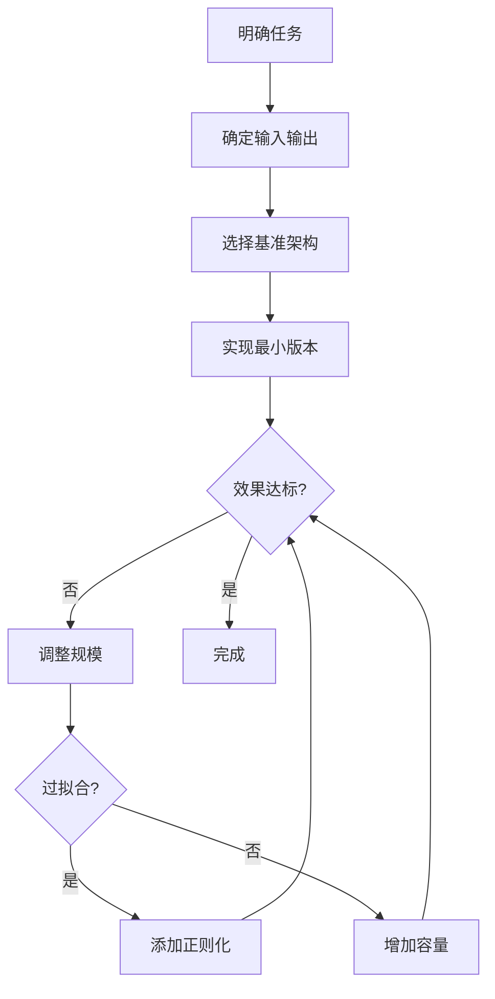

# 网络设计指南

> 阅读时长：约 20 分钟
> 难度等级：入门
> 读完你将学会：设计合理的网络结构、选择合适的超参数、使用常见网络模板

## 要点速览

> - **网络设计**遵循"由简到繁"原则，先跑通再优化
> - **隐藏层**数量和宽度是核心设计决策
> - **超参数**选择有经验法则，但最终需要实验验证
> - **模板**是起点，根据任务调整

## 前置知识

阅读本文前，你需要了解：

- [线性层](/notes/deep-learning/linear-layer) - 理解网络的基本单元
- [激活函数](/notes/deep-learning/activation-functions) - 理解非线性
- [正则化技术](/notes/deep-learning/regularization) - 防止过拟合

本文不假设你了解：

- 任何网络设计经验
- 复杂的架构搜索方法

***

## 一、设计原则

### 1.1 核心原则：由简到繁

**新手常见错误：一上来就设计复杂的网络**

正确做法：

```
第一步：最小可用网络（能跑通）
    ↓
第二步：调整规模（提升效果）
    ↓
第三步：添加技巧（优化细节）
```

### 1.2 设计流程



### 本节要点

> **记住这三点：**
> 1. 先跑通，再优化
> 2. 从小网络开始，逐步增加复杂度
> 3. 每次只改一个地方，观察效果

***

## 二、确定输入输出

### 2.1 输入设计

**输入维度 = 数据的特征数量**

| 任务类型 | 输入维度 | 示例 |
|---------|---------|------|
| 图像分类 | 高×宽×通道 | 28×28×1（MNIST） |
| 文本分类 | 序列长度×词向量维度 | 100×300 |
| 表格数据 | 特征列数 | 20 个特征 |
| 时间序列 | 序列长度×特征数 | 50×10 |

```python
# 片段：确定输入维度
# 图像数据
image_height, image_width, channels = 28, 28, 1
input_size = image_height * image_width * channels  # 784

# 表格数据
num_features = 20
input_size = num_features

# 文本数据
seq_length, embed_dim = 100, 300
input_size = seq_length * embed_dim  # 或使用 RNN/CNN 处理
```

### 2.2 输出设计

**输出维度 = 任务需求**

| 任务类型 | 输出维度 | 激活函数 |
|---------|---------|---------|
| 二分类 | 1 | Sigmoid |
| 多分类（K 类） | K | Softmax |
| 回归（单值） | 1 | 无 |
| 回归（多值） | N | 无 |

```python
# 片段：输出层设计
# 二分类
output_size = 1
output_activation = 'sigmoid'

# 十分类
output_size = 10
output_activation = 'softmax'

# 回归
output_size = 1
output_activation = None  # 恒等函数
```

### 本节要点

> **记住这三点：**
> 1. 输入维度由数据决定
> 2. 输出维度由任务决定
> 3. 输出激活函数：分类用 Sigmoid/Softmax，回归不用

***

## 三、隐藏层设计

### 3.1 隐藏层数量

**经验法则：**

| 数据复杂度 | 推荐层数 | 示例 |
|-----------|---------|------|
| 简单（线性可分） | 0-1 层 | XOR 问题 |
| 中等 | 2-3 层 | MNIST |
| 复杂 | 4+ 层 | ImageNet |

**新手建议：从 2 层开始**

```python
# 片段：不同复杂度的网络
# 简单任务：1 层隐藏层
simple_net = [
    Linear(input_size, 64),
    ReLU(),
    Linear(64, output_size)
]

# 中等任务：2 层隐藏层
medium_net = [
    Linear(input_size, 128),
    ReLU(),
    Linear(128, 64),
    ReLU(),
    Linear(64, output_size)
]

# 复杂任务：3 层隐藏层
complex_net = [
    Linear(input_size, 256),
    ReLU(),
    Linear(256, 128),
    ReLU(),
    Linear(128, 64),
    ReLU(),
    Linear(64, output_size)
]
```

### 3.2 隐藏层宽度

**经验法则：**

$$
\text{隐藏层宽度} \approx \sqrt{\text{输入维度} \times \text{输出维度}}
$$

**常用范围：64 ~ 1024**

| 输入维度 | 推荐宽度 |
|---------|---------|
| 小（< 100） | 32 ~ 128 |
| 中（100 ~ 1000） | 64 ~ 512 |
| 大（> 1000） | 256 ~ 1024 |

### 3.3 宽度变化策略

**三种常见策略：**

```
策略 1：逐渐变窄（最常用）
输入 784 → 256 → 128 → 64 → 输出 10

策略 2：先扩展后压缩
输入 784 → 1024 → 512 → 64 → 输出 10

策略 3：保持不变
输入 784 → 256 → 256 → 256 → 输出 10
```

**推荐：策略 1（逐渐变窄）**

```python
# 片段：逐渐变窄的网络
class TaperedNet:
    def __init__(self, input_size, output_size):
        self.layers = [
            Linear(input_size, 256),
            ReLU(),
            Dropout(0.3),

            Linear(256, 128),
            ReLU(),
            Dropout(0.3),

            Linear(128, 64),
            ReLU(),

            Linear(64, output_size)
        ]
```

### 本节要点

> **记住这三点：**
> 1. 隐藏层数量：简单任务 1-2 层，复杂任务 3+ 层
> 2. 隐藏层宽度：通常 64 ~ 512
> 3. 推荐"逐渐变窄"的结构

***

## 四、超参数选择

### 4.1 学习率

**最重要的超参数！**

| 优化器 | 推荐范围 | 默认值 |
|--------|---------|--------|
| SGD | 0.001 ~ 0.1 | 0.01 |
| SGD + Momentum | 0.001 ~ 0.1 | 0.01 |
| Adam | 0.0001 ~ 0.01 | 0.001 |

**调试技巧：**

```python
# 片段：学习率调试
learning_rates = [1e-5, 1e-4, 1e-3, 1e-2, 1e-1]

for lr in learning_rates:
    model = create_model()
    losses = train(model, lr=lr, epochs=10)
    print(f"lr={lr}: final_loss={losses[-1]:.4f}")
```

**现象诊断：**

| 现象 | 可能原因 | 解决方案 |
|------|---------|---------|
| 损失不下降 | 学习率太小 | 增大 10 倍 |
| 损失震荡 | 学习率太大 | 减小 10 倍 |
| 损失 NaN | 学习率过大 | 减小 100 倍 |

### 4.2 批次大小

**常用值：32, 64, 128, 256**

| 批次大小 | 优点 | 缺点 |
|---------|------|------|
| 小（16-32） | 梯度噪声大，正则化效果好 | 训练慢，不稳定 |
| 中（64-128） | 平衡速度和效果 | - |
| 大（256+） | 训练快，梯度稳定 | 可能过拟合 |

**推荐：从 32 或 64 开始**

### 4.3 训练轮数

**经验法则：训练到验证损失不再下降**

```python
# 片段：早停法
class EarlyStopping:
    def __init__(self, patience=5, min_delta=0.001):
        self.patience = patience
        self.min_delta = min_delta
        self.counter = 0
        self.best_loss = None

    def should_stop(self, val_loss):
        if self.best_loss is None:
            self.best_loss = val_loss
            return False

        if val_loss < self.best_loss - self.min_delta:
            self.best_loss = val_loss
            self.counter = 0
            return False
        else:
            self.counter += 1
            return self.counter >= self.patience
```

### 4.4 超参数总结

| 超参数 | 推荐值 | 调整优先级 |
|--------|--------|-----------|
| 学习率 | 0.001（Adam） | ⭐⭐⭐ 最高 |
| 批次大小 | 32-64 | ⭐⭐ 高 |
| 隐藏层宽度 | 128-256 | ⭐⭐ 高 |
| Dropout 率 | 0.3-0.5 | ⭐ 中 |
| L2 系数 | 1e-4 | ⭐ 中 |
| 训练轮数 | 早停 | ⭐ 低 |

### 本节要点

> **记住这三点：**
> 1. 学习率是最重要的超参数，优先调整
> 2. 批次大小从 32 或 64 开始
> 3. 使用早停法确定训练轮数

***

## 五、常见网络模板

### 5.1 二分类网络

```python
# 模板：二分类网络
class BinaryClassifier:
    """
    二分类任务模板

    适用：垃圾邮件检测、情感分析等
    """

    def __init__(self, input_size):
        self.net = [
            Linear(input_size, 128),
            BatchNorm(128),
            ReLU(),
            Dropout(0.3),

            Linear(128, 64),
            BatchNorm(64),
            ReLU(),
            Dropout(0.3),

            Linear(64, 1),  # 输出 1 维
            Sigmoid()       # Sigmoid 激活
        ]

    def forward(self, x):
        for layer in self.net:
            x = layer.forward(x)
        return x

# 使用示例
model = BinaryClassifier(input_size=20)
loss_fn = BCELoss()
optimizer = Adam(lr=0.001)
```

### 5.2 多分类网络

```python
# 模板：多分类网络
class MultiClassifier:
    """
    多分类任务模板

    适用：手写数字识别、新闻分类等
    """

    def __init__(self, input_size, num_classes):
        self.net = [
            Linear(input_size, 256),
            BatchNorm(256),
            ReLU(),
            Dropout(0.3),

            Linear(256, 128),
            BatchNorm(128),
            ReLU(),
            Dropout(0.3),

            Linear(128, num_classes)  # 输出类别数
            # 注意：CrossEntropyLoss 内部包含 Softmax
        ]

    def forward(self, x):
        for layer in self.net:
            x = layer.forward(x)
        return x

# 使用示例
model = MultiClassifier(input_size=784, num_classes=10)
loss_fn = CrossEntropyLoss()
optimizer = Adam(lr=0.001)
```

### 5.3 回归网络

```python
# 模板：回归网络
class Regressor:
    """
    回归任务模板

    适用：房价预测、销量预测等
    """

    def __init__(self, input_size, output_size=1):
        self.net = [
            Linear(input_size, 128),
            BatchNorm(128),
            ReLU(),
            Dropout(0.2),

            Linear(128, 64),
            BatchNorm(64),
            ReLU(),

            Linear(64, output_size)  # 无激活函数
        ]

    def forward(self, x):
        for layer in self.net:
            x = layer.forward(x)
        return x

# 使用示例
model = Regressor(input_size=10, output_size=1)
loss_fn = MSELoss()
optimizer = Adam(lr=0.001)
```

### 5.4 图像分类网络（简化 CNN）

```python
# 模板：简化版图像分类 CNN
class SimpleCNN:
    """
    简化版 CNN 模板

    适用：小图像分类（如 MNIST、CIFAR）
    """

    def __init__(self, in_channels, num_classes):
        self.features = [
            # 卷积块 1
            Conv2d(in_channels, 32, kernel_size=3, padding=1),
            BatchNorm2d(32),
            ReLU(),
            MaxPool2d(2),  # 尺寸减半

            # 卷积块 2
            Conv2d(32, 64, kernel_size=3, padding=1),
            BatchNorm2d(64),
            ReLU(),
            MaxPool2d(2),  # 尺寸再减半

            # 卷积块 3
            Conv2d(64, 128, kernel_size=3, padding=1),
            BatchNorm2d(128),
            ReLU(),
            MaxPool2d(2)
        ]

        self.classifier = [
            Flatten(),
            Linear(128 * 4 * 4, 256),  # 假设输入 32x32
            ReLU(),
            Dropout(0.5),
            Linear(256, num_classes)
        ]

    def forward(self, x):
        for layer in self.features:
            x = layer.forward(x)
        for layer in self.classifier:
            x = layer.forward(x)
        return x
```

### 本节要点

> **记住这三点：**
> 1. 模板是起点，根据任务调整
> 2. 二分类输出 1 维 + Sigmoid
> 3. 多分类输出 K 维，CrossEntropyLoss 内含 Softmax

***

## 六、调试技巧

### 6.1 网络调试清单

**训练前检查：**

- [ ] 输入数据是否归一化？
- [ ] 输出层激活函数是否正确？
- [ ] 损失函数是否匹配任务？
- [ ] 权重是否正确初始化？

**训练中检查：**

- [ ] 损失是否下降？
- [ ] 训练准确率是否提升？
- [ ] 验证损失是否过拟合？

### 6.2 常见问题排查

| 问题 | 可能原因 | 解决方案 |
|------|---------|---------|
| 损失不下降 | 学习率太小 | 增大学习率 |
| 损失 NaN | 学习率太大 | 减小学习率 |
| 训练准确率低 | 模型容量不足 | 增加隐藏层/宽度 |
| 验证准确率低 | 过拟合 | 添加正则化 |
| 训练很慢 | 批次太小 | 增大批次 |

### 6.3 可视化工具

```python
# 片段：训练过程可视化
import matplotlib.pyplot as plt

def plot_training(train_losses, val_losses, train_accs, val_accs):
    fig, (ax1, ax2) = plt.subplots(1, 2, figsize=(12, 4))

    # 损失曲线
    ax1.plot(train_losses, label='Train')
    ax1.plot(val_losses, label='Val')
    ax1.set_xlabel('Epoch')
    ax1.set_ylabel('Loss')
    ax1.legend()
    ax1.set_title('Loss Curve')

    # 准确率曲线
    ax2.plot(train_accs, label='Train')
    ax2.plot(val_accs, label='Val')
    ax2.set_xlabel('Epoch')
    ax2.set_ylabel('Accuracy')
    ax2.legend()
    ax2.set_title('Accuracy Curve')

    plt.tight_layout()
    plt.show()
```

***

## 七、总结

### 设计流程总结

```
1. 确定输入输出
   ↓
2. 选择模板
   ↓
3. 实现并训练
   ↓
4. 观察结果
   ↓
5. 调整优化
```

### 关键决策点

| 决策 | 推荐选择 |
|------|---------|
| 隐藏层数量 | 2-3 层 |
| 隐藏层宽度 | 128-256 |
| 激活函数 | ReLU |
| 正则化 | Dropout + BatchNorm |
| 优化器 | Adam |
| 学习率 | 0.001 |

## 更新日志

| 日期 | 内容 |
|------|------|
| 2026-03-28 | 初稿发布 |

## 相关主题

- [正则化技术](/notes/deep-learning/regularization) - 防止过拟合
- [损失函数与优化器](/notes/deep-learning/loss-optimizer) - 训练基础
- [CNN 基础](/notes/deep-learning/cnn) - 卷积网络设计
