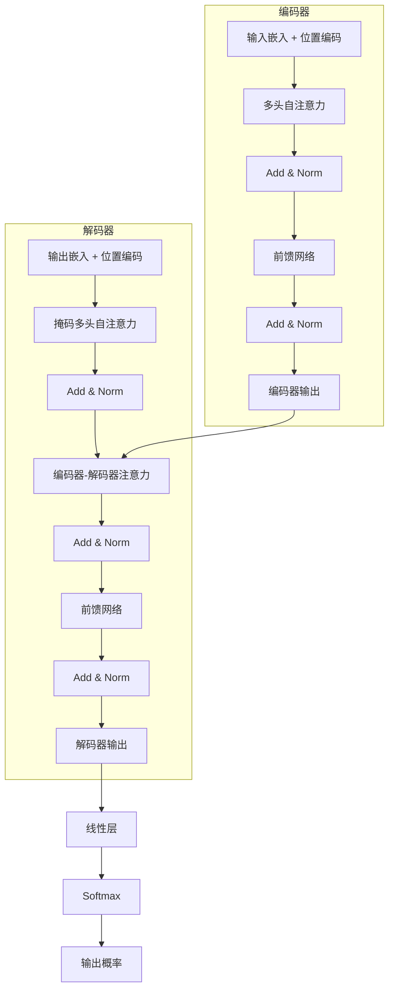
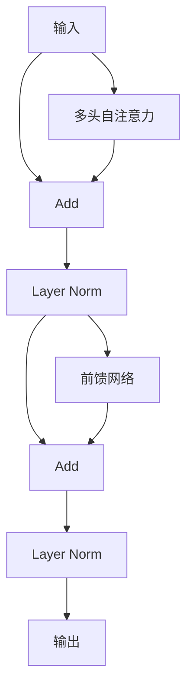
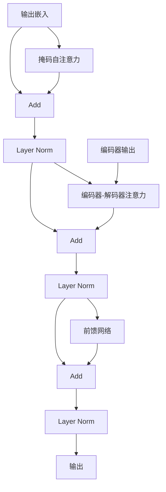

# Transformer 架构详解

> 阅读时长：约 20 分钟
> 难度等级：进阶
> 读完你将学会：理解 Transformer 完整架构、实现核心组件、了解 BERT/GPT 的区别

## 要点速览

> - Transformer 完全基于注意力机制，**没有循环结构**
> - 位置编码为序列注入**位置信息**
> - 编码器由多头注意力和前馈网络组成，**堆叠 N 层**
> - BERT 使用编码器，GPT 使用解码器

## 前置知识

阅读本文前，你需要了解：

- [注意力机制](/notes/deep-learning/attention) - Self-Attention 原理
- 基本的矩阵运算

本文不假设你了解：

- 任何深度学习框架
- 复杂的模型架构

***

## 一、Transformer 概览

### 1.1 核心创新

Transformer 的核心创新：**完全抛弃循环结构，只用注意力机制**。

```
传统 RNN/LSTM:
输入 → [RNN] → [RNN] → [RNN] → 输出
       串行处理，无法并行

Transformer:
输入 → [Attention] → [FFN] → 输出
       并行处理，训练更快
```

**优势对比：**

| 特性 | RNN/LSTM | Transformer |
|------|----------|-------------|
| 并行计算 | ❌ 串行 | ✅ 完全并行 |
| 长距离依赖 | ⚠️ 梯度消失 | ✅ 直接连接 |
| 训练速度 | 慢 | 快 |
| 参数量 | 少 | 多 |

### 1.2 整体架构



***

## 二、输入嵌入与位置编码

### 2.1 词嵌入

将词转换为向量表示：

```python
import numpy as np

class Embedding:
    """
    词嵌入层
    """
    
    def __init__(self, vocab_size, d_model):
        """
        参数:
            vocab_size: 词表大小
            d_model: 嵌入维度
        """
        self.d_model = d_model
        self.embedding = np.random.randn(vocab_size, d_model) * 0.01
    
    def forward(self, x):
        """
        参数:
            x: 词索引 (seq_len,)
        
        返回:
            嵌入向量 (seq_len, d_model)
        """
        return self.embedding[x] * np.sqrt(self.d_model)
```

**解释：**
- `vocab_size` 是词表大小，如 30000
- `d_model` 是模型维度，如 512
- 乘以 `√d_model` 是为了缩放

### 2.2 位置编码

由于 Transformer 没有循环结构，需要显式注入位置信息。

**正弦/余弦位置编码公式：**

$$
PE_{(pos, 2i)} = \sin\left(\frac{pos}{10000^{2i/d_{model}}}\right)
$$

$$
PE_{(pos, 2i+1)} = \cos\left(\frac{pos}{10000^{2i/d_{model}}}\right)
$$

```python
def positional_encoding(seq_len, d_model):
    """
    位置编码
    
    参数:
        seq_len: 序列长度
        d_model: 模型维度
    
    返回:
        PE: 位置编码矩阵 (seq_len, d_model)
    """
    PE = np.zeros((seq_len, d_model))
    
    for pos in range(seq_len):
        for i in range(d_model // 2):
            # 偶数维度用 sin
            PE[pos, 2*i] = np.sin(pos / (10000 ** (2*i / d_model)))
            # 奇数维度用 cos
            PE[pos, 2*i+1] = np.cos(pos / (10000 ** (2*i / d_model)))
    
    return PE
```

**解释：**
- `pos` 是位置索引（0, 1, 2, ...）
- `i` 是维度索引
- 偶数维度用 sin，奇数维度用 cos
- 不同位置有唯一的编码

**位置编码可视化：**

```
位置编码矩阵 (seq_len=10, d_model=8)

位置\维度  0(sin)  1(cos)  2(sin)  3(cos)  4(sin)  5(cos)  6(sin)  7(cos)
   0      0.00    1.00    0.00    1.00    0.00    1.00    0.00    1.00
   1      0.84    0.54    0.01    1.00    0.00    1.00    0.00    1.00
   2      0.91   -0.42    0.02    1.00    0.00    1.00    0.00    1.00
   3      0.14   -0.99    0.03    1.00    0.00    1.00    0.00    1.00
   ...

特点：
- 低维度：变化快，区分相邻位置
- 高维度：变化慢，区分远距离位置
```

### 2.3 组合嵌入

```python
def embedding_with_position(token_ids, embedding_layer, d_model):
    """
    词嵌入 + 位置编码
    
    参数:
        token_ids: 词索引 (seq_len,)
        embedding_layer: 词嵌入层
        d_model: 模型维度
    """
    seq_len = len(token_ids)
    
    # 词嵌入
    word_emb = embedding_layer.forward(token_ids)
    
    # 位置编码
    pos_emb = positional_encoding(seq_len, d_model)
    
    # 相加
    return word_emb + pos_emb
```

**解释：**
- 词嵌入和位置编码直接相加
- 相加后形状不变：`(seq_len, d_model)`

### 本节要点

> **记住这三点：**
> 1. 词嵌入将词转换为向量
> 2. 位置编码注入位置信息
> 3. 两者相加作为 Transformer 输入

***

## 三、编码器

### 3.1 编码器结构

编码器由 N 个相同的层堆叠而成，每层包含：

1. 多头自注意力
2. 前馈网络
3. 残差连接 + 层归一化



### 3.2 多头自注意力

```python
class MultiHeadAttention:
    """
    多头自注意力
    """
    
    def __init__(self, d_model, n_heads):
        self.d_model = d_model
        self.n_heads = n_heads
        self.d_k = d_model // n_heads  # 每个头的维度
        
        # 投影矩阵
        self.W_Q = np.random.randn(d_model, d_model) * 0.1
        self.W_K = np.random.randn(d_model, d_model) * 0.1
        self.W_V = np.random.randn(d_model, d_model) * 0.1
        self.W_O = np.random.randn(d_model, d_model) * 0.1
    
    def forward(self, X, mask=None):
        """
        参数:
            X: 输入 (seq_len, d_model)
            mask: 掩码 (可选)
        
        返回:
            output: 输出 (seq_len, d_model)
            weights: 注意力权重
        """
        seq_len = X.shape[0]
        
        # 线性投影
        Q = X @ self.W_Q  # (seq_len, d_model)
        K = X @ self.W_K
        V = X @ self.W_V
        
        # 重塑为多头形式
        Q = Q.reshape(seq_len, self.n_heads, self.d_k).transpose(1, 0, 2)
        K = K.reshape(seq_len, self.n_heads, self.d_k).transpose(1, 0, 2)
        V = V.reshape(seq_len, self.n_heads, self.d_k).transpose(1, 0, 2)
        # 现在形状: (n_heads, seq_len, d_k)
        
        # 注意力计算
        scores = Q @ K.transpose(0, 2, 1) / np.sqrt(self.d_k)
        
        if mask is not None:
            scores = scores + mask * -1e9  # 掩码位置设为负无穷
        
        weights = self.softmax(scores, axis=-1)
        output = weights @ V  # (n_heads, seq_len, d_k)
        
        # 拼接多头
        output = output.transpose(1, 0, 2).reshape(seq_len, self.d_model)
        
        # 输出投影
        output = output @ self.W_O
        
        return output, weights
    
    def softmax(self, x, axis=-1):
        exp_x = np.exp(x - np.max(x, axis=axis, keepdims=True))
        return exp_x / np.sum(exp_x, axis=axis, keepdims=True)
```

**解释：**
- `d_model` 是模型维度（如 512）
- `n_heads` 是注意力头数（如 8）
- `d_k = d_model // n_heads` 是每个头的维度
- 多头并行计算，最后拼接

**多头注意力数据流：**

```
输入 X (seq_len, 512)
    │
    ├── W_Q → Q (seq_len, 512) → reshape → (8, seq_len, 64)
    │
    ├── W_K → K (seq_len, 512) → reshape → (8, seq_len, 64)
    │
    └── W_V → V (seq_len, 512) → reshape → (8, seq_len, 64)
    
    各头独立计算注意力:
    Q @ K^T / √64 → Softmax → @ V
    
    输出 (8, seq_len, 64) → reshape → (seq_len, 512) → W_O → 最终输出
```

### 3.3 前馈网络

```python
class FeedForward:
    """
    前馈网络
    """
    
    def __init__(self, d_model, d_ff):
        self.W1 = np.random.randn(d_model, d_ff) * 0.1
        self.b1 = np.zeros(d_ff)
        self.W2 = np.random.randn(d_ff, d_model) * 0.1
        self.b2 = np.zeros(d_model)
    
    def forward(self, X):
        """
        参数:
            X: 输入 (seq_len, d_model)
        
        返回:
            输出 (seq_len, d_model)
        """
        # 第一层 + ReLU
        hidden = np.maximum(0, X @ self.W1 + self.b1)
        
        # 第二层
        output = hidden @ self.W2 + self.b2
        
        return output
```

**解释：**
- `d_ff` 是隐藏层维度（通常为 2048）
- 两层全连接，中间有 ReLU
- 对每个位置独立应用（位置间共享参数）

### 3.4 残差连接与层归一化

```python
class LayerNorm:
    """
    层归一化
    """
    
    def __init__(self, d_model, eps=1e-6):
        self.gamma = np.ones(d_model)
        self.beta = np.zeros(d_model)
        self.eps = eps
    
    def forward(self, X):
        """
        参数:
            X: 输入 (seq_len, d_model)
        
        返回:
            归一化后的输出
        """
        mean = np.mean(X, axis=-1, keepdims=True)
        std = np.std(X, axis=-1, keepdims=True)
        
        return self.gamma * (X - mean) / (std + self.eps) + self.beta
```

**解释：**
- 对每个样本的特征维度归一化
- `gamma` 和 `beta` 是可学习参数
- 稳定训练，加速收敛

---

```python
def residual_connection(x, sublayer_output, layer_norm):
    """
    残差连接 + 层归一化
    
    参数:
        x: 子层输入
        sublayer_output: 子层输出
        layer_norm: 层归一化层
    """
    return layer_norm.forward(x + sublayer_output)
```

**解释：**
- 残差连接：`x + sublayer(x)`
- 层归一化：稳定训练
- 公式：`LayerNorm(x + Sublayer(x))`

### 3.5 完整编码器层

```python
class EncoderLayer:
    """
    编码器层
    """
    
    def __init__(self, d_model, n_heads, d_ff):
        self.mha = MultiHeadAttention(d_model, n_heads)
        self.ffn = FeedForward(d_model, d_ff)
        self.norm1 = LayerNorm(d_model)
        self.norm2 = LayerNorm(d_model)
    
    def forward(self, X, mask=None):
        # 多头自注意力 + 残差 + 归一化
        attn_output, _ = self.mha.forward(X, mask)
        X = self.norm1.forward(X + attn_output)
        
        # 前馈网络 + 残差 + 归一化
        ffn_output = self.ffn.forward(X)
        X = self.norm2.forward(X + ffn_output)
        
        return X
```

**编码器层数据流：**

```
输入 X
    │
    ▼
┌─────────────────────────────┐
│     多头自注意力            │
│         ↓                   │
│     X + 注意力输出          │  ← 残差连接
│         ↓                   │
│     Layer Norm              │
└─────────────────────────────┘
    │
    ▼
┌─────────────────────────────┐
│     前馈网络                │
│         ↓                   │
│     X + FFN输出             │  ← 残差连接
│         ↓                   │
│     Layer Norm              │
└─────────────────────────────┘
    │
    ▼
输出
```

### 本节要点

> **记住这三点：**
> 1. 编码器由多头注意力和前馈网络组成
> 2. 每个子层后有残差连接和层归一化
> 3. 编码器堆叠 N 层（通常 6 层）

***

## 四、解码器

### 4.1 解码器结构

解码器与编码器类似，但多了一个**编码器-解码器注意力**层：



### 4.2 掩码自注意力

解码器需要防止"偷看"未来信息：

```python
def create_causal_mask(seq_len):
    """
    创建因果掩码
    
    返回:
        mask: (seq_len, seq_len)
        上三角为 -inf，下三角为 0
    """
    mask = np.triu(np.ones((seq_len, seq_len)), k=1)
    return mask  # 上三角为 1，会被设为 -inf
```

**解释：**
- 因果掩码确保位置 i 只能关注位置 ≤ i
- 上三角（未来位置）被掩码
- 防止解码器"作弊"

**掩码效果图示：**

```
注意力权重矩阵 (seq_len=5)

无掩码:                    有掩码:
┌─────────────────┐        ┌─────────────────┐
│ 0.2 0.2 0.2 0.2 0.2 │    │ 1.0 0.0 0.0 0.0 0.0 │  位置0只看自己
│ 0.2 0.2 0.2 0.2 0.2 │    │ 0.5 0.5 0.0 0.0 0.0 │  位置1看0,1
│ 0.2 0.2 0.2 0.2 0.2 │ →  │ 0.3 0.3 0.4 0.0 0.0 │  位置2看0,1,2
│ 0.2 0.2 0.2 0.2 0.2 │    │ 0.2 0.2 0.3 0.3 0.0 │  位置3看0,1,2,3
│ 0.2 0.2 0.2 0.2 0.2 │    │ 0.2 0.2 0.2 0.2 0.2 │  位置4看全部
└─────────────────┘        └─────────────────┘
```

### 4.3 编码器-解码器注意力

```python
class EncoderDecoderAttention:
    """
    编码器-解码器注意力
    Q 来自解码器，K、V 来自编码器
    """
    
    def __init__(self, d_model, n_heads):
        self.d_model = d_model
        self.n_heads = n_heads
        self.d_k = d_model // n_heads
        
        self.W_Q = np.random.randn(d_model, d_model) * 0.1
        self.W_K = np.random.randn(d_model, d_model) * 0.1
        self.W_V = np.random.randn(d_model, d_model) * 0.1
        self.W_O = np.random.randn(d_model, d_model) * 0.1
    
    def forward(self, decoder_hidden, encoder_output):
        """
        参数:
            decoder_hidden: 解码器隐藏状态 (tgt_len, d_model)
            encoder_output: 编码器输出 (src_len, d_model)
        """
        Q = decoder_hidden @ self.W_Q
        K = encoder_output @ self.W_K
        V = encoder_output @ self.W_V
        
        # 注意力计算（与多头注意力类似）
        # ...
```

**解释：**
- Q 来自解码器：当前要生成什么
- K、V 来自编码器：源序列信息
- 解码器根据当前状态"查询"编码器

### 本节要点

> **记住这三点：**
> 1. 解码器有掩码自注意力，防止看到未来
> 2. 编码器-解码器注意力连接编码器和解码器
> 3. 解码器也堆叠 N 层

***

## 五、完整 Transformer

### 5.1 模型组装

```python
class Transformer:
    """
    Transformer 完整模型
    """
    
    def __init__(self, src_vocab_size, tgt_vocab_size, d_model=512, 
                 n_heads=8, n_layers=6, d_ff=2048):
        self.d_model = d_model
        
        # 嵌入层
        self.src_embedding = Embedding(src_vocab_size, d_model)
        self.tgt_embedding = Embedding(tgt_vocab_size, d_model)
        
        # 编码器
        self.encoder_layers = [EncoderLayer(d_model, n_heads, d_ff) 
                               for _ in range(n_layers)]
        
        # 解码器
        self.decoder_layers = [DecoderLayer(d_model, n_heads, d_ff) 
                               for _ in range(n_layers)]
        
        # 输出层
        self.output_projection = np.random.randn(d_model, tgt_vocab_size) * 0.1
    
    def encode(self, src_tokens):
        """编码器前向传播"""
        X = self.src_embedding.forward(src_tokens)
        X = X + positional_encoding(len(src_tokens), self.d_model)
        
        for layer in self.encoder_layers:
            X = layer.forward(X)
        
        return X
    
    def decode(self, tgt_tokens, encoder_output):
        """解码器前向传播"""
        X = self.tgt_embedding.forward(tgt_tokens)
        X = X + positional_encoding(len(tgt_tokens), self.d_model)
        
        # 创建因果掩码
        mask = create_causal_mask(len(tgt_tokens))
        
        for layer in self.decoder_layers:
            X = layer.forward(X, encoder_output, mask)
        
        return X
    
    def forward(self, src_tokens, tgt_tokens):
        """完整前向传播"""
        encoder_output = self.encode(src_tokens)
        decoder_output = self.decode(tgt_tokens, encoder_output)
        
        # 输出投影
        logits = decoder_output @ self.output_projection
        
        return logits
```

### 5.2 参数量估算

```python
def estimate_transformer_params(vocab_size=30000, d_model=512, 
                                n_heads=8, n_layers=6, d_ff=2048):
    """
    估算 Transformer 参数量
    """
    # 嵌入层
    embedding_params = vocab_size * d_model * 2  # 源 + 目标
    
    # 每个编码器层
    # - 多头注意力: 4 * d_model^2 (Q, K, V, O 投影)
    # - FFN: 2 * d_model * d_ff
    # - LayerNorm: 2 * d_model * 2 (gamma, beta)
    per_layer = 4 * d_model * d_model + 2 * d_model * d_ff + 4 * d_model
    
    # 编码器 + 解码器
    encoder_params = n_layers * per_layer
    decoder_params = n_layers * (per_layer + d_model * d_model)  # 多一个交叉注意力
    
    # 输出层
    output_params = d_model * vocab_size
    
    total = embedding_params + encoder_params + decoder_params + output_params
    
    print(f"嵌入层: {embedding_params/1e6:.1f}M")
    print(f"编码器: {encoder_params/1e6:.1f}M")
    print(f"解码器: {decoder_params/1e6:.1f}M")
    print(f"输出层: {output_params/1e6:.1f}M")
    print(f"总计: {total/1e6:.1f}M")
    
    return total

estimate_transformer_params()
```

**输出：**

```
嵌入层: 30.7M
编码器: 9.4M
解码器: 12.6M
输出层: 15.4M
总计: 68.1M
```

### 本节要点

> **记住这三点：**
> 1. Transformer = 嵌入层 + N 层编码器 + N 层解码器 + 输出层
> 2. 参数主要在嵌入层和输出层（与词表大小相关）
> 3. 典型配置：6 层、8 头、512 维

***

## 六、BERT 与 GPT

### 6.1 架构对比

| 模型 | 架构 | 预训练任务 | 应用场景 |
|------|------|-----------|---------|
| BERT | 编码器 | 掩码语言模型 | 理解任务（分类、NER） |
| GPT | 解码器 | 自回归生成 | 生成任务（对话、写作） |
| T5 | 编码器+解码器 | 序列到序列 | 翻译、摘要 |

### 6.2 BERT

BERT 只使用 Transformer 编码器：

```
输入: [CLS] 我 喜欢 学习 [SEP] 深度 学习 [SEP]
        ↓
    编码器 (双向注意力)
        ↓
输出: 每个位置的表示

预训练任务:
1. 掩码语言模型 (MLM): 随机遮蔽词，预测原词
2. 下一句预测 (NSP): 判断两句是否连续
```

### 6.3 GPT

GPT 只使用 Transformer 解码器：

```
输入: 我 喜欢 学习 深度 学习
        ↓
    解码器 (单向注意力，掩码)
        ↓
输出: 预测下一个词

预训练任务:
自回归生成: P(x_t | x_1, ..., x_{t-1})
```

### 本节要点

> **记住这三点：**
> 1. BERT 用编码器，双向注意力，适合理解任务
> 2. GPT 用解码器，单向注意力，适合生成任务
> 3. 两者都是 Transformer 的变体

***

## 七、总结

### Transformer 核心组件

| 组件 | 作用 |
|------|------|
| 词嵌入 | 词 → 向量 |
| 位置编码 | 注入位置信息 |
| 多头注意力 | 建模全局依赖 |
| 前馈网络 | 非线性变换 |
| 残差连接 | 缓解梯度消失 |
| 层归一化 | 稳定训练 |

### 关键超参数

| 参数 | 典型值 | 说明 |
|------|--------|------|
| d_model | 512/768/1024 | 模型维度 |
| n_heads | 8/12/16 | 注意力头数 |
| n_layers | 6/12/24 | 层数 |
| d_ff | 2048/3072/4096 | FFN 隐藏层维度 |
| dropout | 0.1 | 正则化 |

## 更新日志

| 日期 | 内容 |
|------|------|
| 2026-03-28 | 初稿发布 |

## 相关主题

- [注意力机制](/notes/deep-learning/attention) - 注意力原理
- [模型改进指南](/notes/deep-learning/model-improvement) - 模型改进与调优
