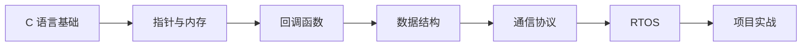

# 嵌入式开发

本系列文章深入讲解嵌入式系统开发的核心技术，从底层驱动到应用层协议，帮助你构建完整的嵌入式知识体系。

## 系列文章

### 设计模式

- [回调函数](/notes/embedded/callback) - 函数指针的应用，实现模块解耦
- [状态机](/notes/embedded/state-machine) - 有限状态机设计，事件驱动架构

### 数据结构

- [环形缓冲区](/notes/embedded/ring-buffer) - 高效的数据缓存结构
- [数据封装](/notes/embedded/data-encapsulation) - 协议数据打包与解析

### 通信协议

- [串口数据解析](/notes/embedded/uart-data) - UART 通信与帧解析
- [网络通信](/notes/embedded/network) - TCP/IP 协议栈应用
- [协议设计](/notes/embedded/protocol) - 自定义通信协议设计

## 学习路径

## 前置知识

学习本系列文章前，你需要：

- 熟练掌握 C 语言语法
- 理解指针和内存管理
- 了解计算机组成原理

## 核心技能

嵌入式开发需要掌握的核心技能：

| 技能领域 | 具体内容 |
|----------|----------|
| 编程语言 | C 语言、汇编基础 |
| 硬件接口 | GPIO、UART、SPI、I2C |
| 操作系统 | RTOS、Linux |
| 调试技能 | JTAG、串口调试、逻辑分析仪 |
| 通信协议 | TCP/IP、MQTT、Modbus |

## 相关主题

- [C 语言核心概念](/notes/c/) - C 语言内存管理、指针详解
- [物联网技术](/notes/iot/) - MQTT 协议、传感器接口
- [Linux 开发](/notes/linux/) - Shell 脚本、内核模块
