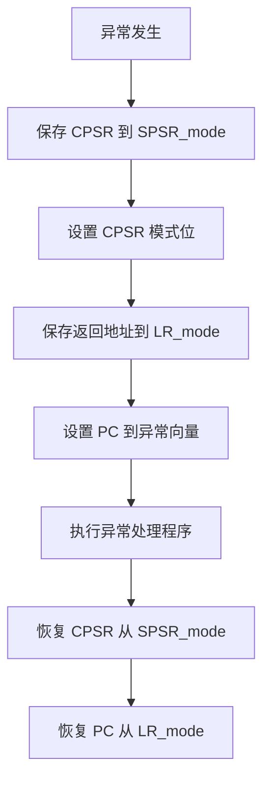
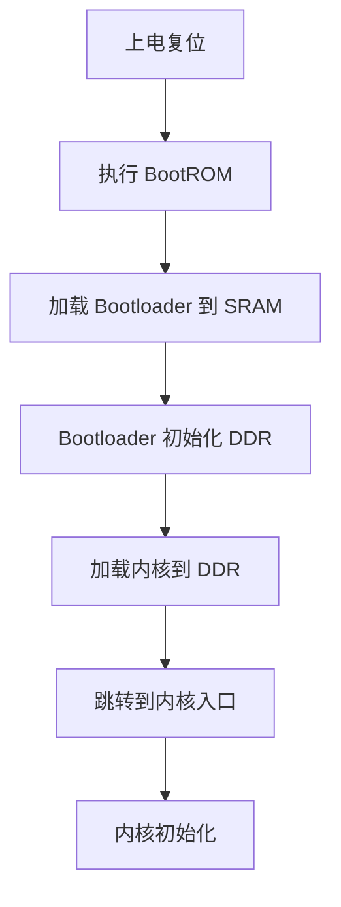

# ARM 架构基础

## ARM 架构概述

ARM（Advanced RISC Machine）是一种精简指令集（RISC）架构，广泛应用于嵌入式系统、移动设备和物联网领域。

### ARM 处理器系列

```
┌─────────────────────────────────────────────────────────────┐
│                    ARM 处理器系列                            │
│  ┌─────────────────────────────────────────────────────────┐│
│  │ Cortex-A 系列 (Application)                             ││
│  │ 高性能处理器，运行 Linux/Android                         ││
│  │ Cortex-A53, Cortex-A72, Cortex-A76...                   ││
│  ├─────────────────────────────────────────────────────────┤│
│  │ Cortex-R 系列 (Real-time)                               ││
│  │ 实时处理器，汽车电子、医疗设备                           ││
│  │ Cortex-R5, Cortex-R7, Cortex-R8...                      ││
│  ├─────────────────────────────────────────────────────────┤│
│  │ Cortex-M 系列 (Microcontroller)                         ││
│  │ 微控制器，低功耗、实时控制                               ││
│  │ Cortex-M0, Cortex-M3, Cortex-M4, Cortex-M7...           ││
│  └─────────────────────────────────────────────────────────┘│
└─────────────────────────────────────────────────────────────┘
```

上述图示展示了 ARM 处理器系列。

**系列对比：**

| 系列 | 定位 | 特点 | 典型应用 |
|------|------|------|----------|
| Cortex-A | 应用处理器 | 高性能、支持 MMU | 手机、平板 |
| Cortex-R | 实时处理器 | 实时性、可靠性 | 汽车、医疗 |
| Cortex-M | 微控制器 | 低功耗、低成本 | IoT、工业控制 |

## ARM 工作模式

ARM 处理器支持多种工作模式，用于处理不同类型的异常：

```
┌─────────────────────────────────────────────────────────────┐
│                    ARM 工作模式 (ARMv7-A)                    │
│  ┌─────────────────────────────────────────────────────────┐│
│  │ 用户模式 (User, usr)      - 用户程序运行                 ││
│  ├─────────────────────────────────────────────────────────┤│
│  │ 特权模式 (Privileged Modes)                             ││
│  │ ┌─────────────────────────────────────────────────────┐ ││
│  │ │ 系统模式 (System, sys)   - 运行特权操作系统任务      │ ││
│  │ │ 管理模式 (Supervisor, svc) - 系统调用、复位          │ ││
│  │ │ 中止模式 (Abort, abt)    - 内存访问异常              │ ││
│  │ │ 未定义模式 (Undefined, und) - 未定义指令异常         │ ││
│  │ │ 中断模式 (IRQ, irq)      - 普通中断                  │ ││
│  │ │ 快中断模式 (FIQ, fiq)    - 快速中断                  │ ││
│  │ └─────────────────────────────────────────────────────┘ ││
│  └─────────────────────────────────────────────────────────┘│
└─────────────────────────────────────────────────────────────┘
```

上述图示展示了 ARM 的工作模式。

**模式说明：**

| 模式 | 异常类型 | 说明 |
|------|----------|------|
| User | - | 用户程序，受限访问 |
| System | - | 特权模式，与 User 共用寄存器 |
| Supervisor | Reset、SVC | 系统调用入口 |
| Abort | Data Abort、Prefetch Abort | 内存访问错误 |
| Undefined | Undefined Instruction | 执行未定义指令 |
| IRQ | IRQ | 普通中断 |
| FIQ | FIQ | 快速中断，更多独立寄存器 |

## ARM 寄存器组

### 通用寄存器

ARM 有 16 个通用寄存器（R0-R15）和程序状态寄存器：

```
┌─────────────────────────────────────────────────────────────┐
│                    ARM 寄存器组                              │
│  ┌─────────────────────────────────────────────────────────┐│
│  │ R0-R3    : 参数寄存器 / 返回值                          ││
│  │ R4-R11   : 通用寄存器（被调用者保存）                    ││
│  │ R12 (IP) : 过程调用中间寄存器                            ││
│  │ R13 (SP) : 栈指针                                        ││
│  │ R14 (LR) : 链接寄存器（返回地址）                        ││
│  │ R15 (PC) : 程序计数器                                    ││
│  ├─────────────────────────────────────────────────────────┤│
│  │ CPSR     : 当前程序状态寄存器                            ││
│  │ SPSR     : 保存的程序状态寄存器（异常模式下）            ││
│  └─────────────────────────────────────────────────────────┘│
└─────────────────────────────────────────────────────────────┘
```

上述图示展示了 ARM 寄存器组。

**寄存器用途：**

| 寄存器 | 别名 | 用途 |
|--------|------|------|
| R0-R3 | a1-a4 | 参数传递、返回值 |
| R4-R11 | v1-v8 | 局部变量 |
| R12 | IP | 过程调用临时寄存器 |
| R13 | SP | 栈指针 |
| R14 | LR | 链接寄存器 |
| R15 | PC | 程序计数器 |

### 程序状态寄存器 (CPSR)

```
┌─────────────────────────────────────────────────────────────┐
│                    CPSR 寄存器格式                           │
│  ┌─────────────────────────────────────────────────────────┐│
│  │  N │ Z │ C │ V │ Q │    Reserved    │  I │ F │ T │ Mode ││
│  │ 31 │30 │29 │28 │27 │  26-8          │ 7 │ 6 │ 5 │ 4-0  ││
│  └─────────────────────────────────────────────────────────┘│
└─────────────────────────────────────────────────────────────┘
```

上述图示展示了 CPSR 寄存器格式。

**标志位说明：**

| 标志 | 名称 | 说明 |
|------|------|------|
| N | Negative | 结果为负数 |
| Z | Zero | 结果为零 |
| C | Carry | 进位/借位 |
| V | Overflow | 溢出 |
| Q | Saturation | 饱和 |
| I | IRQ disable | 禁止 IRQ |
| F | FIQ disable | 禁止 FIQ |
| T | Thumb state | Thumb 指令状态 |
| Mode | 处理器模式 | 当前工作模式 |

## ARM 异常处理

### 异常向量表

```c
// ARM 异常向量表
0x00: Reset                    // 复位
0x04: Undefined Instruction    // 未定义指令
0x08: Software Interrupt (SWI) // 软件中断
0x0C: Prefetch Abort           // 预取指中止
0x10: Data Abort               // 数据中止
0x14: Reserved                 // 保留
0x18: IRQ                      // 普通中断
0x1C: FIQ                      // 快速中断
```

上述代码展示了 ARM 异常向量表。

### 异常处理流程



上述流程图展示了异常处理流程。

**异常处理汇编示例：**

```asm
; IRQ 中断处理
IRQ_Handler:
    SUB     LR, LR, #4          ; 调整返回地址
    PUSH    {R0-R12, LR}        ; 保存寄存器
    
    ; 读取中断控制器，判断中断源
    LDR     R0, =INTC_BASE
    LDR     R1, [R0, #INTC_IRQ_STATUS]
    
    ; 调用 C 语言中断处理函数
    BL      handle_irq
    
    POP     {R0-R12, LR}        ; 恢复寄存器
    SUBS    PC, LR, #0          ; 返回并恢复 CPSR
```

上述代码展示了 IRQ 中断处理的汇编实现。

## ARM 指令集

### ARM 指令格式

```
ARM 指令格式（32 位）：
┌─────────────────────────────────────────────────────────────┐
│ Cond │ Opcode │ S │ Rn │ Rd │ Shifter Operand              │
│31-28 │27-24   │20 │19-16│15-12│11-0                          │
└─────────────────────────────────────────────────────────────┘

Cond: 条件码
Opcode: 操作码
S: 是否更新状态标志
Rn: 第一个操作数寄存器
Rd: 目标寄存器
Shifter Operand: 第二个操作数
```

上述图示展示了 ARM 指令格式。

### 常用指令

```asm
; 数据处理指令
MOV     R0, #100        ; R0 = 100
ADD     R0, R1, R2      ; R0 = R1 + R2
SUB     R0, R1, R2      ; R0 = R1 - R2
AND     R0, R1, R2      ; R0 = R1 & R2
ORR     R0, R1, R2      ; R0 = R1 | R2
CMP     R0, R1          ; 比较 R0 和 R1

; 加载/存储指令
LDR     R0, [R1]        ; R0 = *R1
STR     R0, [R1]        ; *R1 = R0
LDR     R0, [R1, #4]    ; R0 = *(R1 + 4)
STR     R0, [R1], #4    ; *R1 = R0, R1 += 4

; 分支指令
B       label           ; 无条件跳转
BL      function        ; 带链接跳转（调用函数）
BX      LR              ; 跳转到 LR（函数返回）

; 条件执行
ADDEQ   R0, R0, #1      ; 如果相等，R0 += 1
CMP     R0, #10
MOVLT   R0, #0          ; 如果小于，R0 = 0
```

上述代码展示了 ARM 常用指令。

**条件码说明：**

| 条件码 | 后缀 | 说明 |
|--------|------|------|
| 0000 | EQ | 相等 (Z=1) |
| 0001 | NE | 不相等 (Z=0) |
| 0010 | CS/HS | 无符号大于等于 (C=1) |
| 0011 | CC/LO | 无符号小于 (C=0) |
| 0100 | MI | 负数 (N=1) |
| 0101 | PL | 非负数 (N=0) |
| 0110 | VS | 溢出 (V=1) |
| 0111 | VC | 无溢出 (V=0) |
| 1000 | HI | 无符号大于 (C=1 && Z=0) |
| 1001 | LS | 无符号小于等于 |
| 1010 | GE | 有符号大于等于 (N=V) |
| 1011 | LT | 有符号小于 (N!=V) |
| 1100 | GT | 有符号大于 |
| 1101 | LE | 有符号小于等于 |
| 1110 | AL | 无条件 |

## 中断控制器

### GIC (Generic Interrupt Controller)

ARM 使用 GIC 管理中断：

```c
// GIC 寄存器结构
typedef struct {
    volatile uint32_t GICD_CTLR;      // 分发器控制
    volatile uint32_t GICD_TYPER;     // 分发器类型
    volatile uint32_t GICD_ISENABLER; // 中断使能
    volatile uint32_t GICD_ICENABLER; // 中断禁能
    volatile uint32_t GICD_ISPENDR;   // 中断挂起
    volatile uint32_t GICD_ICPENDR;   // 中断清除
    volatile uint32_t GICD_IPRIORITYR;// 中断优先级
    volatile uint32_t GICD_ITARGETSR; // 中断目标
} GICD_Type;

typedef struct {
    volatile uint32_t GICC_CTLR;      // CPU 接口控制
    volatile uint32_t GICC_PMR;       // 优先级掩码
    volatile uint32_t GICC_IAR;       // 中断确认
    volatile uint32_t GICC_EOIR;      // 中断结束
} GICC_Type;
```

上述代码展示了 GIC 寄存器结构。

**中断处理流程：**

```c
void gic_irq_handler(void) {
    uint32_t irq_id = GICC->GICC_IAR;  // 读取中断 ID
    
    switch (irq_id) {
        case TIMER_IRQ:
            timer_handler();
            break;
        case UART_IRQ:
            uart_handler();
            break;
        default:
            printf("Unknown IRQ: %d\n", irq_id);
    }
    
    GICC->GICC_EOIR = irq_id;  // 结束中断
}
```

上述代码展示了 GIC 中断处理流程。

## 启动流程

### ARM 启动过程



上述流程图展示了 ARM 启动过程。

**启动代码示例：**

```asm
; 启动代码 (start.S)
.global _start

_start:
    ; 设置向量表
    LDR     R0, =_vector_table
    MCR     p15, 0, R0, c12, c0, 0
    
    ; 禁用中断
    CPSID   if
    
    ; 设置栈指针
    LDR     SP, =_stack_top
    
    ; 清除 BSS 段
    LDR     R0, =_bss_start
    LDR     R1, =_bss_end
    MOV     R2, #0
bss_loop:
    CMP     R0, R1
    STRLO   R2, [R0], #4
    BLO     bss_loop
    
    ; 跳转到 C 语言入口
    BL      main
    
    ; 死循环
halt:
    B       halt
```

上述代码展示了 ARM 启动汇编代码。

## 总结

| 概念 | 说明 |
|------|------|
| ARM 系列 | Cortex-A（高性能）、Cortex-R（实时）、Cortex-M（微控制器） |
| 工作模式 | User、System、Supervisor、Abort、Undefined、IRQ、FIQ |
| 寄存器 | R0-R15 通用寄存器、CPSR/SPSR 状态寄存器 |
| 异常处理 | 向量表、保存现场、处理、恢复现场 |
| 指令集 | 数据处理、加载存储、分支、条件执行 |

## 参考资料

[1] ARM Architecture Reference Manual. ARM Ltd.

[2] ARM System Developer's Guide. Andrew N. Sloss

[3] Cortex-A Series Programmer's Guide. ARM Ltd.

## 相关主题

- [RTOS 核心概念](/notes/hardware/rtos) - 实时操作系统
- [内核模块开发](/notes/linux/kernel-module) - Linux 内核编程
- [C 语言核心概念](/notes/c/) - C 语言内存管理
