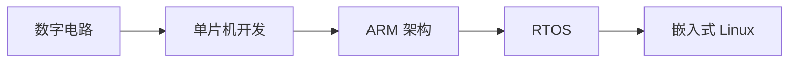

# 硬件基础

本系列文章深入讲解嵌入式硬件基础知识，帮助读者理解底层硬件工作原理。

## 系列文章

### ARM 架构

- [ARM 架构基础](/notes/hardware/arm-architecture) - Cortex 系列处理器、工作模式、寄存器组

### 实时操作系统

- [RTOS 核心概念](/notes/hardware/rtos) - 任务调度、同步通信、内存管理

## 学习路径

## 前置知识

学习本系列文章前，你需要：

- 了解 C 语言编程
- 理解计算机组成原理
- 熟悉嵌入式开发流程

## 相关主题

- [C 语言核心概念](/notes/c/) - C 语言内存管理
- [嵌入式 Linux](/notes/linux/) - Linux 内核与驱动
