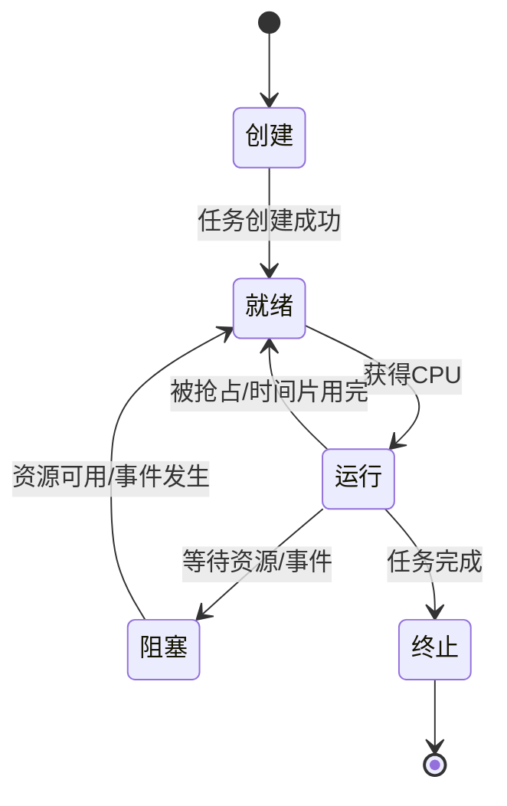

# RTOS 核心概念

## 什么是 RTOS？

RTOS（Real-Time Operating System，实时操作系统）是一种能够在**确定的时间内**完成特定任务的操作系统。与通用操作系统不同，RTOS 的核心目标是**实时性**和**可靠性**。

### RTOS vs 通用 OS

| 特性 | RTOS | 通用 OS (Linux/Windows) |
|------|------|-------------------------|
| 实时性 | 确定性响应时间 | 尽力而为 |
| 调度 | 优先级抢占 | 公平调度 |
| 内存 | 静态分配为主 | 动态分配 |
| 开销 | 小 | 大 |
| 适用场景 | 嵌入式、工业控制 | 桌面、服务器 |

### 硬实时 vs 软实时

```
硬实时 (Hard Real-Time):
┌─────────────────────────────────────────────────────────────┐
│ 任务必须在截止时间前完成，否则造成严重后果                    │
│ 示例：汽车刹车系统、心脏起搏器、飞行控制系统                  │
└─────────────────────────────────────────────────────────────┘

软实时 (Soft Real-Time):
┌─────────────────────────────────────────────────────────────┐
│ 任务最好在截止时间前完成，偶尔超时可接受                      │
│ 示例：视频播放、音频处理、用户界面响应                        │
└─────────────────────────────────────────────────────────────┘
```

上述图示展示了硬实时和软实时的区别。

## 任务管理

### 任务状态



上述状态图展示了 RTOS 任务的生命周期。

**状态说明：**

| 状态 | 说明 |
|------|------|
| 创建 | 任务正在创建，分配 TCB |
| 就绪 | 任务已准备好，等待 CPU |
| 运行 | 任务正在执行 |
| 阻塞 | 任务等待资源或事件 |
| 终止 | 任务执行完毕 |

### 任务控制块 (TCB)

```c
typedef struct tskTaskControlBlock {
    volatile StackType_t *pxTopOfStack;  // 栈顶指针
    ListItem_t xStateListItem;            // 状态链表项
    ListItem_t xEventListItem;            // 事件链表项
    UBaseType_t uxPriority;               // 任务优先级
    StackType_t *pxStack;                 // 栈基地址
    char pcTaskName[configMAX_TASK_NAME_LEN]; // 任务名称
} tskTCB;
```

上述代码展示了 FreeRTOS 的 TCB 结构。

**TCB 关键信息：**

| 字段 | 说明 |
|------|------|
| 栈顶指针 | 保存任务的栈状态 |
| 优先级 | 决定调度顺序 |
| 状态链表项 | 用于就绪/阻塞队列 |
| 栈基地址 | 任务栈的起始地址 |
| 任务名称 | 用于调试 |

### 任务创建

```c
#include "FreeRTOS.h"
#include "task.h"

void vTaskFunction(void *pvParameters) {
    while (1) {
        // 任务代码
        vTaskDelay(pdMS_TO_TICKS(100));
    }
}

int main(void) {
    xTaskCreate(
        vTaskFunction,      // 任务函数
        "TaskName",         // 任务名称
        128,                // 栈大小（字）
        NULL,               // 参数
        1,                  // 优先级
        NULL                // 任务句柄
    );
    
    vTaskStartScheduler();  // 启动调度器
    while (1);
    return 0;
}
```

上述代码展示了 FreeRTOS 任务创建方式。

## 任务调度

### 优先级抢占调度

RTOS 使用**优先级抢占调度**，高优先级任务总是优先执行：

```
时间轴：
├─────┼─────┼─────┼─────┼─────┼─────┼─────┼─────┤
│     │     │     │     │     │     │     │     │
│ 低  │ 高  │ 低  │ 中  │ 低  │ 高  │ 低  │     │
│ 优  │ 优  │ 优  │ 优  │ 优  │ 优  │ 优  │     │
│ 先  │ 先  │ 先  │ 先  │ 先  │ 先  │ 先  │     │
│ 级  │ 级  │ 级  │ 级  │ 级  │ 级  │ 级  │     │
│     │     │     │     │     │     │     │     │
├─────┼─────┼─────┼─────┼─────┼─────┼─────┼─────┤
      ↑           ↑           ↑
    高优先级    中优先级    高优先级
    抢占       抢占       抢占
```

上述图示展示了优先级抢占调度过程。

### 调度器实现

```c
// 简化的调度器伪代码
void vTaskSwitchContext(void) {
    // 从就绪列表中找最高优先级任务
    UBaseType_t uxTopPriority = uxGetHighestPriority();
    
    // 获取该优先级的就绪列表
    List_t *pxReadyList = &pxReadyTasksLists[uxTopPriority];
    
    // 选择下一个任务
    TCB_t *pxNextTCB = listGET_OWNER_OF_HEAD_ENTRY(pxReadyList);
    
    // 切换到新任务
    if (pxCurrentTCB != pxNextTCB) {
        pxCurrentTCB = pxNextTCB;
    }
}
```

上述代码展示了调度器的简化实现。

### 时间片轮转

同优先级任务使用时间片轮转：

```c
// FreeRTOS 配置
#define configUSE_TIME_SLICING 1
#define configTICK_RATE_HZ     1000  // 1ms 时间片

// 同优先级任务轮流执行
void vTask1(void *pvParameters) {
    while (1) {
        // 执行一个时间片后被抢占
        taskYIELD();  // 主动让出 CPU
    }
}
```

上述代码展示了时间片轮转的使用。

## 任务同步

### 信号量

```c
#include "semphr.h"

SemaphoreHandle_t xSemaphore;

void vTask1(void *pvParameters) {
    while (1) {
        if (xSemaphoreTake(xSemaphore, portMAX_DELAY) == pdTRUE) {
            // 获取信号量，访问共享资源
            // ...
            xSemaphoreGive(xSemaphore);  // 释放信号量
        }
    }
}

void vTask2(void *pvParameters) {
    while (1) {
        if (xSemaphoreTake(xSemaphore, portMAX_DELAY) == pdTRUE) {
            // 获取信号量，访问共享资源
            // ...
            xSemaphoreGive(xSemaphore);
        }
    }
}

int main(void) {
    xSemaphore = xSemaphoreCreateMutex();
    // 创建任务...
    vTaskStartScheduler();
}
```

上述代码展示了信号量的使用方式。

**信号量类型：**

| 类型 | 说明 | 用途 |
|------|------|------|
| 二值信号量 | 值为 0 或 1 | 同步、互斥 |
| 计数信号量 | 值为非负整数 | 资源计数 |
| 互斥信号量 | 特殊二值信号量 | 互斥访问，有优先级继承 |

### 互斥量与优先级翻转

```c
// 优先级翻转问题
// 低优先级任务 L 持有互斥量
// 高优先级任务 H 等待互斥量
// 中优先级任务 M 抢占 L
// 结果：H 被 M 间接阻塞

// 解决方案：优先级继承
// 当 H 等待 L 持有的互斥量时
// L 临时继承 H 的优先级
// L 执行完后恢复原优先级
```

上述代码说明了优先级翻转问题及解决方案。

### 事件组

```c
#include "event_groups.h"

EventGroupHandle_t xEventGroup;

#define BIT_0 (1 << 0)
#define BIT_1 (1 << 1)

void vTask1(void *pvParameters) {
    while (1) {
        // 等待事件
        EventBits_t uxBits = xEventGroupWaitBits(
            xEventGroup,
            BIT_0 | BIT_1,    // 等待的位
            pdTRUE,           // 清除位
            pdTRUE,           // 等待所有位
            portMAX_DELAY
        );
        
        if ((uxBits & (BIT_0 | BIT_1)) == (BIT_0 | BIT_1)) {
            // 两个事件都发生
        }
    }
}

void vTask2(void *pvParameters) {
    while (1) {
        // 设置事件
        xEventGroupSetBits(xEventGroup, BIT_0);
        vTaskDelay(pdMS_TO_TICKS(100));
    }
}
```

上述代码展示了事件组的使用方式。

## 任务通信

### 消息队列

```c
#include "queue.h"

QueueHandle_t xQueue;

typedef struct {
    uint8_t id;
    uint8_t data[10];
} Message;

void vSenderTask(void *pvParameters) {
    Message msg;
    msg.id = 1;
    
    while (1) {
        // 发送消息
        if (xQueueSend(xQueue, &msg, portMAX_DELAY) != pdPASS) {
            // 发送失败
        }
        vTaskDelay(pdMS_TO_TICKS(100));
    }
}

void vReceiverTask(void *pvParameters) {
    Message msg;
    
    while (1) {
        // 接收消息
        if (xQueueReceive(xQueue, &msg, portMAX_DELAY) == pdPASS) {
            // 处理消息
            printf("Received: id=%d\n", msg.id);
        }
    }
}

int main(void) {
    xQueue = xQueueCreate(10, sizeof(Message));
    // 创建任务...
    vTaskStartScheduler();
}
```

上述代码展示了消息队列的使用方式。

**队列操作函数：**

| 函数 | 说明 |
|------|------|
| `xQueueCreate()` | 创建队列 |
| `xQueueSend()` | 发送到队尾 |
| `xQueueSendToFront()` | 发送到队首 |
| `xQueueReceive()` | 接收消息 |
| `xQueuePeek()` | 查看队首消息 |
| `uxQueueMessagesWaiting()` | 查询消息数量 |

## 内存管理

### 静态内存分配

```c
// 静态分配任务栈
static StackType_t xTaskStack[128];
static StaticTask_t xTaskBuffer;

void vTaskFunction(void *pvParameters) {
    while (1) {
        vTaskDelay(pdMS_TO_TICKS(100));
    }
}

int main(void) {
    xTaskCreateStatic(
        vTaskFunction,
        "StaticTask",
        128,
        NULL,
        1,
        xTaskStack,
        &xTaskBuffer
    );
    
    vTaskStartScheduler();
}
```

上述代码展示了静态内存分配方式。

### 内存池

```c
#define POOL_SIZE  1024
#define BLOCK_SIZE 64

static uint8_t mem_pool[POOL_SIZE];
static uint8_t block_used[POOL_SIZE / BLOCK_SIZE];

void* pool_alloc(void) {
    for (int i = 0; i < POOL_SIZE / BLOCK_SIZE; i++) {
        if (!block_used[i]) {
            block_used[i] = 1;
            return &mem_pool[i * BLOCK_SIZE];
        }
    }
    return NULL;
}

void pool_free(void *ptr) {
    int index = ((uint8_t*)ptr - mem_pool) / BLOCK_SIZE;
    if (index >= 0 && index < POOL_SIZE / BLOCK_SIZE) {
        block_used[index] = 0;
    }
}
```

上述代码展示了内存池的实现。

## 定时器

### 软件定时器

```c
#include "timers.h"

TimerHandle_t xTimer;

void vTimerCallback(TimerHandle_t xTimer) {
    // 定时器回调函数
    printf("Timer expired\n");
}

int main(void) {
    xTimer = xTimerCreate(
        "Timer",                    // 名称
        pdMS_TO_TICKS(1000),        // 周期
        pdTRUE,                     // 自动重载
        NULL,                       // 参数
        vTimerCallback              // 回调函数
    );
    
    xTimerStart(xTimer, 0);
    vTaskStartScheduler();
}
```

上述代码展示了软件定时器的使用。

**定时器类型：**

| 类型 | 说明 |
|------|------|
| 单次定时器 | 触发一次后停止 |
| 周期定时器 | 周期性触发 |

## 中断管理

### 中断服务程序

```c
// 中断服务程序
void UART_IRQHandler(void) {
    BaseType_t xHigherPriorityTaskWoken = pdFALSE;
    
    // 读取数据
    uint8_t data = UART->DR;
    
    // 发送到队列（使用 FromISR 版本）
    xQueueSendFromISR(xQueue, &data, &xHigherPriorityTaskWoken);
    
    // 如果唤醒了更高优先级任务，触发上下文切换
    portYIELD_FROM_ISR(xHigherPriorityTaskWoken);
}
```

上述代码展示了 RTOS 中断处理方式。

**中断编程要点：**

| 要点 | 说明 |
|------|------|
| 使用 FromISR 版本 API | 中断中必须使用线程安全版本 |
| 简短快速 | ISR 尽量短，复杂处理交给任务 |
| 检查唤醒标志 | 可能需要触发任务切换 |

## 总结

| 概念 | 说明 |
|------|------|
| 任务 | RTOS 的基本执行单元，有独立的栈和 TCB |
| 调度 | 优先级抢占调度，高优先级任务优先执行 |
| 同步 | 信号量、互斥量、事件组 |
| 通信 | 消息队列、任务通知 |
| 内存 | 静态分配为主，避免碎片 |
| 定时 | 软件定时器、硬件定时器 |
| 中断 | 使用 FromISR 版本 API，保持简短 |

## 参考资料

[1] FreeRTOS Documentation. https://www.freertos.org/

[2] Mastering the FreeRTOS Real Time Kernel. Richard Barry

[3] Real-Time Systems. Jane W. S. Liu

## 相关主题

- [ARM 架构基础](/notes/hardware/arm-architecture) - 嵌入式处理器核心
- [进程与线程](/notes/cs/process-thread) - 操作系统核心概念
- [内核模块开发](/notes/linux/kernel-module) - Linux 内核编程
