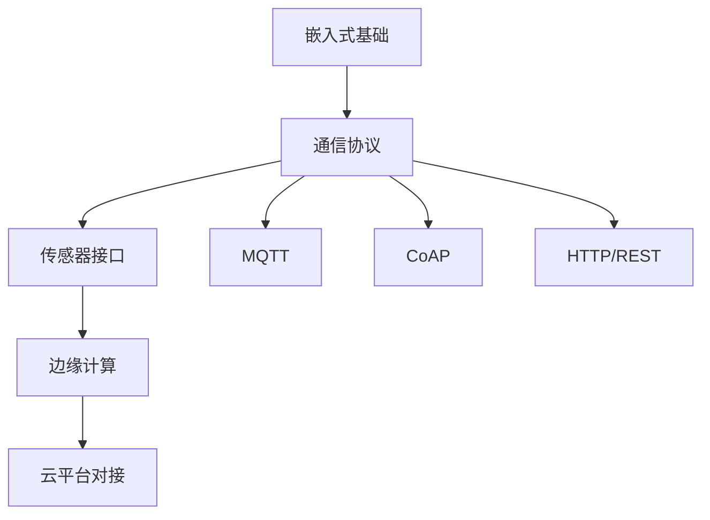

# 物联网技术

本系列文章深入讲解物联网开发技术，从通信协议到实际应用，帮助你掌握 IoT 系统开发技能。

## 系列文章

### 通信协议

- [MQTT 协议](/notes/iot/mqtt) - 轻量级消息协议，IoT 通信标准

### 传感器接口

- [传感器接口](/notes/iot/sensor) - I2C、SPI、ADC 等常用接口

## 学习路径

## 前置知识

学习本系列文章前，你需要：

- 熟练掌握 C 语言编程
- 了解嵌入式系统基础
- 熟悉网络通信概念

## 相关主题

- [硬件基础](/notes/hardware/) - ARM 架构、RTOS
- [嵌入式开发](/notes/embedded/) - 嵌入式系统开发
- [TCP/IP 协议](/notes/cs/tcp-ip) - 网络通信基础
