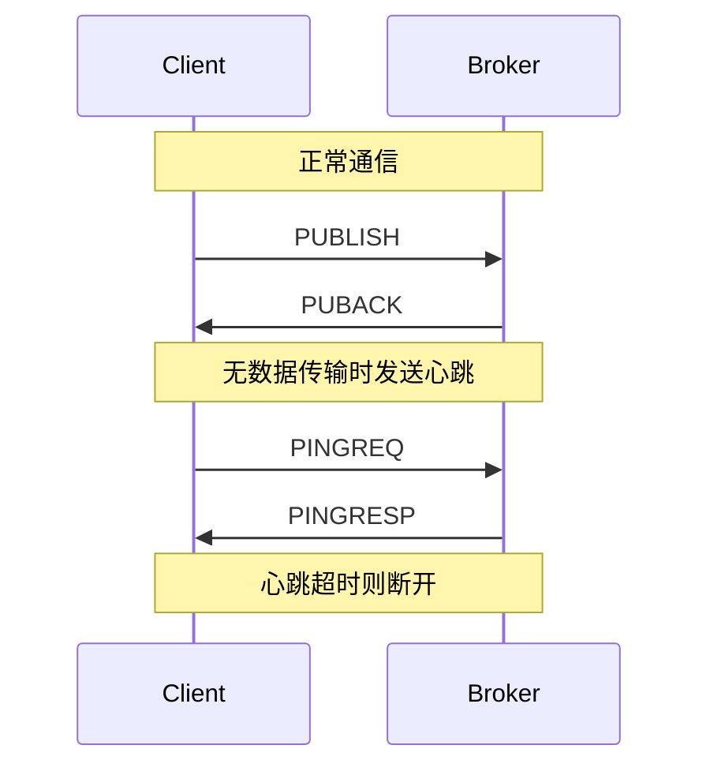

# MQTT 协议

## 什么是 MQTT？

MQTT（Message Queuing Telemetry Transport）是一种**轻量级的发布/订阅消息协议**，专为物联网设计。它具有以下特点：

- **轻量级**：协议头部最小仅 2 字节
- **低带宽**：适合网络不稳定的环境
- **可靠传输**：支持三种 QoS 级别
- **双向通信**：支持发布和订阅

### MQTT 架构

```
┌─────────────────────────────────────────────────────────────┐
│                    MQTT 架构模型                             │
│                                                             │
│  ┌─────────┐     ┌─────────┐     ┌─────────┐              │
│  │ 发布者  │     │ 订阅者  │     │ 订阅者  │              │
│  │Publisher│     │Subscriber│    │Subscriber│             │
│  └────┬────┘     └────┬────┘     └────┬────┘              │
│       │               │               │                    │
│       │    ┌──────────┴──────────┐    │                    │
│       │    │                     │    │                    │
│       └───►│      Broker         │◄───┘                    │
│            │    (消息代理)        │                         │
│            │                     │                         │
│            └─────────────────────┘                         │
│                      │                                      │
│                      ▼                                      │
│            ┌─────────────────────┐                         │
│            │      Topic 树       │                         │
│            │  home/living/temp   │                         │
│            │  home/bedroom/light │                         │
│            └─────────────────────┘                         │
└─────────────────────────────────────────────────────────────┘
```

上述图示展示了 MQTT 的发布/订阅架构。

**核心概念：**

| 概念 | 说明 |
|------|------|
| Broker | 消息代理，负责转发消息 |
| Publisher | 发布者，发送消息的客户端 |
| Subscriber | 订阅者，接收消息的客户端 |
| Topic | 主题，消息路由的地址 |
| QoS | 服务质量等级 |

## MQTT 消息格式

### 固定头部

```
MQTT 固定头部格式：
┌─────────────────────────────────────────────────────────────┐
│   Byte 1    │              Byte 2...N                       │
├──────┬──────┼───────────────────────────────────────────────┤
│ 类型 │ 标志 │              剩余长度                          │
│ 4位  │ 4位  │           (1-4 字节)                          │
└──────┴──────┴───────────────────────────────────────────────┘

消息类型：
┌─────────────────────────────────────────────────────────────┐
│ 1  - CONNECT     : 客户端请求连接                           │
│ 2  - CONNACK     : 连接确认                                 │
│ 3  - PUBLISH     : 发布消息                                 │
│ 4  - PUBACK      : 发布确认 (QoS 1)                         │
│ 5  - PUBREC      : 发布收到 (QoS 2 第一步)                  │
│ 6  - PUBREL      : 发布释放 (QoS 2 第二步)                  │
│ 7  - PUBCOMP     : 发布完成 (QoS 2 第三步)                  │
│ 8  - SUBSCRIBE   : 订阅请求                                 │
│ 9  - SUBACK      : 订阅确认                                 │
│ 10 - UNSUBSCRIBE : 取消订阅                                 │
│ 11 - UNSUBACK    : 取消订阅确认                             │
│ 12 - PINGREQ     : 心跳请求                                 │
│ 13 - PINGRESP    : 心跳响应                                 │
│ 14 - DISCONNECT  : 断开连接                                 │
└─────────────────────────────────────────────────────────────┘
```

上述图示展示了 MQTT 固定头部格式。

### 剩余长度编码

```c
/*
 * 剩余长度使用变长编码
 * 每个字节的最高位表示是否有后续字节
 * 低 7 位为实际数据
 */
int encode_remaining_length(uint8_t *buf, int length)
{
    int bytes = 0;
    
    do {
        uint8_t byte = length % 128;
        length /= 128;
        
        // 如果还有更多字节，设置最高位
        if (length > 0) {
            byte |= 0x80;
        }
        
        buf[bytes++] = byte;
    } while (length > 0);
    
    return bytes;
}

int decode_remaining_length(uint8_t *buf, int *length)
{
    int multiplier = 1;
    int value = 0;
    int bytes = 0;
    uint8_t byte;
    
    do {
        byte = buf[bytes++];
        value += (byte & 0x7F) * multiplier;
        multiplier *= 128;
        
        if (multiplier > 128 * 128 * 128) {
            return -1;  // 错误：长度过长
        }
    } while (byte & 0x80);
    
    *length = value;
    return bytes;
}
```

上述代码展示了剩余长度的编解码方式。

**编码示例：**

```
长度 64:    [0x40]                    // 单字节
长度 321:   [0xC1, 0x02]              // 双字节
            321 = 1 + 2*128 = 0xC1 + 0x02*128
长度 100000: [0xA0, 0x8D, 0x06]       // 三字节
```

## 连接建立

### CONNECT 消息

```c
/*
 * CONNECT 消息格式
 * 客户端发送给 Broker 请求建立连接
 */
typedef struct {
    // 协议名（固定为 "MQTT"）
    char protocol_name[4];
    uint8_t protocol_level;     // 协议版本 (4 = MQTT 3.1.1)
    
    // 连接标志
    uint8_t clean_session:1;    // 清除会话
    uint8_t will_flag:1;        // 遗嘱消息标志
    uint8_t will_qos:2;         // 遗嘱消息 QoS
    uint8_t will_retain:1;      // 遗嘱消息保留
    uint8_t password_flag:1;    // 密码标志
    uint8_t username_flag:1;    // 用户名标志
    
    // 保活时间（秒）
    uint16_t keep_alive;
    
    // 可变头部
    char *client_id;            // 客户端 ID（必需）
    char *will_topic;           // 遗嘱主题
    char *will_message;         // 遗嘱消息
    char *username;             // 用户名
    char *password;             // 密码
} mqtt_connect_t;
```

上述代码展示了 CONNECT 消息的结构。

**连接标志详解：**

```
连接标志字节：
┌─────┬─────┬─────┬─────┬─────┬─────┬─────┬─────┐
│ Bit7│ Bit6│ Bit5│ Bit4│ Bit3│ Bit2│ Bit1│ Bit0│
├─────┼─────┼─────┼─────┼─────┼─────┼─────┼─────┤
│User │Pass │Retain│Will │Will │Will │Clean│  0  │
│Name │Word │      │QoS1 │QoS0 │Flag │Sess │     │
└─────┴─────┴─────┴─────┴─────┴─────┴─────┴─────┘

Clean Session:
  0 = 保持会话状态（订阅、未确认消息等）
  1 = 清除会话状态，重新开始

Will Flag:
  1 = 客户端异常断开时，Broker 发布遗嘱消息
  0 = 不发送遗嘱消息
```

上述图示展示了连接标志的位定义。

### CONNACK 消息

```c
/*
 * CONNACK 消息格式
 * Broker 响应客户端连接请求
 */
typedef struct {
    uint8_t session_present;    // 会话存在标志
    uint8_t return_code;        // 连接返回码
} mqtt_connack_t;

/*
 * 返回码说明
 */
#define CONNACK_ACCEPTED              0  // 连接成功
#define CONNACK_REFUSED_VERSION       1  // 协议版本不支持
#define CONNACK_REFUSED_ID            2  // 客户端 ID 无效
#define CONNACK_REFUSED_SERVER        3  // 服务器不可用
#define CONNACK_REFUSED_USER_PASS     4  // 用户名或密码错误
#define CONNACK_REFUSED_AUTH          5  // 未授权
```

上述代码展示了 CONNACK 消息的结构。

## 主题与订阅

### 主题层级

```
主题层级示例：
┌─────────────────────────────────────────────────────────────┐
│                    主题树结构                                │
│                                                             │
│  home                                                       │
│  ├── living                                                 │
│  │   ├── temperature    (home/living/temperature)          │
│  │   └── light          (home/living/light)                │
│  └── bedroom                                                │
│      ├── temperature    (home/bedroom/temperature)         │
│      └── light          (home/bedroom/light)               │
│                                                             │
│  通配符订阅：                                                │
│  home/+/temperature     (单层通配符 +)                      │
│  home/bedroom/#         (多层通配符 #)                      │
└─────────────────────────────────────────────────────────────┘
```

上述图示展示了主题层级结构。

**通配符说明：**

| 通配符 | 说明 | 示例 |
|--------|------|------|
| `+` | 单层通配符，匹配一个层级 | `home/+/temp` 匹配 `home/living/temp` |
| `#` | 多层通配符，匹配多个层级 | `home/#` 匹配 `home/living/temp` |
| `$` | 系统主题前缀 | `$SYS/broker/version` |

### SUBSCRIBE 消息

```c
/*
 * SUBSCRIBE 消息格式
 */
typedef struct {
    uint16_t packet_id;         // 报文标识符
    char *topic;                // 主题过滤器
    uint8_t qos;                // 订阅的 QoS 级别
} mqtt_subscribe_t;

/*
 * 订阅示例
 */
void subscribe_example(mqtt_client_t *client)
{
    // 订阅单个主题
    mqtt_subscribe(client, "home/living/temperature", 1);
    
    // 使用通配符订阅
    mqtt_subscribe(client, "home/+/temperature", 1);
    
    // 订阅所有卧室主题
    mqtt_subscribe(client, "home/bedroom/#", 0);
}
```

上述代码展示了订阅消息的结构和使用。

## QoS 服务质量

### QoS 级别

```
QoS 0: 最多一次 (At most once)
┌─────────────────────────────────────────────────────────────┐
│ Publisher          Broker           Subscriber              │
│     │                │                   │                  │
│     │───PUBLISH────►│                   │                  │
│     │               │───PUBLISH────────►│                  │
│     │               │                   │                  │
│     ▼               ▼                   ▼                  │
│   发送即忘记，不保证送达                                    │
└─────────────────────────────────────────────────────────────┘

QoS 1: 至少一次 (At least once)
┌─────────────────────────────────────────────────────────────┐
│ Publisher          Broker           Subscriber              │
│     │                │                   │                  │
│     │───PUBLISH────►│                   │                  │
│     │               │───PUBLISH────────►│                  │
│     │◄──PUBACK─────│                   │                  │
│     │               │◄──PUBACK─────────│                  │
│     │               │                   │                  │
│     ▼               ▼                   ▼                  │
│   保证送达，可能重复                                        │
└─────────────────────────────────────────────────────────────┘

QoS 2: 恰好一次 (Exactly once)
┌─────────────────────────────────────────────────────────────┐
│ Publisher          Broker           Subscriber              │
│     │                │                   │                  │
│     │───PUBLISH────►│                   │                  │
│     │◄──PUBREC─────│                   │                  │
│     │───PUBREL────►│                   │                  │
│     │               │───PUBLISH────────►│                  │
│     │               │◄──PUBREC─────────│                  │
│     │               │───PUBREL────────►│                  │
│     │               │◄──PUBCOMP───────│                  │
│     │◄──PUBCOMP────│                   │                  │
│     │               │                   │                  │
│     ▼               ▼                   ▼                  │
│   保证送达且不重复，四次握手                                │
└─────────────────────────────────────────────────────────────┘
```

上述图示展示了三种 QoS 级别的消息流程。

**QoS 选择建议：**

| QoS | 场景 | 特点 |
|-----|------|------|
| 0 | 传感器数据、日志 | 高吞吐、可丢失 |
| 1 | 一般业务消息 | 可靠、可能重复 |
| 2 | 金融交易、计费 | 可靠、不重复 |

## 心跳机制

```c
/*
 * MQTT 心跳机制
 * 保持连接活跃，检测客户端是否在线
 */
void mqtt_keep_alive(mqtt_client_t *client)
{
    time_t now = time(NULL);
    time_t last_send = client->last_send_time;
    uint16_t keep_alive = client->keep_alive;
    
    /*
     * 检查是否需要发送心跳
     * 在 Keep Alive 时间的 1.5 倍内必须发送数据
     */
    if (now - last_send > keep_alive * 1.5) {
        // 发送 PINGREQ
        send_pingreq(client);
        client->last_send_time = now;
        
        // 等待 PINGRESP
        // 如果超时未收到，则断开连接
    }
}
```

上述代码展示了心跳机制的实现。

**心跳流程：**



## 实战：嵌入式 MQTT 客户端

### 客户端结构

```c
/*
 * MQTT 客户端结构
 */
typedef struct {
    // 连接信息
    int socket;
    char *server;
    uint16_t port;
    char *client_id;
    
    // 认证信息
    char *username;
    char *password;
    
    // 会话信息
    uint16_t keep_alive;
    uint16_t packet_id;
    uint8_t clean_session;
    
    // 缓冲区
    uint8_t rx_buffer[1024];
    uint8_t tx_buffer[1024];
    
    // 回调函数
    void (*on_connect)(void);
    void (*on_message)(const char *topic, const uint8_t *payload, 
                       size_t len);
    void (*on_disconnect)(void);
} mqtt_client_t;
```

上述代码展示了 MQTT 客户端的结构定义。

### 连接函数

```c
/*
 * 连接到 MQTT Broker
 * 
 * 参数说明：
 * @client: MQTT 客户端结构
 * @server: 服务器地址
 * @port: 端口号
 * @client_id: 客户端唯一标识
 * 
 * 返回值：
 * 0 = 成功
 * < 0 = 错误码
 */
int mqtt_connect(mqtt_client_t *client, const char *server, 
                 uint16_t port, const char *client_id)
{
    int ret;
    uint8_t *ptr = client->tx_buffer;
    size_t len = 0;
    
    /*
     * 1. 建立 TCP 连接
     */
    client->socket = socket_connect(server, port);
    if (client->socket < 0) {
        return -1;
    }
    
    /*
     * 2. 构建 CONNECT 消息
     */
    // 固定头部
    ptr[len++] = 0x10;  // CONNECT 类型
    
    // 可变头部
    // 协议名
    ptr[len++] = 0x00;  // 长度高字节
    ptr[len++] = 0x04;  // 长度低字节
    memcpy(&ptr[len], "MQTT", 4);
    len += 4;
    
    // 协议级别
    ptr[len++] = 0x04;  // MQTT 3.1.1
    
    // 连接标志
    uint8_t flags = 0x02;  // Clean Session
    if (client->username) flags |= 0x80;
    if (client->password) flags |= 0x40;
    ptr[len++] = flags;
    
    // 保活时间
    ptr[len++] = (client->keep_alive >> 8) & 0xFF;
    ptr[len++] = client->keep_alive & 0xFF;
    
    // 载荷
    // Client ID
    uint16_t id_len = strlen(client_id);
    ptr[len++] = (id_len >> 8) & 0xFF;
    ptr[len++] = id_len & 0xFF;
    memcpy(&ptr[len], client_id, id_len);
    len += id_len;
    
    // 用户名
    if (client->username) {
        uint16_t user_len = strlen(client->username);
        ptr[len++] = (user_len >> 8) & 0xFF;
        ptr[len++] = user_len & 0xFF;
        memcpy(&ptr[len], client->username, user_len);
        len += user_len;
    }
    
    // 密码
    if (client->password) {
        uint16_t pass_len = strlen(client->password);
        ptr[len++] = (pass_len >> 8) & 0xFF;
        ptr[len++] = pass_len & 0xFF;
        memcpy(&ptr[len], client->password, pass_len);
        len += pass_len;
    }
    
    /*
     * 3. 计算并填充剩余长度
     */
    int remaining_len = len - 1;  // 减去固定头部字节
    int rem_bytes = encode_remaining_length(&ptr[1], remaining_len);
    
    /*
     * 4. 发送 CONNECT 消息
     */
    ret = socket_send(client->socket, ptr, 1 + rem_bytes + remaining_len);
    if (ret < 0) {
        socket_close(client->socket);
        return -2;
    }
    
    /*
     * 5. 等待 CONNACK 响应
     */
    ret = socket_recv(client->socket, client->rx_buffer, 4);
    if (ret < 4) {
        socket_close(client->socket);
        return -3;
    }
    
    // 检查 CONNACK
    if (client->rx_buffer[0] != 0x20) {  // CONNACK 类型
        socket_close(client->socket);
        return -4;
    }
    
    if (client->rx_buffer[3] != 0x00) {  // 返回码
        socket_close(client->socket);
        return -5;
    }
    
    // 连接成功
    client->server = strdup(server);
    client->port = port;
    client->client_id = strdup(client_id);
    
    if (client->on_connect) {
        client->on_connect();
    }
    
    return 0;
}
```

上述代码展示了 MQTT 连接函数的实现。

### 发布函数

```c
/*
 * 发布消息
 * 
 * 参数说明：
 * @client: MQTT 客户端
 * @topic: 主题
 * @payload: 消息内容
 * @len: 消息长度
 * @qos: 服务质量等级
 * @retain: 是否保留消息
 */
int mqtt_publish(mqtt_client_t *client, const char *topic,
                 const uint8_t *payload, size_t len, 
                 uint8_t qos, bool retain)
{
    uint8_t *ptr = client->tx_buffer;
    size_t pos = 0;
    
    /*
     * 1. 固定头部
     */
    uint8_t type = 0x30;  // PUBLISH 类型
    if (retain) type |= 0x01;
    type |= (qos << 1);   // QoS 标志
    ptr[pos++] = type;
    
    /*
     * 2. 计算剩余长度
     */
    size_t topic_len = strlen(topic);
    size_t remaining = 2 + topic_len + len;
    if (qos > 0) {
        remaining += 2;  // Packet ID
    }
    
    pos += encode_remaining_length(&ptr[pos], remaining);
    
    /*
     * 3. 可变头部
     */
    // 主题
    ptr[pos++] = (topic_len >> 8) & 0xFF;
    ptr[pos++] = topic_len & 0xFF;
    memcpy(&ptr[pos], topic, topic_len);
    pos += topic_len;
    
    // Packet ID (QoS > 0)
    if (qos > 0) {
        client->packet_id++;
        ptr[pos++] = (client->packet_id >> 8) & 0xFF;
        ptr[pos++] = client->packet_id & 0xFF;
    }
    
    /*
     * 4. 载荷
     */
    memcpy(&ptr[pos], payload, len);
    pos += len;
    
    /*
     * 5. 发送消息
     */
    int ret = socket_send(client->socket, ptr, pos);
    if (ret < 0) {
        return -1;
    }
    
    /*
     * 6. 等待确认 (QoS > 0)
     */
    if (qos == 1) {
        // 等待 PUBACK
        ret = socket_recv(client->socket, client->rx_buffer, 4);
        if (ret < 4 || client->rx_buffer[0] != 0x40) {
            return -2;
        }
    } else if (qos == 2) {
        // 等待 PUBREC, 发送 PUBREL, 等待 PUBCOMP
        // ... 省略 QoS 2 完整流程
    }
    
    return 0;
}
```

上述代码展示了 MQTT 发布函数的实现。

### 订阅函数

```c
/*
 * 订阅主题
 */
int mqtt_subscribe(mqtt_client_t *client, const char *topic, uint8_t qos)
{
    uint8_t *ptr = client->tx_buffer;
    size_t pos = 0;
    
    /*
     * 1. 固定头部
     */
    ptr[pos++] = 0x82;  // SUBSCRIBE 类型 + QoS 1
    
    /*
     * 2. 计算剩余长度
     */
    size_t topic_len = strlen(topic);
    size_t remaining = 2 + 2 + topic_len + 1;  // Packet ID + Topic + QoS
    pos += encode_remaining_length(&ptr[pos], remaining);
    
    /*
     * 3. 可变头部
     */
    client->packet_id++;
    ptr[pos++] = (client->packet_id >> 8) & 0xFF;
    ptr[pos++] = client->packet_id & 0xFF;
    
    /*
     * 4. 载荷
     */
    // 主题过滤器
    ptr[pos++] = (topic_len >> 8) & 0xFF;
    ptr[pos++] = topic_len & 0xFF;
    memcpy(&ptr[pos], topic, topic_len);
    pos += topic_len;
    
    // QoS
    ptr[pos++] = qos;
    
    /*
     * 5. 发送订阅请求
     */
    int ret = socket_send(client->socket, ptr, pos);
    if (ret < 0) {
        return -1;
    }
    
    /*
     * 6. 等待 SUBACK
     */
    ret = socket_recv(client->socket, client->rx_buffer, 5);
    if (ret < 5 || client->rx_buffer[0] != 0x90) {
        return -2;
    }
    
    return 0;
}
```

上述代码展示了 MQTT 订阅函数的实现。

## 常用 MQTT Broker

| Broker | 特点 | 适用场景 |
|--------|------|----------|
| Mosquitto | 开源、轻量 | 开发测试、小型部署 |
| EMQX | 高性能、企业级 | 大规模物联网 |
| HiveMQ | 商业、高可用 | 企业应用 |
| VerneMQ | 分布式、可扩展 | 大规模部署 |

## 总结

| 概念 | 说明 |
|------|------|
| 发布/订阅 | 解耦消息生产者和消费者 |
| Broker | 消息代理，负责路由 |
| Topic | 消息主题，支持通配符 |
| QoS | 服务质量：0/1/2 |
| 心跳 | 保持连接活跃 |

## 参考资料

[1] MQTT Version 3.1.1. OASIS Standard

[2] MQTT Version 5.0. OASIS Standard

[3] Mosquitto Documentation. https://mosquitto.org/

## 相关主题

- [TCP/IP 协议](/notes/cs/tcp-ip) - 网络通信基础
- [RTOS 核心概念](/notes/hardware/rtos) - 实时操作系统
- [传感器接口](/notes/iot/sensor) - 嵌入式传感器
