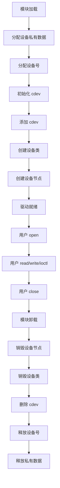

# Linux 字符设备驱动

## 什么是字符设备？

字符设备是 Linux 三大类设备之一，以**字节流**方式访问，支持顺序读写。典型的字符设备包括：

- 串口（/dev/ttyS0）
- 键盘（/dev/input/event0）
- 鼠标
- LED、GPIO
- LCD 显示屏

### 设备分类

```
┌─────────────────────────────────────────────────────────────┐
│                    Linux 设备分类                            │
│  ┌─────────────────────────────────────────────────────────┐│
│  │ 字符设备 (Character Device)                             ││
│  │ - 以字节流方式访问                                       ││
│  │ - 支持随机访问（可选）                                   ││
│  │ - 示例：串口、键盘、GPIO                                 ││
│  ├─────────────────────────────────────────────────────────┤│
│  │ 块设备 (Block Device)                                   ││
│  │ - 以块为单位访问（通常 512 字节）                        ││
│  │ - 支持随机访问                                           ││
│  │ - 示例：硬盘、SSD、U 盘                                  ││
│  ├─────────────────────────────────────────────────────────┤│
│  │ 网络设备 (Network Device)                               ││
│  │ - 通过协议栈访问                                         ││
│  │ - 没有 /dev 节点                                         ││
│  │ - 示例：网卡、WiFi                                       ││
│  └─────────────────────────────────────────────────────────┘│
└─────────────────────────────────────────────────────────────┘
```

上述图示展示了 Linux 设备分类。

**字符设备特点：**

| 特点 | 说明 |
|------|------|
| 访问方式 | 字节流，顺序读写 |
| 设备节点 | /dev 目录下的文件 |
| 主/次设备号 | 标识设备和实例 |
| 文件操作 | 通过 file_operations 实现 |

## 字符设备驱动框架

### 核心数据结构

```c
/*
 * file_operations 结构体
 * 定义设备支持的操作
 * 每个函数指针对应一个系统调用
 */
struct file_operations {
    struct module *owner;           // 模块所有者，通常为 THIS_MODULE
    loff_t (*llseek)(struct file *, loff_t, int);     // 定位
    ssize_t (*read)(struct file *, char __user *, size_t, loff_t *);  // 读
    ssize_t (*write)(struct file *, const char __user *, size_t, loff_t *); // 写
    int (*open)(struct inode *, struct file *);       // 打开
    int (*release)(struct inode *, struct file *);    // 关闭
    long (*unlocked_ioctl)(struct file *, unsigned int, unsigned long); // ioctl
    int (*mmap)(struct file *, struct vm_area_struct *); // 内存映射
    // ... 更多操作
};

/*
 * cdev 结构体
 * 表示一个字符设备
 */
struct cdev {
    struct kobject kobj;            // 内嵌的 kobject
    struct module *owner;           // 模块所有者
    const struct file_operations *ops; // 文件操作
    struct list_head list;          // 设备链表
    dev_t dev;                      // 设备号
    unsigned int count;             // 设备数量
};
```

上述代码展示了字符设备的核心数据结构。

### 完整驱动示例

```c
// chardev.c
#include <linux/init.h>
#include <linux/module.h>
#include <linux/fs.h>
#include <linux/cdev.h>
#include <linux/device.h>
#include <linux/uaccess.h>

#define DEVICE_NAME "mychardev"
#define CLASS_NAME  "myclass"
#define BUF_LEN     1024

/*
 * 设备私有数据结构
 * 存储设备的状态和数据
 */
struct mychar_dev {
    char buffer[BUF_LEN];           // 设备缓冲区
    size_t buffer_len;              // 缓冲区数据长度
    struct cdev cdev;               // cdev 结构
    struct mutex lock;              // 互斥锁
};

static dev_t dev_num;               // 设备号
static struct class *dev_class;     // 设备类
static struct device *dev_device;   // 设备
static struct mychar_dev *mydev;    // 设备私有数据

/*
 * open 函数
 * 当用户空间调用 open() 时触发
 * 
 * 参数说明：
 * @inode: 包含设备号等信息
 * @file: 文件结构，可保存私有数据
 */
static int mychar_open(struct inode *inode, struct file *file)
{
    /*
     * container_of 宏：从结构体成员指针获取结构体指针
     * inode->i_cdev 指向 mydev->cdev
     * 通过它可以获取 mydev 指针
     */
    struct mychar_dev *dev = container_of(inode->i_cdev, 
                                          struct mychar_dev, cdev);
    
    /*
     * 将设备私有数据保存到 file->private_data
     * 这样在 read/write 等函数中可以获取
     */
    file->private_data = dev;
    
    pr_info("mychardev: device opened\n");
    return 0;
}

/*
 * release 函数
 * 当用户空间调用 close() 时触发
 */
static int mychar_release(struct inode *inode, struct file *file)
{
    pr_info("mychardev: device closed\n");
    return 0;
}

/*
 * read 函数
 * 当用户空间调用 read() 时触发
 * 
 * 参数说明：
 * @file: 文件结构
 * @buf: 用户空间缓冲区指针
 * @count: 请求读取的字节数
 * @ppos: 文件偏移量指针
 * 
 * 返回值：
 * > 0: 实际读取的字节数
 * = 0: EOF
 * < 0: 错误码
 */
static ssize_t mychar_read(struct file *file, char __user *buf,
                           size_t count, loff_t *ppos)
{
    struct mychar_dev *dev = file->private_data;
    ssize_t bytes_read;
    
    /*
     * 获取互斥锁
     * 防止并发访问
     */
    if (mutex_lock_interruptible(&dev->lock))
        return -ERESTARTSYS;
    
    /*
     * 检查偏移量
     * 如果偏移量超过数据长度，返回 0（EOF）
     */
    if (*ppos >= dev->buffer_len) {
        mutex_unlock(&dev->lock);
        return 0;
    }
    
    /*
     * 调整读取字节数
     * 不能超过剩余数据量
     */
    if (*ppos + count > dev->buffer_len)
        count = dev->buffer_len - *ppos;
    
    /*
     * copy_to_user: 将内核数据复制到用户空间
     * 返回未复制的字节数，0 表示全部成功
     * 
     * 注意：不能直接使用 memcpy，因为用户空间地址
     * 可能无效或被换出
     */
    if (copy_to_user(buf, dev->buffer + *ppos, count)) {
        mutex_unlock(&dev->lock);
        return -EFAULT;  // Bad address
    }
    
    /*
     * 更新偏移量
     */
    *ppos += count;
    bytes_read = count;
    
    pr_info("mychardev: read %zd bytes\n", bytes_read);
    
    mutex_unlock(&dev->lock);
    return bytes_read;
}

/*
 * write 函数
 * 当用户空间调用 write() 时触发
 */
static ssize_t mychar_write(struct file *file, const char __user *buf,
                            size_t count, loff_t *ppos)
{
    struct mychar_dev *dev = file->private_data;
    ssize_t bytes_written;
    
    if (mutex_lock_interruptible(&dev->lock))
        return -ERESTARTSYS;
    
    /*
     * 检查缓冲区空间
     */
    if (*ppos >= BUF_LEN) {
        mutex_unlock(&dev->lock);
        return -ENOSPC;  // No space left
    }
    
    if (*ppos + count > BUF_LEN)
        count = BUF_LEN - *ppos;
    
    /*
     * copy_from_user: 将用户空间数据复制到内核
     * 返回未复制的字节数
     */
    if (copy_from_user(dev->buffer + *ppos, buf, count)) {
        mutex_unlock(&dev->lock);
        return -EFAULT;
    }
    
    *ppos += count;
    
    /*
     * 更新缓冲区数据长度
     */
    if (*ppos > dev->buffer_len)
        dev->buffer_len = *ppos;
    
    bytes_written = count;
    
    pr_info("mychardev: wrote %zd bytes\n", bytes_written);
    
    mutex_unlock(&dev->lock);
    return bytes_written;
}

/*
 * llseek 函数
 * 当用户空间调用 lseek() 时触发
 */
static loff_t mychar_llseek(struct file *file, loff_t offset, int whence)
{
    struct mychar_dev *dev = file->private_data;
    loff_t new_pos;
    
    switch (whence) {
    case SEEK_SET:  // 从文件开头
        new_pos = offset;
        break;
    case SEEK_CUR:  // 从当前位置
        new_pos = file->f_pos + offset;
        break;
    case SEEK_END:  // 从文件末尾
        new_pos = dev->buffer_len + offset;
        break;
    default:
        return -EINVAL;
    }
    
    /*
     * 检查新位置是否有效
     */
    if (new_pos < 0 || new_pos > BUF_LEN)
        return -EINVAL;
    
    file->f_pos = new_pos;
    return new_pos;
}

/*
 * ioctl 函数
 * 当用户空间调用 ioctl() 时触发
 * 用于设备特定的控制操作
 */
#define MYCHAR_IOCTL_MAGIC  'm'
#define MYCHAR_IOCTL_CLEAR  _IO(MYCHAR_IOCTL_MAGIC, 0)
#define MYCHAR_IOCTL_GETLEN _IOR(MYCHAR_IOCTL_MAGIC, 1, int)

static long mychar_ioctl(struct file *file, unsigned int cmd,
                         unsigned long arg)
{
    struct mychar_dev *dev = file->private_data;
    int ret = 0;
    
    /*
     * 检查魔术数字
     * 防止错误的 ioctl 命令
     */
    if (_IOC_TYPE(cmd) != MYCHAR_IOCTL_MAGIC)
        return -ENOTTY;
    
    switch (cmd) {
    case MYCHAR_IOCTL_CLEAR:
        /*
         * 清空缓冲区
         */
        if (mutex_lock_interruptible(&dev->lock))
            return -ERESTARTSYS;
        dev->buffer_len = 0;
        mutex_unlock(&dev->lock);
        pr_info("mychardev: buffer cleared\n");
        break;
        
    case MYCHAR_IOCTL_GETLEN:
        /*
         * 获取缓冲区数据长度
         * 通过 arg 返回给用户空间
         */
        if (copy_to_user((int __user *)arg, &dev->buffer_len, 
                         sizeof(int)))
            return -EFAULT;
        break;
        
    default:
        return -ENOTTY;
    }
    
    return ret;
}

/*
 * 文件操作结构
 * 将函数指针与系统调用关联
 */
static const struct file_operations mychar_fops = {
    .owner   = THIS_MODULE,
    .open    = mychar_open,
    .release = mychar_release,
    .read    = mychar_read,
    .write   = mychar_write,
    .llseek  = mychar_llseek,
    .unlocked_ioctl = mychar_ioctl,
};

/*
 * 模块初始化函数
 */
static int __init mychar_init(void)
{
    int ret;
    
    pr_info("mychardev: initializing\n");
    
    /*
     * 1. 分配设备私有数据
     */
    mydev = kzalloc(sizeof(*mydev), GFP_KERNEL);
    if (!mydev) {
        pr_err("mychardev: failed to allocate device data\n");
        return -ENOMEM;
    }
    
    /*
     * 初始化互斥锁
     */
    mutex_init(&mydev->lock);
    
    /*
     * 2. 分配设备号
     * alloc_chrdev_region: 动态分配设备号
     * 参数：设备号指针、次设备号起始、数量、设备名
     */
    ret = alloc_chrdev_region(&dev_num, 0, 1, DEVICE_NAME);
    if (ret < 0) {
        pr_err("mychardev: failed to allocate device number\n");
        goto fail_alloc_devnum;
    }
    pr_info("mychardev: device number: %d:%d\n", 
            MAJOR(dev_num), MINOR(dev_num));
    
    /*
     * 3. 初始化 cdev
     */
    cdev_init(&mydev->cdev, &mychar_fops);
    mydev->cdev.owner = THIS_MODULE;
    
    /*
     * 4. 添加 cdev 到系统
     */
    ret = cdev_add(&mydev->cdev, dev_num, 1);
    if (ret < 0) {
        pr_err("mychardev: failed to add cdev\n");
        goto fail_cdev_add;
    }
    
    /*
     * 5. 创建设备类
     * 用于在 /sys/class 下创建目录
     */
    dev_class = class_create(CLASS_NAME);
    if (IS_ERR(dev_class)) {
        pr_err("mychardev: failed to create class\n");
        ret = PTR_ERR(dev_class);
        goto fail_class_create;
    }
    
    /*
     * 6. 创建设备节点
     * 在 /dev 下创建设备文件
     */
    dev_device = device_create(dev_class, NULL, dev_num, NULL, 
                               DEVICE_NAME);
    if (IS_ERR(dev_device)) {
        pr_err("mychardev: failed to create device\n");
        ret = PTR_ERR(dev_device);
        goto fail_device_create;
    }
    
    pr_info("mychardev: device created at /dev/%s\n", DEVICE_NAME);
    return 0;
    
    /*
     * 错误处理：反向释放资源
     */
fail_device_create:
    class_destroy(dev_class);
fail_class_create:
    cdev_del(&mydev->cdev);
fail_cdev_add:
    unregister_chrdev_region(dev_num, 1);
fail_alloc_devnum:
    kfree(mydev);
    return ret;
}

/*
 * 模块清理函数
 */
static void __exit mychar_exit(void)
{
    pr_info("mychardev: exiting\n");
    
    /*
     * 反向释放资源
     */
    device_destroy(dev_class, dev_num);
    class_destroy(dev_class);
    cdev_del(&mydev->cdev);
    unregister_chrdev_region(dev_num, 1);
    kfree(mydev);
    
    pr_info("mychardev: device removed\n");
}

module_init(mychar_init);
module_exit(mychar_exit);

MODULE_LICENSE("GPL");
MODULE_AUTHOR("Your Name");
MODULE_DESCRIPTION("A simple character device driver");
```

上述代码展示了一个完整的字符设备驱动。

## 驱动注册流程



上述流程图展示了驱动注册和卸载流程。

## 设备号

### 主设备号与次设备号

```
设备号 (dev_t): 32 位
┌─────────────────────────────────────────────────────────────┐
│   主设备号 (12 位)   │           次设备号 (20 位)            │
│      31 - 20        │              19 - 0                   │
└─────────────────────────────────────────────────────────────┘

主设备号：标识设备驱动程序
次设备号：标识具体的设备实例
```

上述图示展示了设备号的组成。

**设备号操作宏：**

```c
#include <linux/kdev_t.h>

dev_t dev = MKDEV(240, 0);       // 创建设备号：主设备号 240，次设备号 0
int major = MAJOR(dev);          // 获取主设备号：240
int minor = MINOR(dev);          // 获取次设备号：0

// 静态分配设备号（需要知道未使用的号）
dev_t dev = MKDEV(240, 0);
ret = register_chrdev_region(dev, 1, DEVICE_NAME);

// 动态分配设备号（推荐）
ret = alloc_chrdev_region(&dev, 0, 1, DEVICE_NAME);
```

上述代码展示了设备号的操作方式。

## 用户空间与内核空间数据交换

### copy_to_user / copy_from_user

```c
/*
 * copy_to_user: 内核 → 用户
 * @to: 用户空间地址
 * @from: 内核空间地址
 * @n: 字节数
 * 返回：未复制的字节数（0 表示成功）
 */
unsigned long copy_to_user(void __user *to, const void *from, 
                           unsigned long n);

/*
 * copy_from_user: 用户 → 内核
 * @to: 内核空间地址
 * @from: 用户空间地址
 * @n: 字节数
 * 返回：未复制的字节数（0 表示成功）
 */
unsigned long copy_from_user(void *to, const void __user *from, 
                             unsigned long n);
```

上述代码展示了数据复制函数的原型。

**为什么不能直接使用 memcpy？**

```
用户空间地址的问题：
┌─────────────────────────────────────────────────────────────┐
│ 1. 地址可能无效（用户传入错误地址）                          │
│ 2. 页面可能被换出到磁盘                                      │
│ 3. 页面可能没有映射                                          │
│ 4. 需要进行权限检查                                          │
└─────────────────────────────────────────────────────────────┘

copy_to_user/copy_from_user 会：
┌─────────────────────────────────────────────────────────────┐
│ 1. 检查地址是否有效                                          │
│ 2. 处理缺页异常                                              │
│ 3. 确保访问权限正确                                          │
│ 4. 返回未复制的字节数                                        │
└─────────────────────────────────────────────────────────────┘
```

上述图示解释了为什么需要特殊的复制函数。

### 简单数据类型

```c
#include <linux/uaccess.h>

// 单字节数据
unsigned char val;
put_user(val, (unsigned char __user *)arg);   // 写入用户空间
get_user(val, (unsigned char __user *)arg);   // 从用户空间读取

// 整数数据
int value;
put_user(value, (int __user *)arg);
get_user(value, (int __user *)arg);
```

上述代码展示了简单数据类型的访问方式。

## ioctl 命令设计

### 命令编码

```c
#include <linux/ioctl.h>

/*
 * ioctl 命令编码（32 位）
 * ┌─────────┬─────────┬─────────┬───────────────┐
 * │ 方向    │ 大小    │ 魔术数  │ 序号          │
 * │ 2 位    │ 14 位   │ 8 位    │ 8 位          │
 * │ 31-30   │ 29-16   │ 15-8    │ 7-0           │
 * └─────────┴─────────┴─────────┴───────────────┘
 */

// 方向：数据传输方向
#define _IOC_NONE  0U  // 无数据传输
#define _IOC_READ  1U  // 从驱动读取
#define _IOC_WRITE 2U  // 写入驱动

// 定义 ioctl 命令
#define MY_MAGIC 'm'

// 无参数命令
#define CMD_RESET    _IO(MY_MAGIC, 0)

// 读取数据命令（驱动 → 用户）
#define CMD_GET_DATA _IOR(MY_MAGIC, 1, struct my_data)

// 写入数据命令（用户 → 驱动）
#define CMD_SET_DATA _IOW(MY_MAGIC, 2, struct my_data)

// 双向数据命令
#define CMD_XCHG_DATA _IOWR(MY_MAGIC, 3, struct my_data)
```

上述代码展示了 ioctl 命令的定义方式。

**ioctl 命令解码：**

```c
// 在驱动中解码 ioctl 命令
static long my_ioctl(struct file *file, unsigned int cmd, 
                     unsigned long arg)
{
    // 获取命令各部分
    int dir = _IOC_DIR(cmd);    // 方向
    int size = _IOC_SIZE(cmd);  // 数据大小
    int type = _IOC_TYPE(cmd);  // 魔术数
    int nr = _IOC_NR(cmd);      // 序号
    
    // 检查魔术数
    if (type != MY_MAGIC)
        return -ENOTTY;
    
    // 检查用户空间指针
    if (dir & _IOC_READ) {
        if (!access_ok((void __user *)arg, size))
            return -EFAULT;
    }
    
    // 处理命令...
}
```

上述代码展示了 ioctl 命令的解码方式。

## 用户空间测试程序

```c
// test.c
#include <stdio.h>
#include <stdlib.h>
#include <string.h>
#include <fcntl.h>
#include <unistd.h>
#include <sys/ioctl.h>

#define DEVICE_PATH "/dev/mychardev"

#define MYCHAR_IOCTL_MAGIC  'm'
#define MYCHAR_IOCTL_CLEAR  _IO(MYCHAR_IOCTL_MAGIC, 0)
#define MYCHAR_IOCTL_GETLEN _IOR(MYCHAR_IOCTL_MAGIC, 1, int)

int main(void)
{
    int fd;
    char buf[1024];
    int len;
    ssize_t ret;
    
    /*
     * 打开设备
     */
    fd = open(DEVICE_PATH, O_RDWR);
    if (fd < 0) {
        perror("open");
        return 1;
    }
    printf("Device opened: %s\n", DEVICE_PATH);
    
    /*
     * 写入数据
     */
    strcpy(buf, "Hello, Kernel!");
    ret = write(fd, buf, strlen(buf));
    if (ret < 0) {
        perror("write");
        close(fd);
        return 1;
    }
    printf("Wrote %zd bytes: %s\n", ret, buf);
    
    /*
     * 定位到开头
     */
    lseek(fd, 0, SEEK_SET);
    
    /*
     * 读取数据
     */
    memset(buf, 0, sizeof(buf));
    ret = read(fd, buf, sizeof(buf));
    if (ret < 0) {
        perror("read");
        close(fd);
        return 1;
    }
    printf("Read %zd bytes: %s\n", ret, buf);
    
    /*
     * ioctl 获取长度
     */
    if (ioctl(fd, MYCHAR_IOCTL_GETLEN, &len) < 0) {
        perror("ioctl GETLEN");
    } else {
        printf("Buffer length: %d\n", len);
    }
    
    /*
     * ioctl 清空缓冲区
     */
    if (ioctl(fd, MYCHAR_IOCTL_CLEAR) < 0) {
        perror("ioctl CLEAR");
    } else {
        printf("Buffer cleared\n");
    }
    
    /*
     * 关闭设备
     */
    close(fd);
    printf("Device closed\n");
    
    return 0;
}
```

上述代码展示了用户空间测试程序。

**编译和测试：**

```bash
# 编译驱动
$ make

# 编译测试程序
$ gcc -o test test.c

# 加载驱动
$ sudo insmod chardev.ko

# 查看设备
$ ls -l /dev/mychardev
crw------- 1 root root 240, 0 Mar 27 10:00 /dev/mychardev

# 运行测试
$ sudo ./test
Device opened: /dev/mychardev
Wrote 14 bytes: Hello, Kernel!
Read 14 bytes: Hello, Kernel!
Buffer length: 14
Buffer cleared
Device closed

# 查看内核日志
$ dmesg | tail
mychardev: device opened
mychardev: wrote 14 bytes
mychardev: read 14 bytes
mychardev: buffer cleared
mychardev: device closed

# 卸载驱动
$ sudo rmmod chardev
```

上述命令展示了完整的测试流程。

## 总结

| 概念 | 说明 |
|------|------|
| cdev | 字符设备结构体 |
| file_operations | 文件操作函数指针 |
| 设备号 | 主设备号标识驱动，次设备号标识实例 |
| copy_to_user | 内核到用户空间数据复制 |
| copy_from_user | 用户到内核空间数据复制 |
| ioctl | 设备控制接口 |

## 参考资料

[1] Linux Device Drivers, 3rd Edition. Jonathan Corbet

[2] Linux Kernel Documentation. https://www.kernel.org/doc/

[3] The Linux Programming Interface. Michael Kerrisk

## 相关主题

- [内核模块开发](/notes/linux/kernel-module) - Linux 内核编程基础
- [内存管理](/notes/c/memory-management) - C 语言内存管理
- [进程与线程](/notes/cs/process-thread) - 操作系统核心概念
