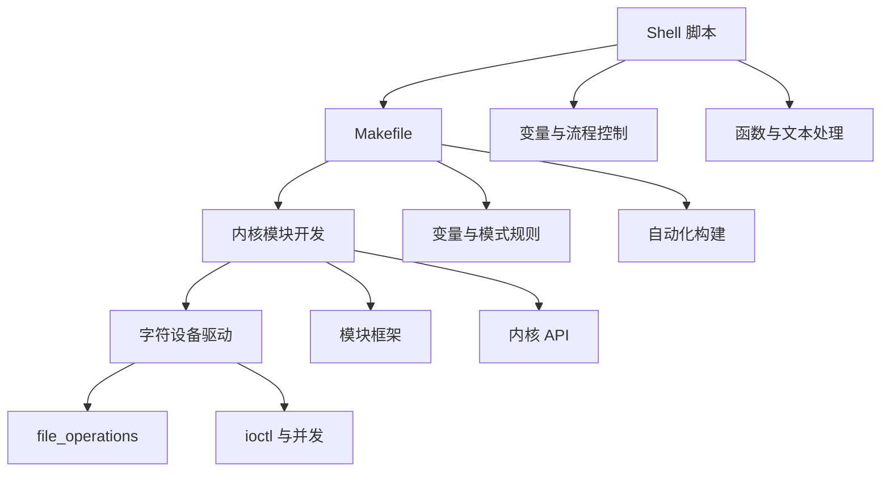

# 嵌入式 Linux

本系列文章深入讲解嵌入式 Linux 开发，从基础语法到内核驱动，帮助你掌握 Linux 系统开发技能。

## 系列文章

### Linux 基础语法

- [Shell 脚本](/notes/linux/shell) - 变量、流程控制、函数、文本处理
- [Makefile](/notes/linux/makefile) - 构建系统、变量、模式规则

### Linux 内核原理

- [内核模块开发](/notes/linux/kernel-module) - 模块加载卸载、内核编程规范

### Linux 驱动开发

- [字符设备驱动](/notes/linux/char-driver) - 字符设备框架、file_operations 实现

## 学习路径

## 前置知识

学习本系列文章前，你需要：

- 熟练掌握 C 语言编程
- 理解计算机组成原理
- 熟悉 Linux 基本操作
- 了解嵌入式硬件基础

## 相关主题

- [C 语言核心概念](/notes/c/) - C 语言内存管理
- [硬件基础](/notes/hardware/) - ARM 架构、RTOS
- [进程与线程](/notes/cs/process-thread) - 操作系统核心概念
