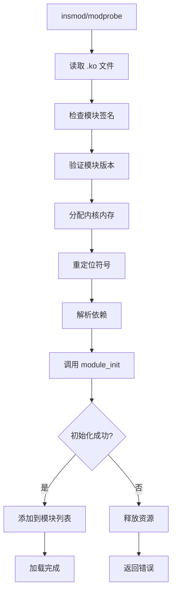

# Linux 内核模块开发

## 什么是内核模块？

内核模块是一种**可以在运行时动态加载到内核**的代码，无需重新编译整个内核。这使得内核可以保持精简，同时支持按需扩展功能。

### 内核模块 vs 用户程序

```
┌─────────────────────────────────────────────────────────────┐
│                      用户空间                                │
│  ┌─────────────────────────────────────────────────────────┐│
│  │                    用户程序                              ││
│  │  - 受限的内存访问                                       ││
│  │  - 通过系统调用访问内核                                 ││
│  │  - 段错误不会导致系统崩溃                               ││
│  │  - 使用 glibc 等标准库                                  ││
│  └─────────────────────────────────────────────────────────┘│
├─────────────────────────────────────────────────────────────┤
│                      内核空间                                │
│  ┌─────────────────────────────────────────────────────────┐│
│  │                    内核模块                              ││
│  │  - 完全访问硬件和内存                                   ││
│  │  - 直接调用内核函数                                     ││
│  │  - 错误可能导致系统崩溃                                 ││
│  │  - 使用内核 API                                         ││
│  └─────────────────────────────────────────────────────────┘│
└─────────────────────────────────────────────────────────────┘
```

上述图示展示了用户程序与内核模块的区别。

**关键差异对比：**

| 特性 | 用户程序 | 内核模块 |
|------|----------|----------|
| 运行空间 | 用户空间 | 内核空间 |
| 权限 | 受限 | 完全访问 |
| 内存保护 | 有 | 无 |
| 错误影响 | 进程崩溃 | 系统崩溃 |
| 库函数 | glibc | 内核 API |
| 链接方式 | 动态链接 | 直接链接到内核 |

## 第一个内核模块

### 模块代码

```c
// hello.c
#include <linux/init.h>    // module_init, module_exit 宏
#include <linux/module.h>  // MODULE_LICENSE 等宏
#include <linux/kernel.h>  // printk 函数

/*
 * 模块初始化函数
 * 当模块加载时（insmod）被调用
 * 返回 0 表示成功，负值表示失败
 */
static int __init hello_init(void)
{
    /*
     * printk 是内核版的 printf
     * KERN_INFO 是日志级别
     * 输出可通过 dmesg 命令查看
     */
    printk(KERN_INFO "Hello, Kernel!\n");
    return 0;
}

/*
 * 模块清理函数
 * 当模块卸载时（rmmod）被调用
 * 用于释放资源，不能失败
 */
static void __exit hello_exit(void)
{
    printk(KERN_INFO "Goodbye, Kernel!\n");
}

/*
 * module_init/module_exit 宏
 * 告诉内核哪个函数是初始化/清理函数
 * 如果不使用这些宏，默认函数名为 init_module/cleanup_module
 */
module_init(hello_init);
module_exit(hello_exit);

/*
 * 模块元信息
 * GPL 许可证是必需的，否则某些内核函数无法使用
 */
MODULE_LICENSE("GPL");
MODULE_AUTHOR("Your Name");
MODULE_DESCRIPTION("A simple Hello World kernel module");
MODULE_VERSION("1.0");
```

上述代码展示了一个最简单的内核模块。

**代码详细解释：**

| 代码元素 | 说明 |
|----------|------|
| `#include <linux/init.h>` | 包含模块初始化相关的宏定义 |
| `#include <linux/module.h>` | 包含模块开发的核心宏和函数 |
| `#include <linux/kernel.h>` | 包含 printk 等内核输出函数 |
| `static int __init` | `static` 限制作用域，`__init` 标记初始化代码（加载后可释放） |
| `static void __exit` | `__exit` 标记清理代码（如果不编译为模块则不包含） |
| `printk` | 内核日志输出函数，类似 printf |
| `KERN_INFO` | 日志级别，表示信息级别 |
| `module_init()` | 注册模块加载函数 |
| `module_exit()` | 注册模块卸载函数 |
| `MODULE_LICENSE("GPL")` | 声明许可证，必须为 GPL 才能使用内核 API |

### Makefile

```makefile
# Makefile

# 模块名称（与 .c 文件名对应）
obj-m += hello.o

# 内核源码路径
# 如果是自己编译的内核，指向内核源码目录
# 如果使用系统内核，可以使用 /lib/modules/$(shell uname -r)/build
KDIR := /lib/modules/$(shell uname -r)/build

# 当前目录
PWD := $(shell pwd)

# 默认目标：编译模块
all:
	$(MAKE) -C $(KDIR) M=$(PWD) modules

# 清理目标
clean:
	$(MAKE) -C $(KDIR) M=$(PWD) clean

# 安装模块到系统
install:
	$(MAKE) -C $(KDIR) M=$(PWD) modules_install
```

上述 Makefile 用于编译内核模块。

**Makefile 解释：**

| 变量/目标 | 说明 |
|-----------|------|
| `obj-m += hello.o` | 告诉内核构建系统要编译的模块 |
| `KDIR` | 内核源码路径，包含内核头文件和构建脚本 |
| `$(MAKE) -C $(KDIR)` | 切换到内核目录执行 make |
| `M=$(PWD)` | 告诉内核构建系统模块源码位置 |
| `modules` | 编译模块目标 |
| `modules_install` | 安装模块到 /lib/modules/ |

### 编译与加载

```bash
# 编译模块
$ make
make -C /lib/modules/5.15.0/build M=/home/user/hello modules
make[1]: Entering directory '/usr/src/linux-5.15.0'
  CC [M]  /home/user/hello/hello.o
  MODPOST /home/user/hello/Module.symvers
  CC [M]  /home/user/hello/hello.mod.o
  LD [M]  /home/user/hello/hello.ko
make[1]: Leaving directory '/usr/src/linux-5.15.0'

# 查看生成的文件
$ ls
hello.c  hello.ko  hello.mod.c  hello.mod.o  hello.o  Makefile  Module.symvers

# 加载模块
$ sudo insmod hello.ko

# 查看内核日志
$ dmesg | tail
[12345.678901] Hello, Kernel!

# 查看已加载模块
$ lsmod | grep hello
hello                  16384  0

# 查看模块信息
$ modinfo hello.ko
filename:       /home/user/hello/hello.ko
version:        1.0
description:    A simple Hello World kernel module
author:         Your Name
license:        GPL
srcversion:     ABC123...
depends:        
retpoline:      Y
name:           hello
vermagic:       5.15.0 SMP mod_unload modversions 

# 卸载模块
$ sudo rmmod hello

# 再次查看日志
$ dmesg | tail
[12345.678901] Hello, Kernel!
[12400.123456] Goodbye, Kernel!
```

上述命令展示了模块的编译、加载、卸载过程。

**编译过程图解：**

```
源文件 (.c)
    │
    ▼
┌─────────────────────────────────────────────────────────────┐
│                    编译过程                                  │
│  ┌─────────────────────────────────────────────────────────┐│
│  │ 1. 预处理 (cpp)                                         ││
│  │    hello.c → hello.i                                    ││
│  │    展开宏、处理 #include                                 ││
│  ├─────────────────────────────────────────────────────────┤│
│  │ 2. 编译 (gcc)                                           ││
│  │    hello.i → hello.s                                    ││
│  │    生成汇编代码                                          ││
│  ├─────────────────────────────────────────────────────────┤│
│  │ 3. 汇编 (as)                                            ││
│  │    hello.s → hello.o                                    ││
│  │    生成目标文件                                          ││
│  ├─────────────────────────────────────────────────────────┤│
│  │ 4. 模块链接 (ld)                                        ││
│  │    hello.o + hello.mod.o → hello.ko                     ││
│  │    生成可加载模块                                        ││
│  └─────────────────────────────────────────────────────────┘│
└─────────────────────────────────────────────────────────────┘
```

上述图示展示了内核模块的编译过程。

## 模块加载机制

### insmod vs modprobe

```bash
# insmod：直接加载模块文件
$ sudo insmod /path/to/module.ko

# modprobe：智能加载，自动处理依赖
$ sudo modprobe module_name

# modprobe 会：
# 1. 在 /lib/modules/$(uname -r) 中查找模块
# 2. 检查并加载依赖模块
# 3. 处理模块别名
```

上述命令对比了 insmod 和 modprobe。

**加载流程图解：**



上述流程图展示了模块加载过程。

### 模块信息结构

```c
// 每个模块都有一个 struct module 结构
// 定义在 include/linux/module.h

struct module {
    enum module_state state;      // 模块状态
    
    /* 模块信息 */
    char name[MODULE_NAME_LEN];   // 模块名称
    const char *version;          // 版本
    const char *srcversion;       // 源码版本
    
    /* 导出的符号 */
    const struct kernel_symbol *syms;  // 导出的符号
    const s32 *crcs;                   // 符号 CRC
    unsigned int num_syms;             // 符号数量
    
    /* 依赖信息 */
    unsigned int num_deps;             // 依赖数量
    struct module *deps;               // 依赖列表
    
    /* 初始化和清理函数 */
    int (*init)(void);                 // 初始化函数
    void (*exit)(void);                // 清理函数
    
    /* 内存信息 */
    void *module_core;                 // 代码段地址
    unsigned int core_size;            // 代码段大小
    void *module_init;                 // 初始化段地址
    unsigned int init_size;            // 初始化段大小
    
    /* ... */
};
```

上述代码展示了模块信息结构。

**模块状态说明：**

| 状态 | 说明 |
|------|------|
| MODULE_STATE_LIVE | 正常运行中 |
| MODULE_STATE_COMING | 正在加载 |
| MODULE_STATE_GOING | 正在卸载 |

## 模块参数

### 定义模块参数

```c
#include <linux/moduleparam.h>

/*
 * 模块参数定义
 * 格式: module_param(name, type, perm)
 * name: 变量名
 * type: 参数类型 (int, charp, bool, etc.)
 * perm: /sys/module/参数文件权限 (0644 表示可读写)
 */
static int count = 1;           // 默认值
module_param(count, int, 0644); // 定义参数
MODULE_PARM_DESC(count, "Number of times to print message"); // 参数描述

static char *name = "World";
module_param(name, charp, 0644);
MODULE_PARM_DESC(name, "Name to greet");

/*
 * 数组参数
 * 格式: module_param_array(name, type, num, perm)
 */
static int values[10];
static int num_values;
module_param_array(values, int, &num_values, 0644);
MODULE_PARM_DESC(values, "Array of values");

static int __init hello_init(void)
{
    int i;
    
    for (i = 0; i < count; i++) {
        printk(KERN_INFO "Hello, %s!\n", name);
    }
    
    for (i = 0; i < num_values; i++) {
        printk(KERN_INFO "value[%d] = %d\n", i, values[i]);
    }
    
    return 0;
}
```

上述代码展示了模块参数的定义和使用。

**参数类型说明：**

| 类型 | 说明 | 示例 |
|------|------|------|
| `bool` | 布尔值 | `insmod mod.ko enable=1` |
| `int` | 整数 | `insmod mod.ko count=5` |
| `charp` | 字符串指针 | `insmod mod.ko name="test"` |
| `long` | 长整数 | `insmod mod.ko size=1024` |
| `ushort` | 无符号短整数 | `insmod mod.ko port=8080` |

**权限位说明：**

| 权限 | 说明 |
|------|------|
| 0 | 不在 sysfs 中创建文件 |
| 0444 | 只读，用户可查看 |
| 0644 | 可读写，用户可修改 |
| 0400 | 只有 root 可读 |

### 使用模块参数

```bash
# 加载时传递参数
$ sudo insmod hello.ko count=3 name="Linux"

# 查看内核日志
$ dmesg | tail
Hello, Linux!
Hello, Linux!
Hello, Linux!

# 通过 sysfs 查看参数
$ cat /sys/module/hello/parameters/count
3

# 运行时修改参数（需要 0644 权限）
$ echo 5 > /sys/module/hello/parameters/count
$ cat /sys/module/hello/parameters/count
5

# 使用 modprobe 传递参数
$ echo "options hello count=3 name=Kernel" > /etc/modprobe.d/hello.conf
$ sudo modprobe hello
```

上述命令展示了模块参数的使用方式。

## 导出符号

### 导出函数和变量

```c
#include <linux/module.h>
#include <linux/kernel.h>

/*
 * 导出符号（函数或变量）
 * 导出后其他模块可以使用
 * EXPORT_SYMBOL: 导出符号，任何模块可用
 * EXPORT_SYMBOL_GPL: 只对 GPL 许可的模块可用
 */

// 导出变量
int exported_value = 100;
EXPORT_SYMBOL(exported_value);

// 导出函数
int exported_function(int x)
{
    return x * 2;
}
EXPORT_SYMBOL(exported_function);

// GPL 专用导出
int gpl_only_function(int x)
{
    return x * 3;
}
EXPORT_SYMBOL_GPL(gpl_only_function);
```

上述代码展示了符号导出方式。

**符号导出流程：**

```
模块 A (导出符号)
┌─────────────────────────────────────────────────────────────┐
│  int exported_function(int x) { return x * 2; }             │
│  EXPORT_SYMBOL(exported_function);                          │
└─────────────────────────────────────────────────────────────┘
                          │
                          │ 符号表
                          ▼
┌─────────────────────────────────────────────────────────────┐
│                    内核符号表                                │
│  ┌─────────────────────────────────────────────────────────┐│
│  │ Symbol              │ Address       │ Module            ││
│  │ exported_function   │ 0xffffffff... │ module_a          ││
│  │ exported_value      │ 0xffffffff... │ module_a          ││
│  └─────────────────────────────────────────────────────────┘│
└─────────────────────────────────────────────────────────────┘
                          │
                          │ 查找符号
                          ▼
模块 B (使用符号)
┌─────────────────────────────────────────────────────────────┐
│  extern int exported_function(int x);                       │
│  int result = exported_function(5);  // 使用导出的函数      │
└─────────────────────────────────────────────────────────────┘
```

上述图示展示了符号导出和使用流程。

### 查看导出符号

```bash
# 查看内核导出的所有符号
$ cat /proc/kallsyms | head
0000000000000000 A VDSO64_PRELINK
0000000000000000 A __vvar_page
ffffffff81000000 T _text
ffffffff81000000 T startup_64
...

# 查看模块导出的符号
$ nm -D hello.ko | grep ' T '
0000000000000000 T exported_function

# 查看模块使用的符号
$ nm -D hello.ko | grep ' U '
                 U printk
                 U __kmalloc
```

上述命令展示了如何查看导出符号。

## 内核日志与调试

### printk 日志级别

```c
#include <linux/kernel.h>

/*
 * printk 日志级别
 * 从高到低：KERN_EMERG > KERN_ALERT > KERN_CRIT > KERN_ERR >
 *          KERN_WARNING > KERN_NOTICE > KERN_INFO > KERN_DEBUG
 */

printk(KERN_EMERG   "System is unusable\n");     // 紧急
printk(KERN_ALERT   "Action must be taken\n");   // 警报
printk(KERN_CRIT    "Critical conditions\n");    // 严重
printk(KERN_ERR     "Error conditions\n");       // 错误
printk(KERN_WARNING "Warning conditions\n");     // 警告
printk(KERN_NOTICE  "Normal but significant\n"); // 通知
printk(KERN_INFO    "Informational\n");          // 信息
printk(KERN_DEBUG   "Debug messages\n");         // 调试

// 使用 pr_* 宏（推荐）
pr_emerg("Emergency message\n");
pr_alert("Alert message\n");
pr_err("Error message\n");
pr_info("Info message\n");
pr_debug("Debug message\n");  // 需要定义 DEBUG 宏

// 带格式的日志
pr_info("Value: %d, String: %s\n", 42, "hello");
```

上述代码展示了 printk 的各种日志级别。

**日志级别说明：**

| 级别 | 值 | 说明 | 典型用途 |
|------|-----|------|----------|
| KERN_EMERG | 0 | 紧急 | 系统不可用 |
| KERN_ALERT | 1 | 警报 | 必须立即处理 |
| KERN_CRIT | 2 | 严重 | 硬件错误 |
| KERN_ERR | 3 | 错误 | 设备驱动错误 |
| KERN_WARNING | 4 | 警告 | 潜在问题 |
| KERN_NOTICE | 5 | 通知 | 正常但重要 |
| KERN_INFO | 6 | 信息 | 一般信息 |
| KERN_DEBUG | 7 | 调试 | 调试信息 |

### 控制台日志级别

```bash
# 查看当前日志级别
$ cat /proc/sys/kernel/printk
4    4    1    7
# 解释：当前级别  默认级别  最小级别  启动时级别

# 只有级别低于当前级别的消息才会打印到控制台
# 例如：当前级别为 4，则 0-3 级别的消息会打印

# 临时修改日志级别
$ echo "8 4 1 7" > /proc/sys/kernel/printk

# 或者使用 dmesg
$ dmesg -n 8  # 设置控制台日志级别为 8（打印所有）

# 查看内核日志
$ dmesg
$ dmesg | tail -20
$ dmesg -w  # 实时监控

# 清除内核日志
$ sudo dmesg -c
```

上述命令展示了日志级别的控制方式。

### 使用 pr_debug 动态调试

```c
// 定义 DEBUG 宏以启用 pr_debug
#define DEBUG
#include <linux/printk.h>

// 或者使用动态调试（不需要重新编译）
// 在代码中使用 pr_debug
pr_debug("Debug: x = %d\n", x);
```

上述代码展示了动态调试的使用。

```bash
# 启用动态调试
$ echo "module:hello +p" > /sys/kernel/debug/dynamic_debug/control

# 查看动态调试状态
$ cat /sys/kernel/debug/dynamic_debug/control | grep hello

# 禁用动态调试
$ echo "module:hello -p" > /sys/kernel/debug/dynamic_debug/control
```

上述命令展示了动态调试的控制方式。

## 内存分配

### 内核内存分配函数

```c
#include <linux/slab.h>
#include <linux/vmalloc.h>

void example_memory(void)
{
    void *ptr;
    
    /*
     * kmalloc: 分配物理连续的内存
     * 适合 DMA、小块内存
     * GFP_KERNEL: 可能睡眠，用于进程上下文
     * GFP_ATOMIC: 不会睡眠，用于中断上下文
     */
    ptr = kmalloc(1024, GFP_KERNEL);
    if (!ptr) {
        pr_err("kmalloc failed\n");
        return -ENOMEM;
    }
    
    // 使用内存...
    memset(ptr, 0, 1024);
    
    // 释放内存
    kfree(ptr);
    
    /*
     * kzalloc: kmalloc + memset(0)
     * 分配并初始化为 0
     */
    ptr = kzalloc(1024, GFP_KERNEL);
    if (ptr) {
        // 内存已经是 0
        kfree(ptr);
    }
    
    /*
     * vmalloc: 分配虚拟连续但物理不连续的内存
     * 适合大块内存，不能用于 DMA
     */
    ptr = vmalloc(1024 * 1024);  // 1MB
    if (ptr) {
        // 使用内存...
        vfree(ptr);
    }
}
```

上述代码展示了内核内存分配方式。

**kmalloc vs vmalloc：**

```
kmalloc 分配：
┌─────────────────────────────────────────────────────────────┐
│ 物理内存                                                    │
│ ┌─────┬─────┬─────┬─────┐                                  │
│ │ 页1 │ 页2 │ 页3 │ 页4 │  ← 物理连续                       │
│ └─────┴─────┴─────┴─────┘                                  │
│         │                                                   │
│         │ 直接映射                                          │
│         ▼                                                   │
│ 虚拟内存                                                    │
│ ┌─────────────────────────────┐                            │
│ │ 连续的虚拟地址空间            │                            │
│ └─────────────────────────────┘                            │
└─────────────────────────────────────────────────────────────┘

vmalloc 分配：
┌─────────────────────────────────────────────────────────────┐
│ 物理内存                                                    │
│ ┌─────┐     ┌─────┐     ┌─────┐     ┌─────┐               │
│ │ 页1 │     │ 页5 │     │ 页9 │     │ 页13│  ← 物理不连续  │
│ └─────┘     └─────┘     └─────┘     └─────┘               │
│     │           │           │           │                  │
│     └───────────┴───────────┴───────────┘                  │
│                 │ 页表映射                                  │
│                 ▼                                           │
│ 虚拟内存                                                    │
│ ┌─────────────────────────────┐                            │
│ │ 连续的虚拟地址空间            │                            │
│ └─────────────────────────────┘                            │
└─────────────────────────────────────────────────────────────┘
```

上述图示展示了 kmalloc 和 vmalloc 的区别。

## 总结

| 概念 | 说明 |
|------|------|
| 内核模块 | 可动态加载到内核的代码 |
| module_init/module_exit | 注册初始化和清理函数 |
| 模块参数 | 加载时可配置的参数 |
| 符号导出 | EXPORT_SYMBOL 导出函数/变量供其他模块使用 |
| printk | 内核日志输出函数 |
| kmalloc/kfree | 物理连续内存分配 |
| vmalloc/vfree | 虚拟连续内存分配 |

## 参考资料

[1] Linux Kernel Documentation. https://www.kernel.org/doc/

[2] Linux Device Drivers, 3rd Edition. Jonathan Corbet

[3] The Linux Kernel Module Programming Guide. https://sysprog21.github.io/lkmpg/

## 相关主题

- [字符设备驱动](/notes/linux/char-driver) - Linux 驱动开发基础
- [内存管理](/notes/c/memory-management) - C 语言内存管理
- [进程与线程](/notes/cs/process-thread) - 操作系统核心概念
