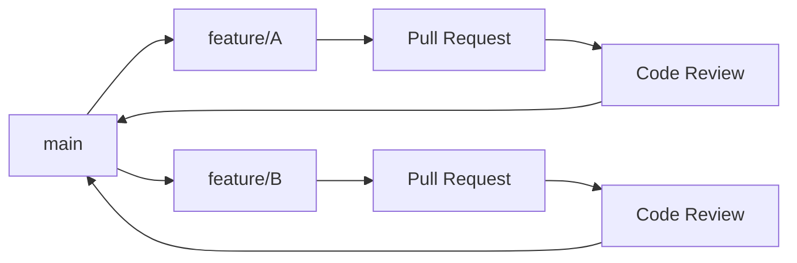
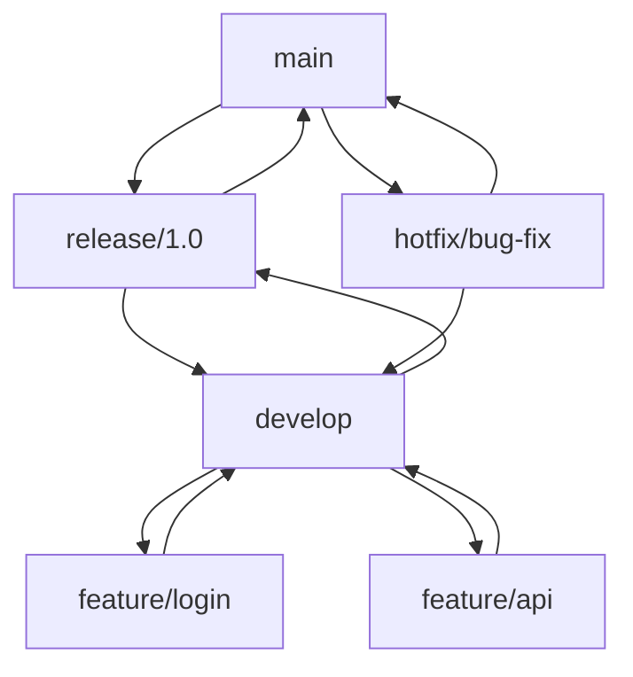
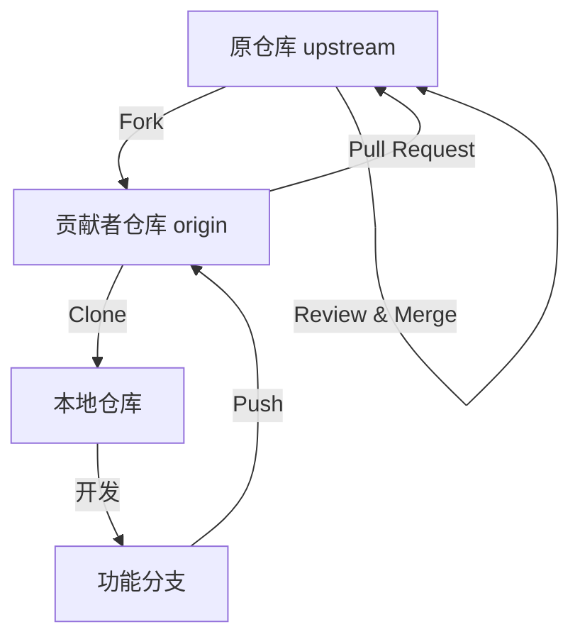

# Git 版本管理

## 什么是 Git？

Git 是一个**分布式版本控制系统**，由 Linus Torvalds 于 2005 年创建，用于管理 Linux 内核开发。它具有以下特点：

- **分布式**：每个开发者都有完整的代码仓库副本
- **高效**：快照存储，操作速度快
- **分支强大**：创建和合并分支非常轻量
- **数据完整**：SHA-1 哈希保证数据完整性

### Git 核心概念

```
工作区 (Working Directory)
    │
    │  git add
    ▼
暂存区 (Staging Area / Index)
    │
    │  git commit
    ▼
本地仓库 (Local Repository)
    │
    │  git push
    ▼
远程仓库 (Remote Repository)
```

上述图示展示了 Git 的四个核心区域。

**核心概念说明：**

| 概念 | 说明 |
|------|------|
| 工作区 | 实际编辑文件的目录 |
| 暂存区 | 准备提交的修改 |
| 本地仓库 | 本地的版本历史 |
| 远程仓库 | 服务器上的版本历史 |

## Git 基础配置

### 安装与初始化

```bash
# Windows: 从 https://git-scm.com/ 下载安装
# macOS: brew install git
# Linux: sudo apt install git

# 配置用户信息
git config --global user.name "你的名字"
git config --global user.email "your@email.com"

# 配置默认编辑器
git config --global core.editor "code --wait"

# 配置默认分支名
git config --global init.defaultBranch main

# 查看配置
git config --list
```

上述命令展示了 Git 的基础配置。

### 初始化仓库

```bash
# 创建新仓库
mkdir my-project
cd my-project
git init

# 克隆远程仓库
git clone https://github.com/user/repo.git
git clone git@github.com:user/repo.git

# 克隆指定分支
git clone -b branch-name https://github.com/user/repo.git
```

上述命令展示了仓库的初始化方式。

## Git 基本操作

### 文件状态管理

```bash
# 查看状态
git status
git status -s

# 添加到暂存区
git add filename        # 添加单个文件
git add .              # 添加所有修改
git add -A             # 添加所有文件（包括删除）
git add *.c            # 添加所有 .c 文件

# 从暂存区移除
git reset filename      # 移除单个文件
git reset              # 移除所有

# 放弃工作区修改
git checkout -- filename
git restore filename    # Git 2.23+

# 删除文件
git rm filename        # 删除文件并添加到暂存区
git rm --cached filename  # 只从 Git 移除，保留本地文件
```

上述命令展示了文件状态管理操作。

**文件状态流转：**

| 状态 | 说明 | 命令 |
|------|------|------|
| Untracked | 未跟踪 | `git add` |
| Staged | 已暂存 | `git commit` |
| Unmodified | 未修改 | 编辑文件 |
| Modified | 已修改 | `git add` |

### 提交更改

```bash
# 提交暂存区的更改
git commit -m "提交说明"

# 提交并添加说明（打开编辑器）
git commit

# 跳过暂存区直接提交
git commit -a -m "提交说明"

# 修改上一次提交
git commit --amend -m "新的提交说明"

# 修改上一次提交（不改说明，只补充文件）
git add forgotten-file
git commit --amend --no-edit
```

上述命令展示了提交更改的方式。

**提交信息规范：**

```
<type>(<scope>): <subject>

<body>

<footer>
```

**常用 type：**

| 类型 | 说明 |
|------|------|
| feat | 新功能 |
| fix | 修复 bug |
| docs | 文档更新 |
| style | 代码格式（不影响逻辑） |
| refactor | 重构 |
| test | 测试相关 |
| chore | 构建/工具相关 |

### 查看历史

```bash
# 查看提交历史
git log
git log --oneline          # 简洁模式
git log --graph            # 图形化显示
git log --all              # 所有分支
git log -n 5               # 最近 5 条

# 查看指定文件历史
git log -- filename

# 查看每次提交的差异
git log -p

# 查看统计信息
git log --stat

# 搜索提交信息
git log --grep="关键词"

# 查看某作者的提交
git log --author="作者名"
```

上述命令展示了查看历史的方式。

**日志格式化：**

```bash
# 自定义格式
git log --pretty=format:"%h - %an, %ar : %s"

# 常用占位符
# %H  完整哈希
# %h  短哈希
# %an 作者名字
# %ae 作者邮箱
# %ad 作者日期
# %ar 作者日期（相对）
# %s  提交说明
```

## 分支管理

### 分支基础

```bash
# 查看分支
git branch              # 本地分支
git branch -r           # 远程分支
git branch -a           # 所有分支
git branch -v           # 显示最后一次提交

# 创建分支
git branch branch-name

# 切换分支
git checkout branch-name
git switch branch-name   # Git 2.23+

# 创建并切换
git checkout -b branch-name
git switch -c branch-name

# 删除分支
git branch -d branch-name    # 已合并的分支
git branch -D branch-name    # 强制删除

# 重命名分支
git branch -m old-name new-name
```

上述命令展示了分支的基本操作。

### 分支工作流程

```bash
# 场景：开发新功能

# 1. 从 main 创建功能分支
git checkout main
git pull origin main
git checkout -b feature/new-feature

# 2. 开发并提交
git add .
git commit -m "feat: 添加新功能"

# 3. 推送到远程
git push -u origin feature/new-feature

# 4. 合并回 main（通过 Pull Request 或本地合并）
git checkout main
git merge feature/new-feature

# 5. 删除功能分支
git branch -d feature/new-feature
git push origin --delete feature/new-feature
```

上述代码展示了典型的分支工作流程。

### 分支合并

```bash
# 合并分支
git merge branch-name

# 快进合并（默认）
git merge --ff-only branch-name

# 禁用快进合并（创建合并提交）
git merge --no-ff branch-name

# 压缩合并（将多个提交压缩为一个）
git merge --squash branch-name
```

上述命令展示了分支合并的方式。

**合并类型对比：**

| 类型 | 说明 | 特点 |
|------|------|------|
| Fast-forward | 快进合并 | 线性历史，无合并提交 |
| No-fast-forward | 普通合并 | 保留分支历史 |
| Squash | 压缩合并 | 简洁历史，丢失分支信息 |

### 解决合并冲突

```bash
# 当合并出现冲突时

# 1. 查看冲突文件
git status

# 2. 手动编辑冲突文件
# 冲突标记格式：
# <<<<<<< HEAD
# 当前分支的内容
# =======
# 要合并分支的内容
# >>>>>>> branch-name

# 3. 解决冲突后添加文件
git add resolved-file

# 4. 完成合并
git commit

# 放弃合并
git merge --abort
```

上述代码展示了解决合并冲突的步骤。

**冲突标记说明：**

```
<<<<<<< HEAD
当前分支的内容
=======
要合并分支的内容
>>>>>>> feature-branch
```

### 分支策略

**Git Flow 模型：**

```
main (生产分支)
  │
  ├─── release/1.0 (发布分支)
  │      │
  │      └─── develop (开发分支)
  │             │
  │             ├─── feature/login (功能分支)
  │             └─── feature/api (功能分支)
  │
  └─── hotfix/bug (热修复分支)
```

上述图示展示了 Git Flow 分支模型。

**分支类型说明：**

| 分支类型 | 命名 | 说明 |
|----------|------|------|
| main/master | main | 生产环境代码 |
| develop | develop | 开发主分支 |
| feature | feature/* | 新功能开发 |
| release | release/* | 发布准备 |
| hotfix | hotfix/* | 紧急修复 |

**GitHub Flow（简化版）：**

```bash
# 1. 从 main 创建分支
git checkout -b feature/new-feature

# 2. 开发并提交
git add .
git commit -m "feat: 新功能"

# 3. 推送并创建 Pull Request
git push -u origin feature/new-feature

# 4. Code Review 后合并

# 5. 部署到生产环境
```

上述代码展示了 GitHub Flow 工作流程。

## 版本回退

### 回退操作

```bash
# 查看操作历史
git reflog

# 回退到指定提交
git reset --soft HEAD~1     # 保留工作区和暂存区
git reset --mixed HEAD~1    # 保留工作区（默认）
git reset --hard HEAD~1     # 全部丢弃

# 回退到指定 commit
git reset --hard commit-hash

# 撤销某次提交（创建新提交）
git revert commit-hash

# 撤销多个提交
git revert HEAD~3..HEAD
```

上述命令展示了版本回退操作。

**reset 模式对比：**

| 模式 | 工作区 | 暂存区 | 提交历史 |
|------|--------|--------|----------|
| --soft | 保留 | 保留 | 回退 |
| --mixed | 保留 | 清空 | 回退 |
| --hard | 清空 | 清空 | 回退 |

**reset vs revert：**

| 操作 | 说明 | 适用场景 |
|------|------|----------|
| reset | 回退历史 | 本地未推送的提交 |
| revert | 创建反向提交 | 已推送的提交 |

### 暂存工作

```bash
# 暂存当前工作
git stash
git stash save "描述信息"

# 查看暂存列表
git stash list

# 恢复暂存
git stash pop           # 恢复并删除
git stash apply         # 恢复但不删除
git stash apply stash@{n}  # 恢复指定暂存

# 删除暂存
git stash drop stash@{n}
git stash clear         # 清空所有
```

上述命令展示了暂存工作的操作。

## 远程仓库

### 远程操作

```bash
# 查看远程仓库
git remote -v

# 添加远程仓库
git remote add origin https://github.com/user/repo.git

# 修改远程仓库地址
git remote set-url origin new-url

# 删除远程仓库
git remote remove origin

# 推送到远程
git push origin branch-name
git push -u origin branch-name  # 设置上游
git push --force origin branch-name  # 强制推送（危险）

# 拉取远程更新
git fetch origin           # 只获取，不合并
git pull origin branch-name  # 获取并合并
git pull --rebase origin branch-name  # 变基合并

# 推送标签
git push origin tag-name
git push origin --tags
```

上述命令展示了远程仓库操作。

**fetch vs pull：**

| 命令 | 说明 |
|------|------|
| fetch | 只下载远程更新，不修改本地 |
| pull | fetch + merge |

### 变基操作

```bash
# 变基当前分支
git rebase main

# 交互式变基
git rebase -i HEAD~3

# 解决冲突后继续
git rebase --continue

# 放弃变基
git rebase --abort
```

上述命令展示了变基操作。

**merge vs rebase：**

```
Merge:
    A---B---C  feature
   /         \
  D---E---F---G  main (merge commit)

Rebase:
          A'--B'--C'  feature
         /
  D---E---F  main (linear history)
```

上述图示展示了 merge 和 rebase 的区别。

| 操作 | 特点 | 适用场景 |
|------|------|----------|
| merge | 保留分支历史 | 合并到主分支 |
| rebase | 线性历史 | 整理本地提交 |

## 标签管理

### 创建标签

```bash
# 轻量标签
git tag v1.0.0

# 附注标签（推荐）
git tag -a v1.0.0 -m "版本 1.0.0 发布"

# 给历史提交打标签
git tag -a v0.9.0 commit-hash -m "版本 0.9.0"

# 查看标签
git tag
git tag -l "v1.*"
git show v1.0.0

# 删除标签
git tag -d v1.0.0
git push origin --delete v1.0.0

# 推送标签
git push origin v1.0.0
git push origin --tags
```

上述命令展示了标签管理操作。

**语义化版本号：**

```
vMAJOR.MINOR.PATCH

MAJOR: 不兼容的 API 变更
MINOR: 向后兼容的功能新增
PATCH: 向后兼容的问题修复

示例：v1.2.3
- v1: 主版本
- 2: 次版本
- 3: 修订版本
```

## GitHub 操作

### 创建仓库

**在 GitHub 上创建新仓库：**

1. 登录 GitHub，点击右上角 **+** → **New repository**
2. 填写仓库信息：
   - **Repository name**：仓库名称
   - **Description**：描述（可选）
   - **Public/Private**：公开或私有
   - **Initialize**：是否添加 README、.gitignore、license

**将本地项目推送到 GitHub：**

```bash
# 方式一：已有本地项目
git init
git add .
git commit -m "Initial commit"
git branch -M main
git remote add origin https://github.com/username/repo.git
git push -u origin main

# 方式二：克隆后修改
git clone https://github.com/username/repo.git
cd repo
# 进行修改...
git add .
git commit -m "Update"
git push
```

上述命令展示了将项目推送到 GitHub 的方式。

### SSH 密钥配置

**生成 SSH 密钥：**

```bash
# 生成 SSH 密钥
ssh-keygen -t ed25519 -C "your@email.com"

# 如果系统不支持 ed25519，使用 RSA
ssh-keygen -t rsa -b 4096 -C "your@email.com"

# 查看公钥
cat ~/.ssh/id_ed25519.pub
# 或
cat ~/.ssh/id_rsa.pub
```

**添加到 GitHub：**

1. 复制公钥内容
2. GitHub → **Settings** → **SSH and GPG keys** → **New SSH key**
3. 粘贴公钥，保存

**测试连接：**

```bash
ssh -T git@github.com
# 成功输出：Hi username! You've successfully authenticated...
```

**使用 SSH 地址克隆：**

```bash
git clone git@github.com:username/repo.git
```

### GitHub 上创建分支

**方式一：网页创建**

1. 进入仓库页面
2. 点击分支下拉菜单（默认显示 **main**）
3. 输入新分支名称
4. 点击 **Create branch: xxx from 'main'**

**方式二：本地创建后推送**

```bash
# 创建并切换分支
git checkout -b feature/new-feature

# 推送到 GitHub（自动创建远程分支）
git push -u origin feature/new-feature
```

**查看远程分支：**

```bash
# 查看所有远程分支
git branch -r

# 查看所有分支（本地 + 远程）
git branch -a

# 拉取远程分支信息
git fetch origin

# 切换到远程分支
git checkout -b feature/xxx origin/feature/xxx
# 或（Git 2.23+）
git switch feature/xxx
```

**删除远程分支：**

```bash
# 删除本地分支
git branch -d feature/xxx

# 删除远程分支
git push origin --delete feature/xxx
```

### 多人协作仓库设置

**添加协作者：**

1. 进入仓库 → **Settings** → **Collaborators**
2. 点击 **Add people**
3. 输入协作者的 GitHub 用户名或邮箱
4. 选择权限级别：
   - **Write**：可以推送代码
   - **Read**：只能查看和克隆
   - **Admin**：完全控制权限
5. 发送邀请，等待对方接受

**组织团队管理：**

对于更大的团队，建议使用 GitHub Organizations：

1. 创建组织：GitHub 首页 → **+** → **New organization**
2. 创建团队：组织页面 → **Teams** → **New team**
3. 添加成员到团队
4. 为团队分配仓库权限

**权限级别对比：**

| 权限 | Read | Write | Admin |
|------|------|-------|-------|
| 查看仓库 | ✓ | ✓ | ✓ |
| 克隆仓库 | ✓ | ✓ | ✓ |
| 推送代码 | ✗ | ✓ | ✓ |
| 管理分支保护 | ✗ | ✗ | ✓ |
| 管理协作者 | ✗ | ✗ | ✓ |
| 删除仓库 | ✗ | ✗ | ✓ |

### 分支保护规则

**设置分支保护：**

1. 进入仓库 → **Settings** → **Branches**
2. 点击 **Add branch protection rule**
3. 配置保护规则

**常用保护设置：**

| 设置 | 说明 |
|------|------|
| Require a pull request before merging | 必须通过 PR 合并 |
| Require approvals | 需要 PR 审核通过 |
| Require status checks to pass before merging | CI 通过才能合并 |
| Require signed commits | 提交必须签名 |
| Include administrators | 管理员也受限制 |

**推荐的保护配置：**

```
main 分支保护规则：
┌─────────────────────────────────────────────────────────────┐
│  ☑ Require a pull request before merging                    │
│    ☑ Require approvals: 1                                   │
│    ☑ Dismiss stale pull request approvals when new commits  │
│  ☑ Require status checks to pass before merging             │
│    ☑ Require branches to be up to date before merging       │
│  ☑ Include administrators                                   │
└─────────────────────────────────────────────────────────────┘
```

### 团队协作工作流程

**场景一：功能分支工作流（Feature Branch Workflow）**

适用于小型团队，所有人都有写权限。



**完整流程：**

```bash
# 开发者 A 的操作
# 1. 同步最新代码
git checkout main
git pull origin main

# 2. 创建功能分支
git checkout -b feature/user-auth

# 3. 开发并提交
git add .
git commit -m "feat: 添加用户认证功能"

# 4. 推送到 GitHub
git push -u origin feature/user-auth

# 5. 在 GitHub 上创建 Pull Request

# 6. 等待 Code Review

# 7. 根据反馈修改（如有需要）
git add .
git commit -m "fix: 修复认证逻辑"
git push

# 8. PR 合并后，删除功能分支
git checkout main
git pull origin main
git branch -d feature/user-auth
```

**场景二：Git Flow 工作流**

适用于有计划发布周期的项目。



**分支说明：**

| 分支 | 说明 | 从哪创建 | 合并到 |
|------|------|----------|--------|
| main | 生产环境 | - | - |
| develop | 开发主分支 | main | release |
| feature/* | 功能开发 | develop | develop |
| release/* | 发布准备 | develop | main, develop |
| hotfix/* | 紧急修复 | main | main, develop |

**场景三：Fork 工作流**

适用于开源项目或外部贡献者。



**贡献者流程：**

```bash
# 1. Fork 仓库（在 GitHub 网页操作）

# 2. 克隆自己的 Fork
git clone https://github.com/your-username/repo.git
cd repo

# 3. 添加上游仓库
git remote add upstream https://github.com/original-owner/repo.git

# 4. 同步上游最新代码
git fetch upstream
git checkout main
git merge upstream/main

# 5. 创建功能分支
git checkout -b feature/contribution

# 6. 开发并提交
git add .
git commit -m "feat: 添加新功能"

# 7. 推送到自己的 Fork
git push origin feature/contribution

# 8. 在 GitHub 上创建 Pull Request 到原仓库
```

**保持 Fork 同步：**

```bash
# 定期同步上游更新
git fetch upstream
git checkout main
git merge upstream/main
git push origin main

# 或使用 rebase 保持历史整洁
git fetch upstream
git checkout main
git rebase upstream/main
git push origin main --force
```

### Code Review 最佳实践

**审核者操作：**

1. 打开 Pull Request
2. 点击 **Files changed** 查看变更
3. 在代码行添加评论：
   - 鼠标悬停在行号左侧
   - 点击 **+** 添加评论
4. 选择审核结果：
   - **Comment**：仅评论
   - **Approve**：批准合并
   - **Request changes**：要求修改

**审核检查清单：**

```
代码审核检查项：
┌─────────────────────────────────────────────────────────────┐
│  □ 代码风格是否符合规范                                      │
│  □ 是否有足够的注释和文档                                    │
│  □ 是否有单元测试                                            │
│  □ 是否引入安全风险                                          │
│  □ 是否有性能问题                                            │
│  □ 是否处理了错误情况                                        │
│  □ 是否与现有代码兼容                                        │
└─────────────────────────────────────────────────────────────┘
```

**常用审核评论：**

```markdown
# 建议修改
**建议**：这里可以使用更简洁的写法
```suggestion
const result = data.filter(item => item.active);
```

# 提问
**问题**：这个函数在边界情况下会怎么处理？

# 批准
LGTM (Looks Good To Me) 👍
```

### 冲突解决

**在 GitHub 网页解决：**

1. PR 页面会显示 **This branch has conflicts**
2. 点击 **Resolve conflicts**
3. 编辑冲突文件，删除冲突标记
4. 点击 **Mark as resolved**
5. 点击 **Commit merge**

**在本地解决：**

```bash
# 1. 确保目标分支是最新的
git checkout main
git pull origin main

# 2. 切换到功能分支
git checkout feature/my-feature

# 3. 合并或变基
git merge main
# 或
git rebase main

# 4. 解决冲突
# 编辑冲突文件，删除 <<<<<<< ======= >>>>>>> 标记

# 5. 标记冲突已解决
git add .
git commit  # merge 方式
# 或
git rebase --continue  # rebase 方式

# 6. 推送
git push origin feature/my-feature
# rebase 后可能需要强制推送
git push origin feature/my-feature --force-with-lease
```

### 团队协作最佳实践

**提交规范：**

```bash
# 好的提交信息
git commit -m "feat(auth): 添加 JWT 认证支持"
git commit -m "fix(api): 修复用户查询接口超时问题"
git commit -m "docs(readme): 更新安装说明"

# 不好的提交信息
git commit -m "update"
git commit -m "fix bug"
git commit -m "changes"
```

**分支命名规范：**

| 类型 | 命名格式 | 示例 |
|------|----------|------|
| 功能 | feature/xxx | feature/user-login |
| 修复 | fix/xxx | fix/login-error |
| 热修复 | hotfix/xxx | hotfix/security-patch |
| 发布 | release/x.x | release/1.0 |
| 文档 | docs/xxx | docs/api-reference |

**协作注意事项：**

```
团队协作黄金法则：
┌─────────────────────────────────────────────────────────────┐
│  1. 永远不要直接推送到 main 分支                             │
│  2. 每个功能/修复使用独立分支                                │
│  3. PR 越小越好，便于审核                                    │
│  4. 写清楚 PR 描述和测试步骤                                 │
│  5. 及时响应 Code Review 反馈                                │
│  6. 合并前确保 CI 通过                                       │
│  7. 合并后及时删除功能分支                                   │
│  8. 定期同步主分支到功能分支                                 │
└─────────────────────────────────────────────────────────────┘
```

### Fork 与 Pull Request

**Fork 工作流程：**

```
原仓库 (upstream)
    │
    │  Fork
    ▼
你的仓库 (origin)
    │
    │  Clone
    ▼
本地仓库
```

上述图示展示了 Fork 工作流程。

**完整流程：**

```bash
# 1. 在 GitHub 上 Fork 仓库

# 2. 克隆你的 Fork
git clone https://github.com/your-username/repo.git
cd repo

# 3. 添加上游仓库
git remote add upstream https://github.com/original-owner/repo.git

# 4. 同步上游更新
git fetch upstream
git checkout main
git merge upstream/main

# 5. 创建功能分支
git checkout -b feature/my-feature

# 6. 开发并提交
git add .
git commit -m "feat: 添加新功能"

# 7. 推送到你的 Fork
git push origin feature/my-feature

# 8. 在 GitHub 上创建 Pull Request
```

**创建 Pull Request：**

1. 推送分支后，GitHub 会提示 **"Compare & pull request"**
2. 或进入仓库 → **Pull requests** → **New pull request**
3. 选择 **base repository**（目标仓库）和 **head repository**（你的 Fork）
4. 填写 PR 标题和描述
5. 点击 **Create pull request**

**Pull Request 模板：**

```markdown
## 变更说明

简要描述本次 PR 的内容和目的。

## 变更类型

- [ ] 新功能 (feat)
- [ ] Bug 修复 (fix)
- [ ] 文档更新 (docs)
- [ ] 代码重构 (refactor)

## 测试情况

描述如何测试这些变更。

## 相关 Issue

Fixes #123
```

### Issues 管理

**创建 Issue：**

1. 进入仓库 → **Issues** → **New issue**
2. 填写标题和描述
3. 添加标签（Labels）、指派人员（Assignees）、项目（Projects）

**Issue 模板：**

```markdown
## 问题描述

清晰描述遇到的问题。

## 复现步骤

1. 执行步骤一
2. 执行步骤二
3. 看到错误

## 期望行为

描述你期望发生什么。

## 实际行为

描述实际发生了什么。

## 环境信息

- 操作系统：
- 软件版本：

## 截图

如有必要，添加截图说明。
```

**关联 Issue 与 PR：**

```markdown
# 在 PR 描述中引用 Issue
Fixes #123        # 合并后自动关闭 Issue
Closes #456       # 同上
Related to #789   # 仅关联，不自动关闭
```

**常用标签：**

| 标签 | 说明 |
|------|------|
| bug | Bug 报告 |
| enhancement | 功能增强 |
| documentation | 文档相关 |
| good first issue | 适合新手 |
| help wanted | 需要帮助 |
| question | 问题咨询 |

### GitHub Actions

**基本概念：**

| 概念 | 说明 |
|------|------|
| Workflow | 工作流，定义在 YAML 文件中 |
| Job | 任务，由多个步骤组成 |
| Step | 步骤，执行具体操作 |
| Action | 可复用的操作单元 |
| Event | 触发事件（push、pull_request 等） |

**创建工作流：**

```yaml
# .github/workflows/ci.yml
name: CI

on:
  push:
    branches: [ main ]
  pull_request:
    branches: [ main ]

jobs:
  build:
    runs-on: ubuntu-latest

    steps:
    - uses: actions/checkout@v4

    - name: Setup Node.js
      uses: actions/setup-node@v4
      with:
        node-version: '20'

    - name: Install dependencies
      run: npm install

    - name: Run tests
      run: npm test

    - name: Build
      run: npm run build
```

**常用触发事件：**

```yaml
on:
  push:                    # 推送时触发
    branches: [ main ]
  pull_request:            # PR 时触发
    branches: [ main ]
  schedule:                # 定时触发
    - cron: '0 0 * * *'    # 每天 0 点
  workflow_dispatch:       # 手动触发
```

**部署到 GitHub Pages：**

```yaml
# .github/workflows/deploy.yml
name: Deploy to GitHub Pages

on:
  push:
    branches: [ main ]

permissions:
  contents: read
  pages: write
  id-token: write

jobs:
  build-and-deploy:
    runs-on: ubuntu-latest

    steps:
    - uses: actions/checkout@v4

    - name: Setup Node.js
      uses: actions/setup-node@v4
      with:
        node-version: '20'

    - name: Install and Build
      run: |
        npm install
        npm run build

    - name: Upload artifact
      uses: actions/upload-pages-artifact@v3
      with:
        path: ./dist

    - name: Deploy to GitHub Pages
      uses: actions/deploy-pages@v4
```

### GitHub Pages

**启用 GitHub Pages：**

1. 进入仓库 → **Settings** → **Pages**
2. **Source** 选择：
   - **Deploy from a branch**：从分支部署
   - **GitHub Actions**：通过 Actions 部署（推荐）
3. 选择分支和目录（/root 或 /docs）
4. 点击 **Save**

**访问地址：**

```
https://username.github.io/              # 用户/组织主页
https://username.github.io/repo-name/    # 项目页面
```

**自定义域名：**

1. 在仓库根目录创建 `CNAME` 文件，内容为域名
2. 在域名服务商添加 DNS 记录：
   - A 记录指向 GitHub Pages IP
   - 或 CNAME 记录指向 `username.github.io`
3. 在 Pages 设置中添加自定义域名

**GitHub Pages IP 地址：**

```
185.199.108.153
185.199.109.153
185.199.110.153
185.199.111.153
```

### GitHub 常用快捷键

| 快捷键 | 功能 |
|--------|------|
| `T` | 激活文件搜索 |
| `/` | 激活搜索框 |
| `G` + `P` | 跳转到 Pull Requests |
| `G` + `I` | 跳转到 Issues |
| `G` + `C` | 跳转到 Code |
| `?` | 显示快捷键帮助 |

## 实用技巧

### .gitignore 配置

```gitignore
# 忽略特定文件
*.log
*.tmp

# 忽略目录
node_modules/
dist/
build/

# 不忽略特定文件
!important.log

# 忽略特定目录下的文件
src/*.js
!src/main.js

# 常见配置
# Node.js
node_modules/
npm-debug.log*

# Python
__pycache__/
*.py[cod]
.env

# IDE
.idea/
.vscode/
*.swp
```

上述配置展示了 .gitignore 的用法。

### 常用别名

```bash
# 设置别名
git config --global alias.st status
git config --global alias.co checkout
git config --global alias.br branch
git config --global alias.ci commit
git config --global alias.lg "log --oneline --graph --all"
git config --global alias.unstage "reset HEAD --"
git config --global alias.last "log -1 HEAD"

# 使用别名
git st
git lg
```

上述命令展示了常用别名的设置。

### 撤销操作汇总

| 场景 | 命令 |
|------|------|
| 撤销工作区修改 | `git restore filename` |
| 撤销暂存区 | `git restore --staged filename` |
| 撤销最后一次提交 | `git reset --soft HEAD~1` |
| 撤销已推送的提交 | `git revert commit-hash` |
| 撤销 merge | `git merge --abort` |
| 撤销 rebase | `git rebase --abort` |

## 总结

| 概念 | 说明 |
|------|------|
| 工作区 | 实际编辑的文件 |
| 暂存区 | 准备提交的修改 |
| 分支 | 独立的开发线 |
| 合并 | 整合不同分支 |
| 变基 | 重写提交历史 |
| 标签 | 标记重要版本 |

## 参考资料

[1] Pro Git. https://git-scm.com/book/zh/v2

[2] Git 文档. https://git-scm.com/docs

[3] GitHub Flow. https://docs.github.com/en/get-started/quickstart/github-flow

## 相关主题

- [嵌入式 Linux](/notes/linux/) - Linux 开发环境
- [Shell 脚本](/notes/linux/shell) - 命令行脚本
