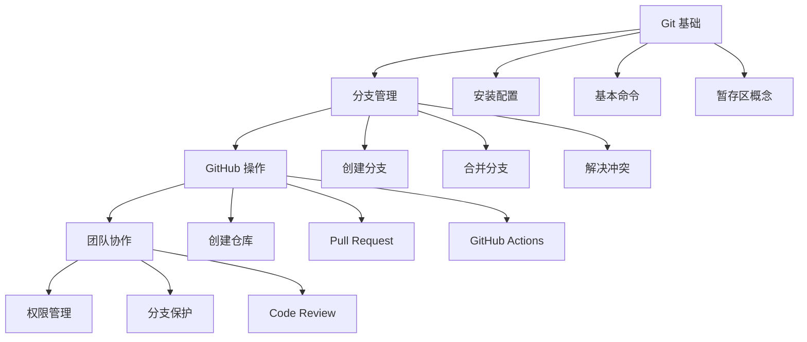

# 开发工具

本系列文章介绍常用开发工具的使用方法，帮助你提高开发效率。

## 系列文章

### 版本控制

- [Git 版本管理](/notes/tools/git) - Git 基础、分支管理、GitHub 操作、版本控制策略

## 学习路径

## 前置知识

学习本系列文章前，你需要：

- 基本的命令行操作能力
- 了解软件开发的基本流程
- 有团队协作开发的需求

## 相关主题

- [嵌入式 Linux](/notes/linux/) - Linux 开发环境
- [计算机基础](/notes/cs/) - 计算机核心概念
